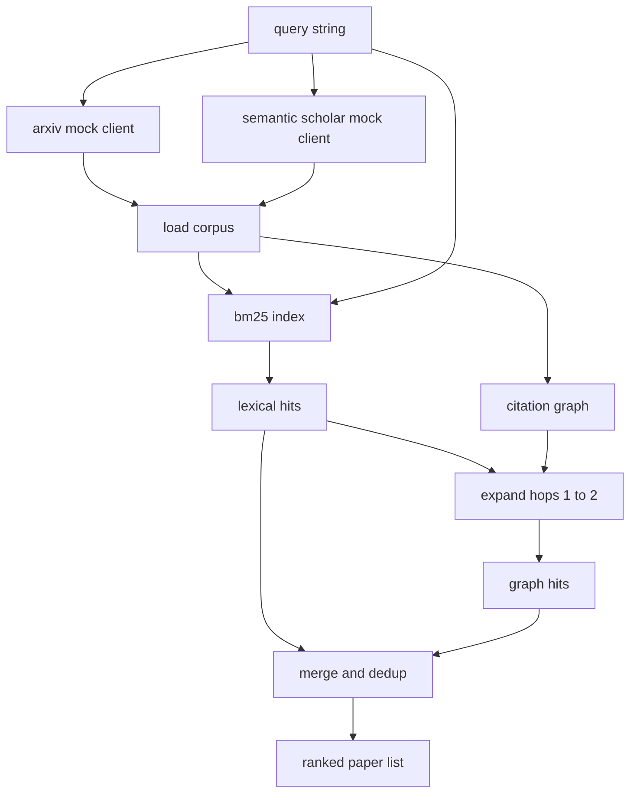

# 文獻檢索

> 一個假說很便宜。知道有沒有人已經證明過它，才是昂貴的那部分。在執行器把沙箱轉起來之前，先建出那層回答這個問題的檢索。

**類型：** 實作
**程式語言：** Python
**先修單元：** 階段 19 A 軌第 20-29 課
**時間：** 約 90 分鐘

## 學習目標
- 把一筆小型論文紀錄，建模成帶著「迴路下游會讀到的那些欄位」的樣子。
- 只用標準函式庫的資料結構，在摘要上建出一份 BM25 索引。
- 走過一張引用圖，把詞彙檢索漏掉的論文浮現出來。
- 依穩定的論文 id，把詞彙與圖這兩趟的命中結果去重。
- 把兩個模擬的外部 API 包在同一個客戶端後面，好讓真實端點落地時，上游的呼叫點維持不變。

## 為什麼要兩趟檢索

在摘要上做關鍵字檢索，回傳的是與查詢共用詞彙的論文。那涵蓋了大部分表面。它漏掉兩種情況。第一是當那篇奠基論文用了不同的詞彙；例如查「稀疏注意力」會漏掉一篇標題為「transformer 路由中的區塊選擇」的論文。第二是當相關論文是一篇引用了某個已知錨點的後續研究；找到那個錨點再往前走，比暴力掃過整池摘要更有效率。

這一課把兩趟都建出來。在摘要上的 BM25 抓到詞彙命中。引用圖走訪把一個種子集往前往後擴展一到兩跳。聯集依論文 id 去重，並以一個小型的組合分數排序。

## Paper 的形狀

```text
Paper
  id          : str           (stable identifier, "p001" for the mock corpus)
  title       : str
  abstract    : str
  year        : int
  authors     : list[str]
  references  : list[str]     (paper ids this paper cites)
  citations   : list[str]     (paper ids that cite this paper)
  source      : str           (which mock api supplied it, "arxiv" or "s2")
```

references 與 citations 這兩個欄位構成那張有向引用圖。兩個模擬 API 回傳的欄位有重疊但不完全相同，所以語料載入器在 `id` 上把它們做聯集。

```figure
cg-citation-hops
```

## 架構



檢索客戶端擁有那兩趟與那次合併。呼叫方遞給它一個查詢，拿回一份排序清單，其中每一筆都帶著解釋那個排序的逐論文分數欄位（`bm25_score`、`graph_distance`、`recency_score`、`final_score`）。

## 從零打造 BM25

實作是標準的 Okapi BM25，預設參數 `k1=1.5`、`b=0.75`。索引是兩個字典：`term -> doc_frequency` 與 `term -> list of (doc_id, term_count)`。文件長度是摘要的詞元數。平均文件長度在建索引時算一次。替一個查詢評分，就是對查詢詞項加總 `idf * tf_norm`，其中 `tf_norm` 是標準 BM25 的長度正規化詞頻。

分詞器是先 `lower` 再依非英數字元切分。它不做詞幹化。生產系統會換上一個小型詞幹器。介面維持不變。

```text
idf(t)      = log((N - df + 0.5) / (df + 0.5) + 1.0)
tf_norm(t)  = (f * (k1 + 1)) / (f + k1 * (1 - b + b * dl / avgdl))
score(d, q) = sum over t in q of idf(t) * tf_norm(t)
```

## 引用圖走訪

那張圖從語料建出來一次。前向邊從一篇論文指向它的參考文獻。反向邊從一篇論文指向引用它的論文。走訪是一次以 BM25 前幾名命中為種子的廣度優先搜尋，上限兩跳。

兩跳是一個刻意設下的天花板。一跳太淺；代理常常想要的是直接的祖先或後代。三跳會在一張連通的圖上把結果數量炸開，而且傾向離題。這一課把跳數上限暴露成一個設定旋鈕，好讓下游迴路能把它收緊。

## 去重與排序

那兩趟回傳的集合有重疊。合併以論文 id 為鍵。對每一篇論文，最終分數是一個加權混合。

```text
final_score = w_bm25 * bm25_score_norm
            + w_graph * graph_score
            + w_recency * recency_score
```

`bm25_score_norm` 是 BM25 分數除以合併集合中的最大 BM25 分數（好讓這個欄位落在零到一之間）。`graph_score` 對直接的詞彙命中是一、一跳是 `0.6`、兩跳是 `0.3`、其餘為零。`recency_score` 是一條從語料最小年份的零、線性爬到最大年份的一的斜坡。

預設權重是 `0.5`、`0.3`、`0.2`。那些權重是設定；一個陳舊的主題可能會把 recency 調低，而一個快速演進的主題會把它調高。

## 模擬語料

那份語料是一百篇論文，由 `build_corpus()` 生成。每篇論文都有一個手寫的標題與摘要，落在五個主題之一：注意力稀疏度、檢索增強、低秩轉接器、資料集蒸餾，以及評估框架。參考文獻與引用被接起來，好讓每個主題形成一張連通的子圖，並帶幾條跨主題的邊。

那兩個模擬 API 客戶端（`ArxivMockClient`、`SemanticScholarMockClient`）讀的是同一份語料，但暴露不同的欄位。Arxiv 回傳標題、摘要、年份、作者。Semantic Scholar 多加參考文獻與引用。檢索客戶端在 id 上做聯集；跨客戶端的欄位不一致要怎麼處理，留給後續課程。

## 第 52 與 53 課會讀什麼

第五十二課的執行器讀 `paper.id`、`paper.title`，以及摘要的前三句，當作那次實驗的脈絡。第五十三課的評估器讀 `paper.year` 與 `paper.references`，好把一個基線歸屬到某篇特定論文上。

檢索客戶端回傳一份 `RetrievalResult`，同時帶著那份排序清單與逐查詢的指標：命中數、平均分數、最高分數、總實際時間。執行器把這些記下來，好讓下游的可觀測性能把品質隨時間畫出來。

## 怎麼讀那些程式碼

`code/main.py` 定義了 `Paper`、`ArxivMockClient`、`SemanticScholarMockClient`、`BM25Index`、`CitationGraph`、`RetrievalClient`，以及一個確定性的示範。那些模擬客戶端與那份語料都在同一個檔案裡，好讓這一課保持可攜。BM25 的實作是一個類別、六十行。圖走訪是一個方法。

`code/tests/test_retrieval.py` 涵蓋詞彙路徑、圖路徑、合併、去重，以及空查詢。

## 這一課插在哪裡

第五十課產出一個假說。第五十一課檢索文獻，看那個假說是不是早就有定論。若沒有，第五十二課就跑那個實驗。第五十三課讀那份檢索結果與那些實驗指標，寫下判定。檢索客戶端是這四個階段裡最便宜的，在編排者裡跑第一個。
