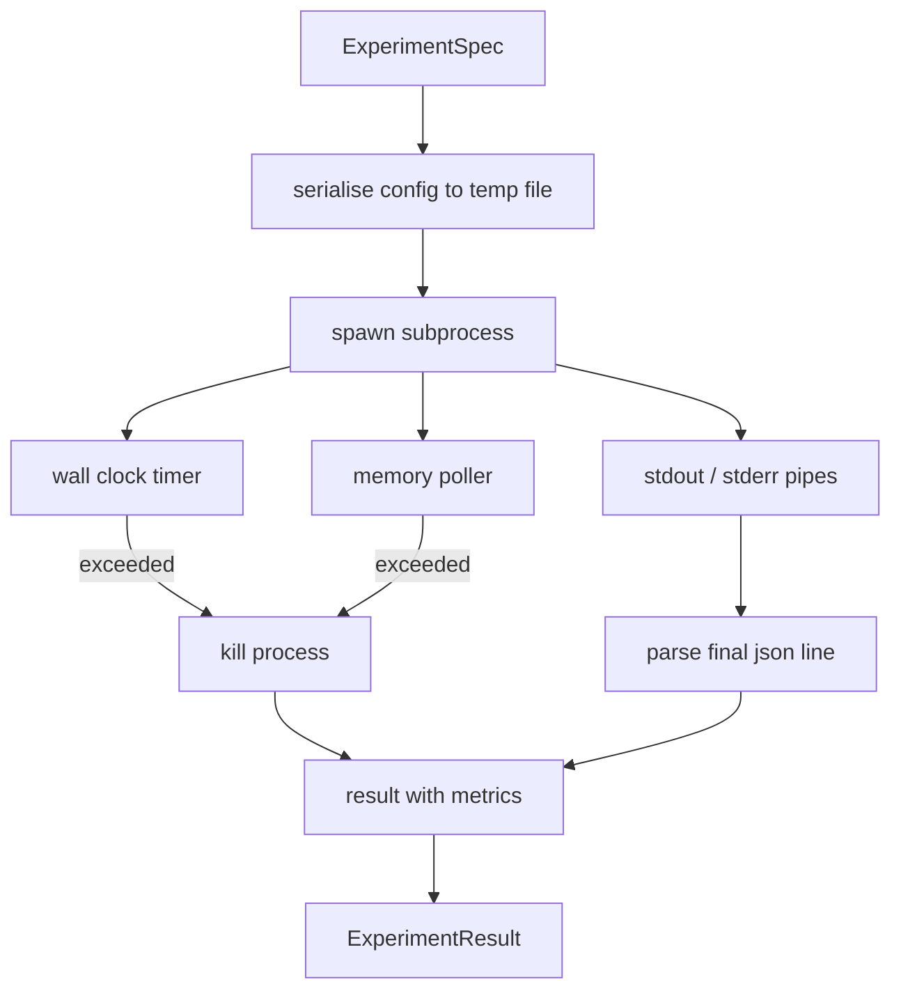

# 實驗執行器

> 迴路的誠實程度，只跟它的量測一樣高。建出那個執行器：它吃下一份規格、在沙箱化的子行程中執行它，並產出一份評估器信得過的 json 指標團塊。

**類型：** 實作
**程式語言：** Python
**先修單元：** 階段 19 A 軌第 20-29 課
**時間：** 約 90 分鐘

## 學習目標
- 把一次實驗編碼成一份型別化的規格，好讓執行器能把它序列化送進子行程。
- 帶著硬性實際時間逾時與軟性記憶體上限啟動一個子行程，並把兩者都當成終止條件浮現出來。
- 把 stdout、stderr 與那份結構化的指標團塊，擷取進單一份結果紀錄。
- 建出一張消融表，在一份固定的基礎規格上，一次只掃一個組態旋鈕。
- 在給定種子時讓每一份結果都保持確定性，好讓評估器在各次執行間看到同樣的數字。

## 為什麼要用子行程

研究迴路跑的是不受信任的程式碼。假說來自一個取樣器，實驗腳本來自同一條路徑；把任何一個當成行程內安全的東西，等於在求一次會把編排者一起帶走的當機。子行程是這個語言出貨的最簡單隔離：一個獨立行程、一份獨立的位址空間、父端一個訊號控制代碼。

這裡的執行器並不實作完整的沙箱。沒有 cgroup、沒有 seccomp 過濾器、沒有命名空間重映。它有的是一個實際時間逾時、一條輪詢記憶體成長的迴路，以及一條在任一上限被觸及時終止行程的殺掉路徑。那就是每一種更精緻沙箱所擴充的執行期契約。這一課把那份契約保持在一次讀得完的大小。

## ExperimentSpec 的形狀

```text
ExperimentSpec
  spec_id        : str            (stable id, "exp_001")
  hypothesis_id  : int            (link back to the queue from lesson 50)
  script_path    : str            (path to the python script to run)
  config         : dict           (passed to the script as one json arg)
  seed           : int            (deterministic seed for the experiment)
  wall_timeout_s : float          (hard timeout, killed on exceed)
  memory_cap_mb  : int            (soft cap, polled; killed on exceed)
  metric_keys    : list[str]      (which fields the evaluator will read)
```

腳本住在磁碟上；執行器把設定寫到一個暫存檔路徑，供腳本讀取。腳本被期待在 stdout 上印出單一行 json，其鍵是 `metric_keys` 的超集。stdout 上的其他東西會被擷取，但指標剖析器會忽略它們。

## 架構



執行器是一個類別、一個主要方法。那個輪詢器是一條小執行緒，每隔一個輪詢間隔醒來一次，並在平台支援時從 proc 檔案系統讀取子行程的 `psutil` 等價資訊，平台不暴露時就退回不做事。

## 為什麼是軟性記憶體上限

硬性記憶體上限需要 `resource.setrlimit`，而且只在 POSIX 上有用。這一課出貨一個可攜的做法：從平台輪詢常駐集大小，並在超過上限時殺掉子行程。它是軟性的，因為輪詢器有一個非零的間隔；一個行程可以在兩次輪詢之間衝上上限再掉回來。執行器記錄觀察到的最大 RSS，好讓評估器看得出這次執行離那個上限有多近。

在不支援行程檢視的系統上，輪詢器記一次警告然後把自己關掉。實際時間逾時仍然適用。這一課的測試涵蓋這兩條路徑。

## 擷取 stdout 與 stderr

執行器在完成時把兩條管線都排空讀出。Stdout 逐行掃描；最後一行「能剖析成 json、且含有全部必要 `metric_keys`」的，就被當成那份指標團塊。先前的 json 行則以 `intermediate_metrics` 留在結果裡；評估器可以拿它們畫學習曲線。

Stderr 原封不動地被擷取進結果。執行器從不因為非零結束碼而拋出例外；它反而把那個碼記在結果裡。任何非零結束都被標成 `"crash"`，就算腳本印出了指標也一樣，好讓評估器預設把「跑了一部分」視為失敗。

## 消融表

```python
def ablate(base: ExperimentSpec, knob: str, values: list[Any]) -> list[ExperimentSpec]:
    ...
```

給定一份基礎規格與一個旋鈕名稱，這個輔助函式替每個值回傳一份規格，其中 `config[knob]` 被覆寫。每份規格拿到一個推導出來的 `spec_id`（`f"{base.spec_id}_{knob}_{value}"`）。這一課出貨一個 `AblationRunner`，依序跑它們，並回傳一份以旋鈕值為鍵的 `AblationTable`。

為什麼一次只調一個旋鈕。完整的因子掃描會指數爆炸，並產出評估器詮釋不了的結果。一次一個旋鈕產出的是一條乾淨、評估器畫得出來的軸。這一課只以「重複的單旋鈕消融」來支援多旋鈕掃描，由呼叫方自行組合。

## 確定性

每份規格都帶一個種子。執行器透過設定字典把種子轉給腳本（`config["__seed"] = spec.seed`）。`code/experiments/` 裡那些模擬實驗腳本尊重種子，並在各次執行間產出相同的指標。第五十三課的評估器依賴這件事；沒有確定性，一次「退化」可能只是不同的隨機初始化。

## 那個模擬實驗腳本

這一課出貨一個實驗腳本：`code/experiments/sparsity_experiment.py`。它是一支真的腳本，讀它的設定檔、用一次 numpy 隨機過程模擬一次小型訓練，並印出一份 json 指標團塊。腳本尊重一個供測試逾時用的 `sleep_s` 旋鈕，以及一個供測試記憶體輪詢器用的 `allocate_mb` 旋鈕。

那個模擬並沒有真的在訓練什麼。它是一次模仿訓練迴路形狀的數值運算：一條損失曲線、一個最終困惑度、一個實際時間。這一課的重點是執行器，不是那個模擬。一支真正的實驗腳本會匯入一個模型。

## 結果的形狀

```text
ExperimentResult
  spec_id              : str
  hypothesis_id        : int
  exit_code            : int
  terminal             : "ok" | "timeout" | "oom" | "crash"
  wall_time_s          : float
  peak_rss_mb          : float | None
  metrics              : dict
  intermediate_metrics : list[dict]
  stdout_tail          : str
  stderr_tail          : str
```

評估器先讀 `metrics` 與 `terminal`。若 terminal 是 `"ok"` 以外的任何值，這次實驗就算一次失敗的執行，而評估器的判定是自動的。否則那些指標就被送過顯著性檢定。

## 怎麼讀那些程式碼

`code/main.py` 定義了 `ExperimentSpec`、`ExperimentResult`、`ExperimentRunner`、`AblationRunner`，以及一個確定性的示範。子行程管理是一個類別。記憶體輪詢器是一條小執行緒。消融的輔助函式是單一個函式。

`code/experiments/sparsity_experiment.py` 是測試裡用的那個模擬實驗。它從 argv 讀出自己的設定檔路徑，並在完成時寫出單一行 json 指標。

`code/tests/test_runner.py` 涵蓋成功路徑、逾時路徑、當機路徑、消融表，以及跨兩次執行的確定性檢查。

## 這一課插在哪裡

第五十課生成假說。第五十一課濾掉文獻早已有定論的那些。第五十二課替剩下的跑實驗。第五十三課讀那份結果、跑顯著性檢定，並寫下編排者要對著那個假說 id 存起來的判定。
