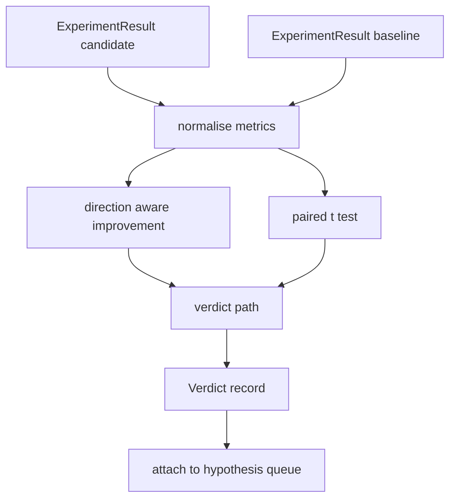

# 結果評估器

> 執行器產出了數字。評估器決定那些數字是改善、退化，還是雜訊。建出那條把指標變成一行結論的判定路徑。

**類型：** 實作
**程式語言：** Python
**先修單元：** 階段 19 A 軌第 20-29 課
**時間：** 約 90 分鐘

## 學習目標
- 用「感知方向的改善」與一個固定門檻，把一次候選執行拿去與基線比較。
- 在逐種子的指標上，從零跑一次配對 t 檢定，並讀出那個 p 值。
- 把對數尺度的指標正規化，好讓下游報告能把它們與線性指標混在一起。
- 產出一份逐假說的判定，好讓編排者能把它掛到第五十課那份佇列上。
- 讓每一步都保持純粹，好讓同樣的輸入永遠產出同樣的判定。

## 為什麼要配對檢定

執行器給的單一個數字，說不出這次改動是不是真的。同樣的組態換一個種子就給出不同的困惑度。這次改動可能只是雜訊。正確的比較是配對的：同樣的種子、同樣的資料，用候選跑一次、用基線跑一次。每個種子貢獻一個差值。那些差值的平均是那個效應。那些差值的標準誤是那個雜訊底線。

這一課從零實作那個檢定。沒有 `scipy.stats`。那些數學小到一個螢幕就讀得完。

```text
diffs    = [a_i - b_i for i in seeds]
mean     = sum(diffs) / n
variance = sum((d - mean) ** 2 for d in diffs) / (n - 1)
t_stat   = mean / sqrt(variance / n)
df       = n - 1
p_value  = two_sided_p(t_stat, df)
```

那個雙尾 p 值用的是正則化不完全貝他函數。這一課出貨一份使用 Lentz 連分數的小型實作。整件事是六十行的標準函式庫數學。

## 感知方向的改善

有些指標往上走才算改善（準確率、吞吐量）。有些往下走才算改善（損失、困惑度、實際時間）。評估器在每個指標上帶一個 `direction` 欄位。

```text
if direction == "higher_is_better":
    improvement = (candidate - baseline) / abs(baseline)
elif direction == "lower_is_better":
    improvement = (baseline - candidate) / abs(baseline)
```

改善是帶正負號的。在一個「愈高愈好」的指標上出現負的改善，代表候選比較差。判定路徑會把正負號與大小一起讀。

一個平坦的門檻（`improvement_threshold=0.02`，也就是 2%）決定這次改動大到值不值得下結論。低於那個門檻，不管 p 值如何判定都是「雜訊」；迴路對「使用者量不出來的改動」不感興趣。

```figure
cg-paired-verdict
```

## 架構



評估器跑三項各自獨立的計算，並在判定路徑上把它們接起來。每一項計算都是一個沒有共享狀態的純函數。

## 對數正規化

困惑度是損失的指數。損失掉 0.1，在困惑度上是大得多的掉幅。直接跨兩種組態比較困惑度沒問題，但要在同一份報告裡把它與線性指標混在一起，就需要正規化。

這一課把任何 `scale` 欄位為 `"log"` 的指標，在計算改善之前先取自然對數。門檻於是套用在對數空間裡。困惑度從 32 掉到 28，在一個「愈低愈好」的指標上是 `log(28) - log(32) = -0.133`，遠高於那個 2% 的門檻。

```text
if scale == "log":
    a = log(candidate)
    b = log(baseline)
else:
    a = candidate
    b = baseline
```

`scale="linear"`（預設）的指標跳過那次轉換。同一條程式碼路徑處理兩者。

## 逐種子的配對檢定

第五十二課的執行器每次執行產出一份最終指標團塊。要做配對檢定，評估器需要候選每個種子一份、基線每個種子一份。編排者在一份種子清單上，用兩種組態各跑同一個實驗，並把兩份 `ExperimentResult` 紀錄清單交給評估器。

評估器依種子把它們配對起來（種子住在 `result.metrics["seed"]` 裡），並走過被要求的那個指標。若兩份清單之間的種子對不上，評估器就拋出一個 `PairingError`。編排者應該重跑。

## Verdict 的形狀

```text
Verdict
  hypothesis_id          : int
  metric                 : str
  direction              : "higher_is_better" | "lower_is_better"
  scale                  : "linear" | "log"
  candidate_mean         : float
  baseline_mean          : float
  improvement            : float       (signed, fraction; see direction rules)
  p_value                : float | None  (None if n < 2)
  significance_threshold : float
  improvement_threshold  : float
  verdict                : "improved" | "regressed" | "noise" | "failed"
  rationale              : str
```

判定路徑是一張小小的決策表：

```text
1. If any candidate result has terminal != "ok": verdict = "failed"
2. else if |improvement| < improvement_threshold:  verdict = "noise"
3. else if p_value is None or p_value > significance: verdict = "noise"
4. else if improvement > 0:                          verdict = "improved"
5. else:                                             verdict = "regressed"
```

Rationale 是一句人類讀得懂的話，編排者可以把它對著那個假說 id 記下來。

## 怎麼讀那些程式碼

`code/main.py` 定義了 `MetricSpec`、`Verdict`、`Evaluator`、那些 t 統計量與不完全貝他的輔助函式，以及一個確定性的示範。那個 t 檢定是用純標準函式庫數學實作的；numpy 只用來讀那份指標清單並計算平均與變異數。

`code/tests/test_evaluator.py` 涵蓋改善路徑、退化路徑、雜訊路徑（改善很小）、雜訊路徑（n 太小）、終止狀態為失敗的路徑、對數正規化路徑、對照一個已知參考值的 t 檢定，以及那個配對錯誤。

## 這一課插在哪裡

第五十課產出那份假說佇列。第五十一課濾掉文獻已有定論的那些。第五十二課在候選與基線兩種組態、跨多個種子上跑實驗。第五十三課讀那些執行結果並寫下判定。編排者把這四者縫起來：

```text
for hypothesis in queue:
    literature = retrieval.search(hypothesis.text)
    if literature_settles(hypothesis, literature):
        attach(hypothesis, verdict="settled")
        continue
    candidates = runner.run_all(specs_for(hypothesis))
    baselines  = runner.run_all(baseline_specs_for(hypothesis))
    metric_spec = MetricSpec("perplexity", direction=LOWER, scale=LOG)
    verdict = evaluator.evaluate(hypothesis.id, metric_spec, candidates, baselines)
    attach(hypothesis, verdict)
```

那個編排者不在這一課裡；那四課組合起來就成了它，除了各自定義的 dataclass 之外不需要任何黏合劑。
