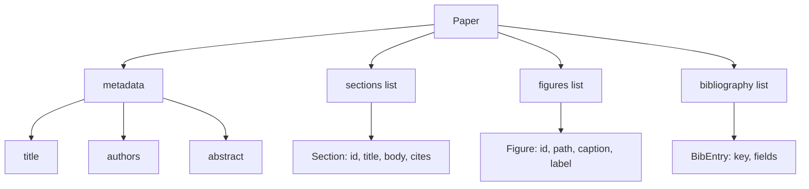
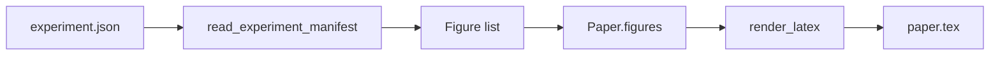
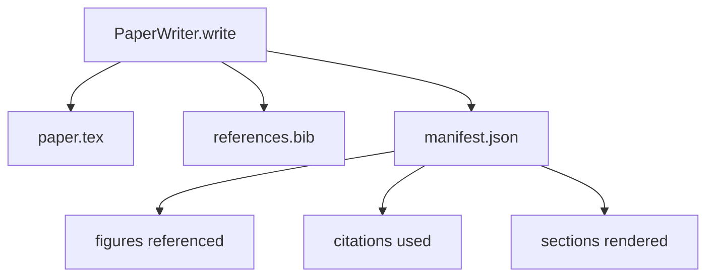

# 論文撰寫器

> 一份 LaTeX 骨架，是研究者與排版器之間的一紙契約。契約一破，文件就編不出來，而那次失敗很大聲。先把骨架建出來，再去填它。

**類型：** 實作
**程式語言：** Python
**先修單元：** 階段 19 第 50-53 課
**時間：** 約 90 分鐘

## 學習目標

- 把一篇研究論文當成一件帶已知章節圖的結構化產出物，而不是一份自由格式的文件。
- 產出一份 LaTeX 骨架，在任何散文寫下之前就宣告好它的摘要、章節、圖表插槽與參考文獻鍵。
- 透過一套確定性的插槽機制，把實驗輸出的圖（路徑與圖說）注入那份骨架。
- 接上一個模擬的散文產生器，從一份結構化大綱填滿每一節，好讓這套框架不必模型也測得了。
- 產出單一份 `paper.tex` 加一份 `references.bib`，再加一份列出「每一張被引用的圖與每一項被用到的引用」的清單。

```figure
ch-paper-skeleton
```

## 為什麼要先有骨架

一份從散文開始的草稿會累積結構債。引言長出三段本該放在相關研究裡的內容。某張圖在被定義之前就被引用了。參考文獻最後對同一篇論文有三個鍵。等到作者發現時，重寫的成本已經高過寫作的成本了。

骨架把這件事倒過來。結構一開始就被宣告成資料。章節是帶名稱與順序的插槽。圖是帶 id 與圖說的插槽。參考文獻鍵在最上面就連同它們所指向的條目一起宣告好。散文一次一個地被生成進那些插槽裡。在任何散文被寫下之前，這套框架就驗證得了：每一張圖都有插槽、每一項引用都有條目、每一節都出現在目錄裡。

這與先前課程套用在計畫、工具呼叫與軌跡上的，是同一套紀律。結構就是契約。

## Paper 的形狀



每一個欄位都是純粹的 Python 資料。渲染器是一個從 `Paper` 到 LaTeX 字串的純函數。這套框架在渲染之前就內省得了那篇論文：數章節、列出缺少的圖檔、檢查每一個 `\cite{key}` 都有相符的 `BibEntry`。

## 那份渲染契約

渲染器保證三項性質。第一，骨架裡每一個圖插槽都產出一個 `\begin{figure}` 區塊，帶一個 `fig:<id>` 形式的穩定標籤。第二，每一節都產出一個 `\section{}`，帶一個 `sec:<id>` 形式的穩定標籤，好讓交叉引用管用。第三，參考文獻產出一個 `\bibliography` 區塊，而它的 `references.bib` 恰好含有論文上所宣告的那些條目，不多也不少。

違反其中任何一項都是渲染錯誤，不是警告。骨架就是那紙契約；一次無聲丟掉某張圖的渲染，就是違約。

## 從實驗注入圖

本軌先前的課程把實驗輸出產成 JSON 清單。每份清單帶著一份含路徑與簡短圖說的產出物清單。論文撰寫器讀那份清單並產出 `Figure` 紀錄。



那次注入是確定性的。圖的 id 由實驗名稱加上一個單調計數器導出。圖說來自那份清單。路徑相對於論文的輸出目錄正規化，好讓實驗輸出坐在磁碟別處時 LaTeX 仍然編得出來。

## 那個模擬散文產生器

這一課不呼叫模型。一個 `MockProseGenerator` 讀一份大綱形狀，並確定性地產出散文。那份大綱形狀是每一節一段短字串。產生器把那段字串展開成兩小段，並把該節標題織進去。當大綱有宣告時，生成的散文就恰好提到那些圖與引用。

這足以測試撰寫器的每一項行為。真實的實作會把那個產生器換成一次模型呼叫。圍繞它的框架不會變。那就是把散文產生器宣告成一個可呼叫物的價值：測試代換一個確定性的、生產代換一個模型的，管線其餘部分完全相同。

## 那份清單輸出

撰寫器往輸出目錄產出三個檔案。



那份清單，就是下游的評估器或批評迴路所讀的東西。它不剖析 LaTeX；它讀那份清單。下一課，也就是那個批評迴路，把這份清單當輸入，並產出一份回饋清單。這就是為什麼那份清單是契約的一部分，而那份 LaTeX 不是。

## 驗證閘門

撰寫器在寫出任何檔案之前先跑四道閘門。

1. 每一個圖的 id 在論文之內都唯一。
2. 每一節的 `cites` 欄位所引用的參考文獻鍵，都在論文上有宣告。
3. 摘要不為空。
4. 標題不為空。

閘門失敗會拋出帶精確理由的 `PaperValidationError`。框架把那個理由當成失敗模式浮現出來。不會有部分寫入：要嘛三個檔案全部產出，要嘛一個都沒有。

## 怎麼讀那些程式碼

`code/main.py` 定義了 `Paper`、`Section`、`Figure`、`BibEntry`、`PaperValidationError`、`MockProseGenerator`、`PaperWriter`，以及一個 `render_latex` 函式。`write` 方法吃下一個輸出目錄，並產出 `paper.tex`、`references.bib` 與 `manifest.json`。`read_experiment_manifest` 這個輔助函式把一份實驗清單的清單，轉成 `Figure` 紀錄。

`code/tests/test_paper_writer.py` 涵蓋：沒有章節時的骨架渲染、帶兩節與兩張圖的完整渲染、缺少引用的閘門、圖 id 重複的閘門、清單的內容，以及那份 LaTeX 字串契約（每一節都產出一個 `\section{}`、每一張圖都產出一個 `\begin{figure}`）。

## 再往前走

真實實作會想要兩項擴充。第一，多格式渲染：同一份 `Paper` 形狀，能編成給部落格用的 Markdown 與給預覽用的 HTML。渲染器成了 `Paper` 上的一種策略。第二，引用充實：給定一份本地 DOI 快取，撰寫器依引用鍵去取回 BibTeX 條目。兩者都有價值，而且都能在不動到骨架契約的情況下加上去。

骨架就是那個賭注。章節、圖與引用被宣告成資料，散文被生成進插槽，清單與 LaTeX 一起產出。其他每一項改善都疊在它上面。
