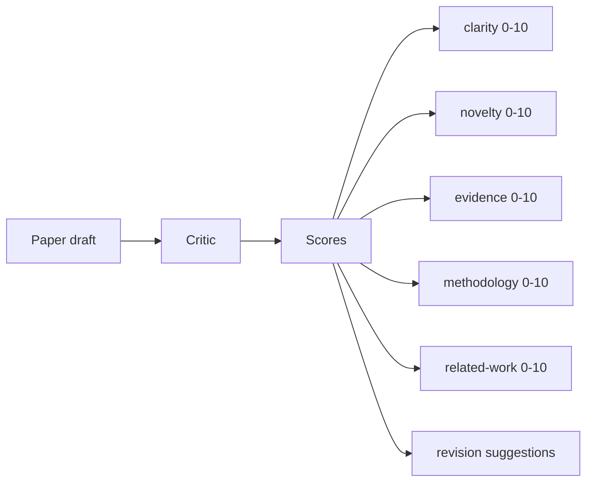
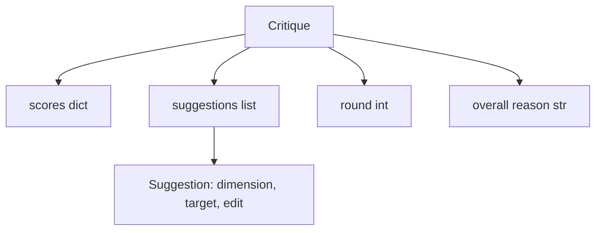
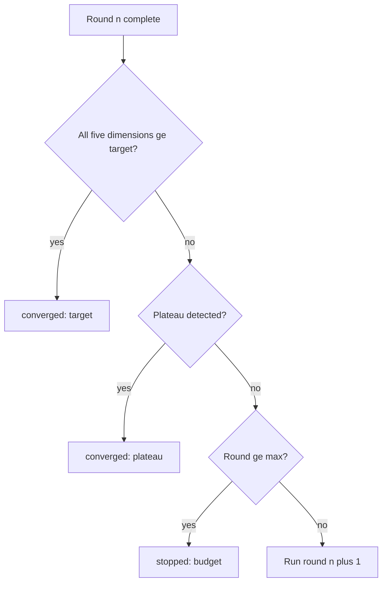
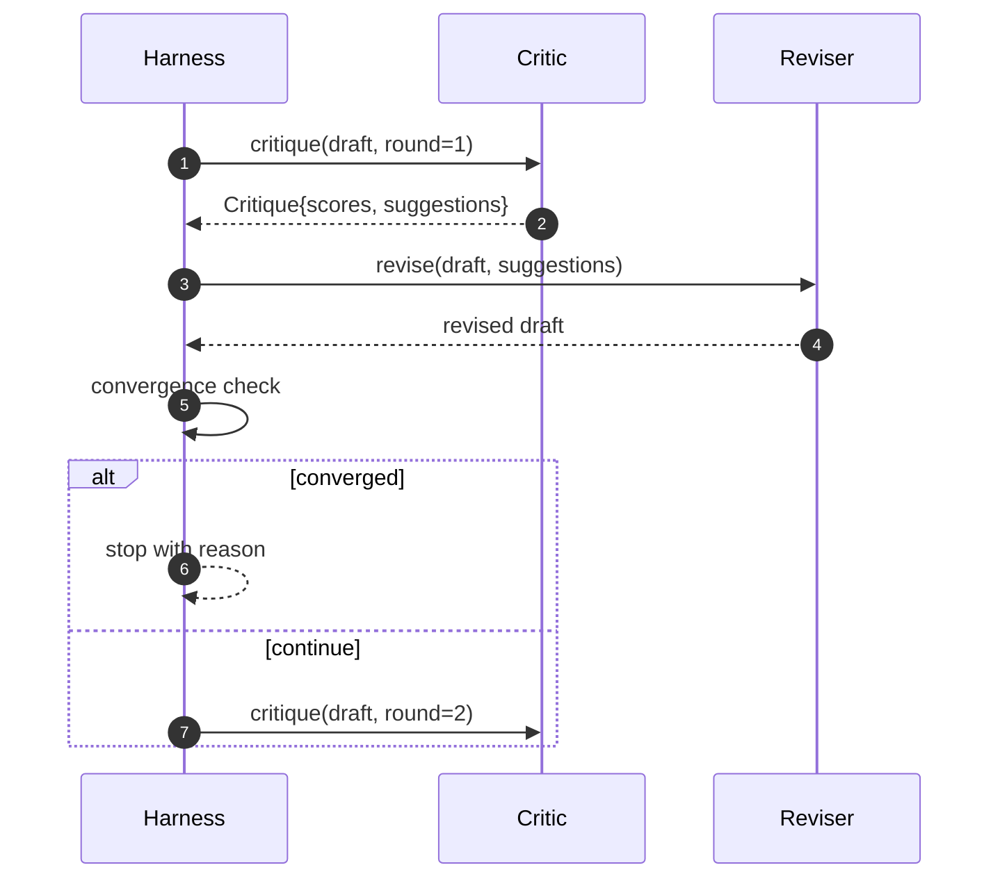

# 批評迴路

> 一個第一次就回「看起來不錯」的批評者是壞的。一個永遠回「還要再改」的批評者也是壞的。有意思的批評者是會收斂的那個，而收斂是你得工程出來的。

**類型：** 實作
**程式語言：** Python
**先修單元：** 階段 19 第 50-53 課
**時間：** 約 90 分鐘

## 學習目標

- 在五個固定維度上替一份論文草稿評分：清晰度、新穎度、證據、方法論、相關研究。
- 把每一輪的批評套用成一份結構化的修訂差異，而不是一次自由格式的重寫。
- 藉由比較跨輪次的分數來偵測收斂；在停滯、達標，或預算耗盡時停下。
- 用一個最大迭代預算把輪數封頂，好讓一個不收斂的批評者不會永遠跑下去。
- 產出一份逐輪的軌跡，好讓儀表板或下一階段能把分數軌跡畫出來。

```figure
ch-critic-converge
```

## 為什麼是五個固定維度

一個自由格式的批評者，是一個回傳一段建議文字的模型。下一輪的修訂把那段文字當成環境脈絡。那次重寫有沒有處理到那項批評，是查證不了的，因為那項批評從來就沒有結構。

五個維度給了框架一紙契約。



分數是一個向量。框架跨輪次盯著每一個維度。一次「拉高清晰度卻把證據砸掉」的修訂，就是證據上的一次退化，而收斂檢查看得見它。一個只有模型的批評者提供不了那份保證。

## Critique 的形狀



每一項建議都帶著它要改善的維度、它瞄準的章節，以及一個修訂者可以套用的 `edit` 指示。修訂者同樣是一個可呼叫物。這一課出貨一個確定性的修訂者，把那個編輯指示詮釋成一次「附加到某節」的操作。一個模型驅動的修訂者會把同一個欄位詮釋成一段提示詞。契約不變。

## 收斂規則，依序

批評迴路在三個條件之一觸發時終止。



達標是最嚴格的那個情況：五個維度（clarity、novelty、evidence、methodology、related_work）每一個都必須達到 `>= target_score`（預設 `8.0`），迴路才回報成功。平均很高但有一個維度很弱是不夠的。停滯偵測把當前這一輪的平均與前一輪的平均比較。若改善連續兩輪低於 `plateau_epsilon`（預設 `0.1`），迴路就以 `plateau` 退出。預算是輪數的硬性上限（預設 `5`），並以 `budget` 退出。

順序要緊。達標勝過停滯，停滯勝過預算。若第三輪在「同時也會觸發停滯」的那次迭代上達標了，結果就是 `target`，不是 `plateau`。

## 為什麼停滯偵測要跨兩輪

一輪的停滯是雜訊。一個真的批評者，就算在固定草稿上，每次迭代給的分數也會有點不同，因為確定性評分仍然取決於套用了哪些建議、以什麼順序套用。要求連續兩輪停滯，把那個雜訊濾掉了。若框架回報停滯，那份草稿就真的不再進步了。

## 這一課裡那個確定性批評者

這一課不呼叫模型。出貨的批評者是一個可呼叫物，依三種訊號替草稿評分：平均章節本文長度（清晰度）、圖數與引用數（證據），以及論文中繼資料上一個 `originality_tag` 欄位（新穎度）。修訂者知道怎麼把每個分數往上推。

```text
clarity      grows when the average section body length increases
novelty      grows when originality_tag is set to "high"
evidence     grows when a section's figure_refs is non-empty
methodology  grows when a section titled "Method" exists with body
related-work grows when a section titled "Related Work" exists with body
```

修訂者把每一項建議詮釋成一次針對性的附加。第一輪之後，框架就觀察得到分數往上走。那些測試用這項性質來斷言迴路縮小了那個差距。

## 完整的迴路契約



框架擁有輪數計數器、那份軌跡與那次收斂檢查。批評者擁有分數。修訂者擁有那份差異。這三者誰也不碰別人的狀態。

## 那份軌跡輸出

每一輪都產出一個軌跡事件，帶輪次編號、那個分數向量、建議數，以及那次收斂判定。完整的軌跡會與最終草稿一起回傳。下游的儀表板可以把「逐輪分數」的圖畫出來。下一課，也就是那個迭代排程器，讀那份軌跡來決定這條分支值不值得留著。

## 保護你不被壞批評者害到的預算

一個產出「永遠不會提升分數之建議」的批評者，會把迴路鎖死在最大迭代天花板上。那份軌跡讓這件事看得見：五輪、分數平坦、判定 `budget`。使用者把它讀成批評者的臭蟲，不是草稿的臭蟲。反過來，只把最終草稿呈現出來的做法，會把診斷藏起來。軌跡優先的設計把它攤開。

## 怎麼讀那些程式碼

`code/main.py` 定義了 `Critique`、`Suggestion`、`Critic` 協定、`Reviser` 協定、`CriticLoop`，以及一個 `make_deterministic_critic_pair` 工廠函式，回傳那個確定性批評者與一個相配的修訂者。裡面也收錄了一個最小的 `Paper` 形狀，好讓這一課自足。

`code/tests/test_critic_loop.py` 涵蓋：第一輪之後的單調改善、在一份調過的草稿上達標收斂、兩輪平坦之後的停滯偵測、沒有任何建議有幫助時的預算耗盡、修訂者對建議的套用，以及軌跡的形狀。

## 再往前走

真實實作會想要兩項擴充。第一，維度權重：投工作坊的論文會把新穎度看得比方法論重；投期刊則相反。收斂檢查就變成一個加權平均。第二，成對批評者：一個批評者評分，第二個批評者在修訂者看到那些建議之前先做裁決。兩者都有價值，而且都在同一份 `Critique` 形狀上組合得起來。

那個賭注是那個分數向量。一旦批評被結構化，其他每一項改善 —— 收斂規則、儀表板、成對批評者 —— 都不必改動迴路就插得進來。
