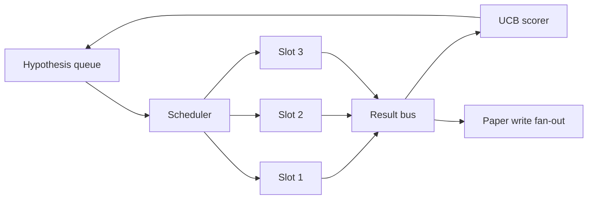
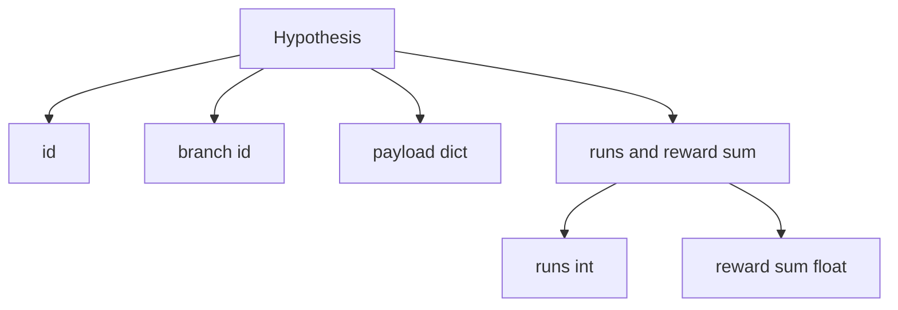
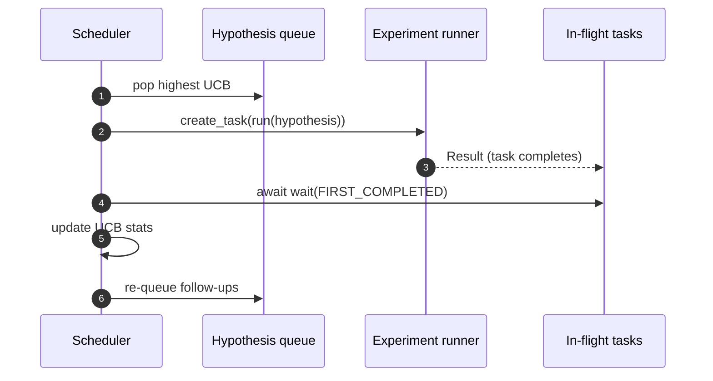

# 迭代排程器

> 一條沒有排程器的研究迴路，是一份帶著妄想的佇列。排程器就是迴路決定「停止探索什麼」的地方，而那個決定就是整場遊戲。

**類型：** 實作
**程式語言：** Python
**先修單元：** 階段 19 第 50-53 課
**時間：** 約 90 分鐘

## 學習目標

- 把一條研究工作流建模成：一份假說佇列餵給多個平行實驗槽位，其結果再扇回來。
- 用 asyncio 並行跑多個實驗，好讓排程器能讓所有槽位都忙著。
- 用 UCB 替每一條假說分支評分，好讓排程器能在不放棄探索的前提下修剪掉低產出的分支。
- 把完成的結果扇出到一個論文撰寫階段與一個重新入列階段，好讓一條高產出分支孵出後續假說。
- 呈現一份帶分支分數、槽位佔用率與修剪決策的逐迭代軌跡。

## 為什麼要排程器，而不是待辦清單

一份平坦的待辦清單依提交順序跑工作。當每項工作彼此獨立時那沒問題。研究並不獨立：實驗三的一項發現，會改變實驗四與實驗五的優先順序。一個會讀結果扇入並重新排序佇列的排程器，在每單位運算裡完成更多有用的工作。

有意思的設計抉擇在那條評分規則上。一個貪婪的評分器永遠挑當前的領先者，從不探索。一個均勻的評分器從不利用。UCB（信賴上界）是中間路線：利用領先者的同時，替那些被試得較少的分支保留容量。

## 這套系統的形狀



佇列裝著假說。槽位一空出來，排程器就挑 UCB 最高的假說。每個槽位非同步地跑一個實驗。完成的實驗把它的結果扇到那條匯流排上。匯流排更新來源分支的 UCB 統計，並在某條分支的產出跨過門檻時扇出到論文撰寫階段。

## Hypothesis 的形狀



`branch` 是 UCB 統計的鍵。多個假說可以共用一條分支（分支是那個研究方向；假說是它裡面的一次試驗）。`runs` 是該分支已完成的實驗數，`reward_sum` 是累積獎勵。UCB 兩個都讀。

## UCB 評分

這一課用的 UCB 公式是經典的 UCB1。

```text
ucb(branch) = mean_reward(branch) + c * sqrt( ln(total_runs) / runs(branch) )
```

`total_runs` 是所有分支上已完成實驗的總數。`c` 是探索權重；這一課預設 `sqrt(2)`。跑過零次的分支拿到 `+inf`，所以沒試過的分支永遠最先被排。平均獎勵高的分支會維持高分，直到其他分支追上；跑了很多次卻沒什麼獎勵的分支，則會被跑得較少的替代選項蓋過去。

修剪閘門與挑選器是分開的。當一條分支在至少 `prune_after_runs` 次試驗（預設 `3`）之後，平均獎勵掉到一個絕對地板（預設 `0.2`）以下時，修剪就把它從未來的排程中移除。這讓佇列保持有界。

## 用 asyncio 做平行槽位

排程器用 `asyncio.create_task` 驅動實驗。每個任務跑那個實驗執行器（一個 `async def` 的可呼叫物），並回傳一份 `Result`。主迴路用 `asyncio.wait(..., return_when=asyncio.FIRST_COMPLETED)` 等在那組飛行中的任務上，並在每次完成時觸發評分更新。



三個槽位並行地跑。主迴路從不阻塞在單一個實驗上。槽位一空出來，排程器就繼續啟動新任務，直到佇列空了且沒有任務還在飛。

## 扇出：論文觸發

當某條分支的平均獎勵跨過 `paper_threshold`（預設 `0.7`），而那條分支還沒產出過論文時，排程器就把一個 `paper.trigger` 事件扇到一份輸出清單上。下游第五十四課的論文撰寫器會把它接走。在這一課裡，那個觸發被捕捉成一份清單，好讓測試能斷言它。

## 扇出：後續假說

當一份高產出的結果落地時，排程器可以呼叫使用者提供的 `expander`，在同一條分支上產出一個或多個後續假說。這個擴充器是一個從 `Result` 到 `list[Hypothesis]` 的純函數。這一課出貨一個確定性的擴充器，對任何獎勵超過論文門檻的結果產出兩個後續假說。

## 預算

有兩份預算保護排程器不陷入失控迴路。

```text
max_experiments    : total count of experiments run across all branches
max_seconds        : wall-clock cap (asyncio time)
```

任一項觸發時，排程器就停止排新任務、等完飛行中的那些，並回傳最終軌跡。那份軌跡包含一個 `stop_reason`。

## 那份軌跡與最終報告

每一次排程決策（挑選、派送、結果、修剪、扇出）都產出一個事件。最終報告摘要出逐分支的統計、總執行數、總實際時間，以及觸發過的論文觸發。下一課，也就是那個端到端示範，讀這份報告來驅動論文撰寫器。

## 怎麼讀那些程式碼

`code/main.py` 定義了 `Hypothesis`、`Result`、`BranchStats`、`IterationScheduler`，以及一個 `make_deterministic_runner` 工廠函式，回傳一個帶可預測獎勵的 asyncio 實驗執行器。那個執行器睡固定的 `delay_ms`（預設 `5ms`），好讓並行性看得見。

`code/tests/test_scheduler.py` 涵蓋：UCB 先挑沒試過的分支、平行槽位的佔用、跨過門檻時的論文觸發、低產出試驗後的分支修剪、扇出後續假說，以及預算退出（實驗數與實際時間兩者）。

## 再往前走

真實實作會想要三項擴充。第一，跨工作階段持久化的 UCB 統計：目前的統計住在記憶體裡；真實的排程器會替它們做檢查點，好讓重啟保住已經花掉的探索預算。第二，多目標評分：不是一個純量獎勵，而是每份結果都產出一個向量，於是 UCB 變成一個柏拉圖式的挑選器。第三，脈絡式吃角子老虎：挑選器以假說特徵（長度、複雜度）為條件，好讓相似的假說共用探索。

排程器就是那個讓研究不只是一份待辦清單的地方。一旦 UCB 接上、槽位並行地跑起來，其他每一項改善都疊在它上面。
