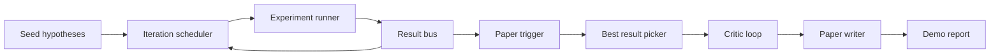
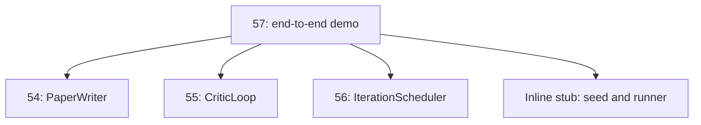
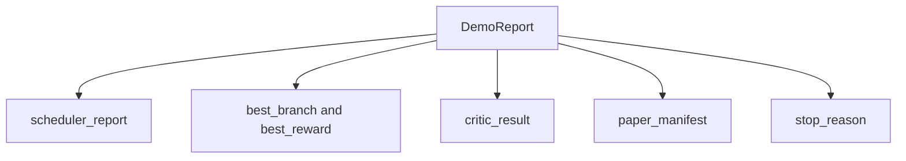

# 端到端研究示範

> 示範是每一份你先前寫下的契約都必須組合起來的地方。只要其中任何一份漏了，示範就是抓到它的那一課。

**類型：** 實作
**程式語言：** Python
**先修單元：** 階段 19 第 50-53 課
**時間：** 約 90 分鐘

## 學習目標

- 把自動研究迴路端到端接起來：假說種子、實驗執行器、排程器、批評迴路、論文撰寫器。
- 透過純粹的 Python 匯入，把先前四堂 D 軌課程的原語組合起來，不用框架。
- 讓迴路跑到一個會自我終止的結尾，並產出單一份列出每個階段輸出的示範報告。
- 讓這個示範保持確定性，好讓測試套件能斷言最終形狀。
- 在任何階段的契約破掉時浮現一個清楚的失敗模式，好讓下一階段不會帶著壞掉的輸入去跑。

## 這裡組合了什麼



五個階段。種子是一份三個假說的清單。排程器以三個平行槽位在它們之上跑六個實驗。匯流排回報一個或多個論文觸發。挑選器選出唯一那份最佳結果。批評迴路在一份由該結果建出來的草稿上迭代。論文撰寫器產出最終的 LaTeX、BibTeX 與清單。

## 為什麼是匯入，不是複製

先前每一課都出貨一個帶公開 dataclass 與函式的 `main.py`。示範藉由把 `sys.path` 調到各課的父目錄來匯入它們。這不是框架接線；這與先前各課測試檔案早就在用的匯入方式一樣。



那個內聯存根代替第五十到五十三課：一個小型的種子假說產生器與一個同步的獎勵函數。使用者只要調整兩處匯入，就能把那個內聯存根換成那些課裡真正的原語。

## 確定性的保證

這個示範就構造而言是確定性的。實驗執行器是設過種子的 numpy。批評迴路的修訂者以固定順序走過固定維度。論文撰寫器的散文產生器，是第五十四課那個模擬的。排程器的 UCB 挑選器以迭代順序、而不是隨機選擇來打破平手。

在同樣的種子下，示範產出同樣的報告。測試以「跑兩次示範並比較清單」來斷言這項性質。

## 那份示範報告的形狀



每一個欄位都原封不動地來自上游階段。示範不轉換任何輸出；它只組合它們。那就是這個示範所做的測試。

## 失敗模式的處理

每一個階段要嘛成功、要嘛拋出一個型別化的錯誤。

```text
Scheduler ........ returns SchedulerReport with stop_reason
                   in {queue_empty, max_experiments, deadline}
Best-result pick . raises NoTriggerError if no paper trigger fired
Critic loop ...... returns LoopResult with status converged or stopped
Paper writer ..... raises PaperValidationError on contract break
```

任何階段的一次失敗，都會以一個型別化例外把示範短路掉。那些測試把這份契約釘住：`test_no_triggers_raises_typed_error` 與 `test_best_picker_raises_when_no_triggers` 斷言，在沒有任何分支觸發時挑選器會拋出 `NoTriggerError` / `BestResultError`，而撰寫器從不被呼叫。

## 那個最佳結果挑選器

排程器逐分支產出論文觸發。挑選器選出所有觸發之中平均獎勵最高的那條分支。平手時依分支 id 的字母序打破，好讓示範保持確定性。挑選器是一個小小的純函數；測試在一份固定的排程器報告上把它釘住。

## 接上批評迴路

第五十五課的批評迴路作用在一個 `MiniPaper` 上。示範從被挑中的分支建出一個 `MiniPaper`：用分支 id 填摘要、種下兩節（Introduction 與 Results），並依那條分支的平均獎勵設定 `originality_tag`（`>= 0.8` 為 high、`>= 0.6` 為 medium，其餘為 low）。

修訂者接著把那份草稿迭代到收斂。輸出送進論文撰寫器。

## 接上論文撰寫器

第五十四課的論文撰寫器作用在完整的 `Paper` 形狀上，含圖與參考文獻。示範透過 `mini_to_full_paper` 把收斂後的 `MiniPaper` 升級上去，它會替被選中的分支附上一張圖，以及一份由批評者所建議引用鍵之聯集所建出的小型合成參考文獻。示範加進去的每一個引用，也都會被加進參考文獻清單，所以驗證會通過。

## 怎麼讀那些程式碼

`code/main.py` 定義了 `BestResultError`、`NoTriggerError`、`DemoReport`、`pick_best_branch`、`build_mini_paper`、`mini_to_full_paper` 與 `run_demo`。檔案頂端的匯入把 `sys.path` 調整一次，並從各課拉進 `PaperWriter`、`CriticLoop` 與 `IterationScheduler`。

`code/tests/test_e2e.py` 涵蓋：示範端到端跑起來並產出一份五個欄位都填好的報告、跨兩次執行的確定性、沒有分支跨過門檻時的 NoTriggerError、撰寫器契約破掉時的 PaperValidationError、論文清單含有被挑中分支的那張圖，以及排程器的停止理由落在預期值之中。

## 再往前走

示範轉綠之後，有三項擴充值得接上去。第一，持久化狀態：每個階段的結果寫進一個小型 JSON 儲存，好讓重啟能在不重跑那些便宜階段的情況下續跑。第二，一個儀表板：排程器與批評迴路的軌跡事件，渲染成同一條時間軸。第三，真實的模型呼叫：把那個模擬的散文產生器與那個確定性批評者，換成模型驅動的；接線方式不變。

這個示範的工作，是證明「組合就是架構」。五課、四次匯入、一份報告。下次你加一個階段時，接線只會多出剛好一行。
