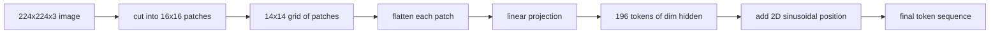

# 視覺編碼器的圖塊

> 一個要讀像素的視覺模型，需要一個給像素用的分詞器。圖塊嵌入就是那個分詞器。把影像切成一格格的方塊、把每個方塊攤平、讓它通過一個線性層，再加上一份 2D 位置訊號，好讓 transformer 知道每個方塊原本坐在影像的哪裡。

**類型：** 實作
**程式語言：** Python
**先修單元：** 階段 19 第 30-37 課（B 軌基礎）
**時間：** 約 90 分鐘

## 學習目標

- 把一張影像分詞成一段定長的圖塊嵌入序列。
- 實作一個以 `Conv2d` 為基礎的圖塊投影，讓它與「先 unfold 再線性」的數學相符。
- 建出一份確定性的 2D 正弦位置嵌入，好讓詞元順序編碼出空間位置。
- 在一份合成固定資料上，驗證圖塊數、嵌入形狀，以及 `Conv2d` 與 unfold 的等價性。

## 那個問題

Transformer 吃的是一串向量。影像是一張三通道的網格。把每個像素當成一個詞元讀，序列長度就爆炸了：一張 224x224 的 RGB 影像是 150,528 個詞元，一個 12 層的 transformer 在注意力上負擔不起。把影像當成一個巨大的扁平向量來讀，則丟掉了局部性，而注意力層救不回來。編碼器前端的工作，是把像素網格壓成幾百個各自摘要一塊方形區域的詞元。

圖塊嵌入用一次線性投影解決這件事。一張 224x224 的影像切成 16x16 的圖塊，產出一張 14x14、共 196 塊的網格。每一塊從 `(3, 16, 16) = 768` 個像素值攤平成一個向量，再由一個線性層把它對映到模型的隱藏維度。Transformer 看到的是 196 個維度為 `hidden`（通常是 768）的詞元，加上一個 CLS 詞元。那是網路其餘部分嚼得動的序列。

## 那個概念



### 為什麼是圖塊，不是像素

注意力對序列長度是二次的。一段 196 詞元的序列，每個頭每一層要付 `196 * 196 = 38,416` 個注意力分數；一段 150,528 詞元的序列要付 `150,528 * 150,528 = 226 億`。圖塊在注意力運算上買到了 59 萬倍的縮減，而單一塊 16x16 區域對高層次視覺任務而言帶著足夠的訊號。代價是損失了單一塊圖塊內部細緻的空間細節，這也是為什麼當精細定位很要緊時，下游的多模態堆疊常常會再跑一條高解析度分支。

### 為什麼一次線性投影就夠

每一塊圖塊都被當成一個獨立向量對待。那次投影學到的是一組基底：邊緣偵測器、色彩濾波器、簡單紋理。單一個線性層很小（ViT-Base 是 `768 * 768 = 589,824` 個參數），而且訓練得快。更深的卷積前段是存在的（那個「混合式」ViT），但扁平的線性投影才是標準，而多數現代開放權重編碼器出貨時用的就是這個確切形狀。

### `Conv2d` 這個技巧

一個 `Conv2d(in_channels=3, out_channels=hidden, kernel_size=patch_size, stride=patch_size)`、不做填補，給出的數值結果與「先 unfold 再線性」相同，因為每一個輸出位置都是把圖塊像素與一個濾波器做內積。那個卷積就是那次圖塊投影，而多數生產程式碼庫就是這樣出貨的，因為它在 GPU 上更快，而且少用一次 reshape。

### 位置嵌入

詞元從投影出來時不帶順序。那份 2D 正弦嵌入替每個詞元給一份固定訊號，編碼它的 `(row, col)` 位置。嵌入維度的一半以多重頻率的 sin/cos 編碼列位置；另一半編碼行位置。這份編碼是確定性的，所以你可以在不重新訓練的情況下換解析度，而且它能乾淨地內插到模型在訓練時從沒見過的網格上。

| 元件 | 形狀 | 參數 |
|-----------|-------|------------|
| 圖塊投影（`Conv2d`） | `(hidden, 3, patch, patch)` | `3 * P * P * hidden + hidden` |
| 位置嵌入（固定） | `(num_patches, hidden)` | 0（算出來的，不是學出來的） |
| CLS 詞元（學出來的） | `(1, hidden)` | `hidden` |

以 224 解析度的 ViT-Base/16 而言：投影裡有 590,592 個參數、CLS 詞元 768 個，而正弦位置為零。下一課（59）在這個前端之上疊一個 12 層的 transformer。

### 把等價性當成健全性檢查

圖塊那一步有兩種寫法：一個 `Conv2d` 投影，以及一個明確的「先 unfold 再線性」。在同樣的權重下，它們必須產出同樣的輸出。若不然，那個 unfold 的數學就錯了，而編碼器其餘部分是蓋在沙上的。這一課的測試演練了那份等價性。

## 動手建

`code/main.py` 實作：

- `PatchEmbed`，一個把 `Conv2d` 包起來做圖塊投影的 `nn.Module`。
- `sinusoidal_2d(grid_h, grid_w, dim)`，一個建出 2D 位置表的無狀態函式。
- `VisionFrontEnd`，把圖塊嵌入、CLS 前置與位置相加組合成一次前向傳遞。
- 一個 `synthesize_image(seed)` 輔助函式，用 `numpy.random` 建出一份確定性的 224x224x3 固定資料。
- 一個示範，把一張固定影像跑過那個前端，並印出輸出形狀、CLS 詞元的範數，以及位置嵌入的一列。

跑它：

```bash
python3 code/main.py
```

輸出：那張 224x224 的固定影像被分詞成形狀為 `(1, 197, 768)` 的序列。第一個詞元是 CLS；接下來 196 個是圖塊詞元。位置嵌入的範數在同一列之內是均勻的，那就是正弦的簽名。

## 動手用

同一個圖塊前端出現在每一個現代視覺語言模型裡：CLIP ViT-L/14、SigLIP、DINOv2、Qwen-VL 家族，以及 InternVL 堆疊，全都從一個 `Conv2d` 圖塊投影加一份位置訊號開始。各家族之間的差異住在下游（CLS 對無 CLS 的池化、暫存詞元、14 或 16 的不同圖塊大小、透過內插位置做的動態解析度）。這一課的前端，就是那每一個模型所站立的基底。

## 測試

`code/test_main.py` 涵蓋：

- 圖塊數與 `(image_size / patch_size) ** 2` 相符
- 輸出形狀與 `(batch, num_patches + 1, hidden)` 相符
- 在一份小型固定資料上，`Conv2d` 投影等於手動的「先 unfold 再線性」
- 正弦位置表在各次呼叫間都是確定性的
- CLS 詞元跨批次維度廣播且不外洩

跑它們：

```bash
python3 -m unittest code/test_main.py
```

## 練習

1. 把那個正弦位置換成一個學出來的 `nn.Parameter`，並在一項極小的合成分類任務上比較第一個訓練週期的損失。在固定解析度下學出來的位置勝出；當你在訓練後換解析度時，正弦勝出。

2. 把 `Conv2d` 換成一個明確的 `nn.Unfold` 加 `nn.Linear`，並斷言兩者輸出在浮點容差之內相符。同樣的數學，兩種寫法。

3. 加上非正方形圖塊大小的支援（例如給寬幅輸入用的 32x16），並驗證那份位置表處理得了非正方形網格。

4. 在批次大小 1、8、64 上替圖塊那一步做效能剖析。圖塊投影很少是瓶頸；下游的注意力層才是主導。

5. 在一份四類別的合成形狀資料集（圓形、方形、三角形、星形）上，把這個前端當成凍結的特徵抽取器來訓練。CLS 詞元的輸出應該線性可分。

## 關鍵術語

| 術語 | 它的意思 |
|------|---------------|
| 圖塊 | 影像的一塊方形子區域，典型是 14x14 或 16x16 |
| 圖塊嵌入 | 把一塊攤平的圖塊線性投影到隱藏維度 |
| 序列長度 | 圖塊分詞之後的詞元數，通常再加上 CLS |
| 正弦位置 | 編碼 2D 網格座標的固定 sin/cos 訊號 |
| CLS 詞元 | 前置到序列上、當成池化頭的可學習向量 |

## 延伸閱讀

- An Image is Worth 16x16 Words（ViT，2021），了解最初那套圖塊嵌入的框架。
- Attention Is All You Need（2017），了解這裡被改編成 2D 的那條正弦位置公式。
- DINOv2 論文，了解暫存詞元，那是你可以當成第 6 題練習加上去的擴充。
