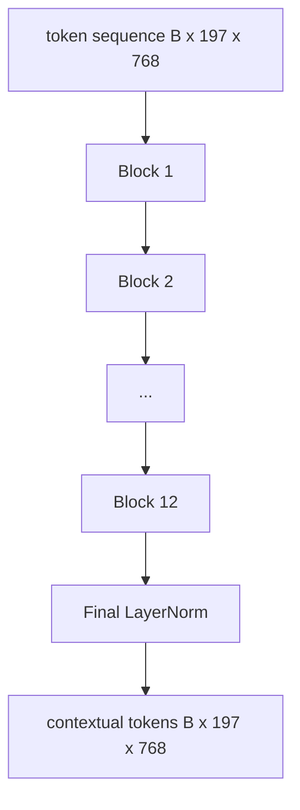
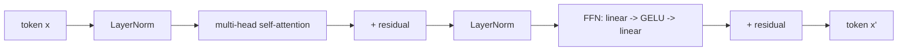

# 視覺 Transformer 編碼器

> 光有圖塊看不見東西。一個 12 層、12 個注意力頭的 pre-LN transformer，把那串圖塊詞元變成一串帶脈絡的詞元，而 CLS 詞元則在它最終的隱藏狀態裡池化出整張影像的特徵。這一課是每一個現代視覺語言模型的引擎室。

**類型：** 實作
**程式語言：** Python
**先修單元：** 階段 19 第 30-37 課（B 軌基礎）
**時間：** 約 90 分鐘

## 學習目標

- 實作一個帶多頭自注意力與前饋子層的 pre-LN transformer 區塊。
- 疊出 12 個區塊、12 個頭，構成一個 ViT-Base 編碼器。
- 把第 58 課的圖塊前端接進編碼器，並跑一次前向傳遞。
- 驗證 CLS 詞元確實從每一塊圖塊彙總了資訊。

## 那個問題

圖塊嵌入產出一串 197 個詞元，每一個都是一個對其他圖塊毫無察覺的向量。一張貓的照片，需要每一塊圖塊都知道哪些圖塊含有鬍鬚、哪些是背景、哪些是眼睛。Transformer 就是那個一層注意力接一層地建起那份察覺的機制。少了它，圖塊前端就是一個沒有理解力的聰明分詞器。

那份標準配方是十二個區塊深、十二個頭寬，配上前置 LayerNorm 的擺法、GELU 激活，以及 4 倍的前饋擴張。那份配方是 CLIP ViT-L、SigLIP、DINOv2、Qwen-VL 家族、InternVL，以及 2025-2026 年每一個其他開放權重視覺編碼器的脊椎。這份配方穩定到你可以讀任何一篇那些論文，並假設就是這個區塊形狀，除非它們明說不是。

## 那個概念





### Pre-LN 對上 post-LN

原始的 Transformer 把 LayerNorm 擺在殘差之後。Pre-LN（LayerNorm 擺在每個子層之前）是每一個現代視覺語言模型在用的版本，因為它不必靠學習率暖身花招就訓練得穩。差別只在前向傳遞裡的一行，而在深度 12 以上的梯度流動則是天差地別。

### 多頭自注意力

每個頭把詞元向量投影成自己的 `(query, key, value)` 三元組，維度為 `head_dim = hidden / num_heads`。在 `hidden = 768`、`heads = 12` 之下，每個頭的 `dim = 64`。那 12 個頭平行地做注意力，然後它們的輸出串接回 768 維，並通過一個輸出投影。多頭的重點在於：一個頭可以學「注意貓的眼睛」，而另一個學「注意背景漸層」，彼此不干擾。

### 為什麼是 4 倍的前饋擴張

那個 FFN 走 `hidden -> 4 * hidden -> hidden`，中間夾 GELU。4 這個倍數是經驗性的，而且自 2017 年起在語言與視覺 transformer 上都站得住。更小（2 倍）會欠擬合；更大（8 倍）在固定資料預算下會過擬合。MLP 是模型存放大部分已學事實的地方，而那個更寬的中段就是它們坐的位置。

| 元件 | ViT-Base 規模下的參數 |
|-----------|------------------------------|
| 每區塊的 qkv 投影 | `3 * 768 * 768 = 1.77M` |
| 每區塊的輸出投影 | `768 * 768 = 590K` |
| 每區塊的 FFN（4 倍擴張） | `2 * 768 * 4 * 768 = 4.72M` |
| 每區塊的 LayerNorm | `4 * 768 = 3K` |
| 每區塊合計 | 約 7.1M |
| 12 個區塊 | 約 85M |
| 加上前端 | 合計約 86M |

ViT-Base 是一個 8600 萬參數的編碼器。以 2026 年的標準來說那很小（SigLIP-So400M 是 4 億、Qwen-VL 的 ViT 是 6.75 億），但架構在寬度與深度之外完全相同。

### 要不要因果遮罩？

視覺 Transformer 是純編碼器且雙向的：對任意一對而言，詞元 `i` 都可以注意詞元 `j`。沒有遮罩。第 61 課解碼器那一側的交叉注意力會用因果遮罩，但在視覺編碼器內部，注意力是全連接的。

### CLS 詞元學到什麼

CLS 詞元一開始是一個可學習參數、自己不帶任何圖塊內容，並透過每一個區塊的注意力累積資訊。到了最後一層，那一列 CLS 就是整張影像的向量摘要；下游的頭把這單一個向量投影成類別 logits、對比嵌入，或供文字解碼器使用的交叉注意力鍵。

## 動手建

`code/main.py` 實作：

- `MultiHeadSelfAttention`，帶 `qkv` 與輸出投影、那套縮放點積注意力數學，以及形狀斷言。
- `FeedForward`，那個 4 倍擴張的 GELU MLP。
- `Block`，一個把注意力與前饋子層連同殘差組合起來的 pre-LN 區塊。
- `ViT`，一疊 12 個區塊加上一個最終 LayerNorm。
- `VisionEncoder`，把第 58 課的 `VisionFrontEnd` 接到那疊 `ViT` 上，並暴露一個回傳「帶脈絡序列與池化後 CLS 向量」的 `forward()`。
- 一個示範，把一張合成的 224x224 固定影像跑過完整編碼器，並印出輸入形狀、輸出形狀、參數量，以及每隔一層的 CLS 範數。

跑它：

```bash
python3 code/main.py
```

輸出：那張固定影像被編碼成一個 `(1, 197, 768)` 的張量。隨著各層組合，CLS 範數往上飄，然後在最終 LayerNorm 處穩定下來。總參數量回報約 8600 萬。

## 動手用

這裡定義的編碼器，在寬度與深度之外，就是 2025-2026 年每一個開放權重 VLM 內部出貨的那疊區塊。差異住在：

- **寬度與深度。** ViT-Large 是 `hidden=1024, depth=24, heads=16`；SigLIP So400M 是 `hidden=1152, depth=27, heads=16`。同一個區塊。
- **池化頭。** CLS 池化（這一課）對上平均池化（SigLIP）對上注意力池化（較後期的 VLM）。
- **位置處理。** 固定正弦（第 58 課）對上學出來的 1D、對上 ALiBi、對上 2D RoPE。區塊的數學不變。
- **暫存詞元。** DINOv2 額外前置 4 個學出來的詞元。一行程式碼。

這疊區塊就是那個基底。接下來幾課（60-63）站在它之上。

## 測試

`code/test_main.py` 涵蓋：

- 單一區塊保住形狀，且對輸入批次大小不變
- 注意力分數沿鍵軸加總為一（softmax 的健全性）
- 殘差路徑有接上（零輸入仍透過 CLS 詞元產出非零輸出）
- 一次四層堆疊的前向傳遞產出正確形狀
- 梯度從 CLS 輸出流回圖塊投影

跑它們：

```bash
python3 -m unittest code/test_main.py
```

## 練習

1. 加上暫存詞元（在 CLS 之後前置 4 個學出來的向量）並重跑。透過最後一層 softmax 分布的熵，比較注意力圖的平滑度。

2. 把 pre-LN 換成 post-LN，並在一個合成形狀分類器上訓練一個週期。觀察哪一個在沒有學習率暖身時仍訓練得穩。

3. 把因果遮罩實作成一個 `attn_mask` 參數，好讓同一個區塊也能當解碼器區塊重複使用。遮罩形狀是 `(seq, seq)`，下三角。

4. 用 `torch.profiler` 在批次大小 1、8、64 上替一次前向傳遞做效能剖析。主導實際時間的是 MLP 層，不是注意力。

5. 把某一個注意力頭的 q-k-v 投影換成一個低秩的 LoRA 轉接器、凍結其餘部分，並驗證梯度只流到你預期的地方。

## 關鍵術語

| 術語 | 它的意思 |
|------|---------------|
| Pre-LN | LayerNorm 套用在每個子層之前，而不是之後 |
| 自注意力 | 每個詞元都去注意同一序列中的每一個其他詞元 |
| 多頭 | 隱藏維度被切給 `H` 個各自獨立的注意力頭 |
| FFN 擴張 | 前饋層先加寬到 `4 * hidden` 再收縮回來 |
| CLS 池化 | 用第一個詞元的最終隱藏狀態當作影像摘要 |

## 延伸閱讀

- An Image is Worth 16x16 Words（ViT，2021），了解那份編碼器配方。
- DINOv2（2023），了解暫存詞元與那套自監督預訓練目標。
- SigLIP（2023），了解那個平均池化變體，以及第 62 課會用到的 sigmoid 對比損失。
