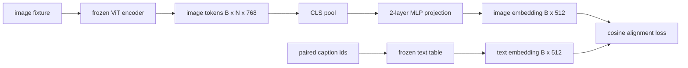

# 供模態對齊用的投影層

> 一個視覺編碼器產出影像詞元。一個文字解碼器消費文字詞元。兩者住在不同的向量空間裡。一個小小的兩層 MLP 把影像詞元投影進文字嵌入空間，而一個對著配對字幕的餘弦對齊損失，把兩個空間拉到一致。那次投影是視覺語言模型裡最小的一塊，也是對遷移最要緊的一塊。

**類型：** 實作
**程式語言：** Python
**先修單元：** 階段 19 第 30-37 課（B 軌基礎）
**時間：** 約 90 分鐘

## 學習目標

- 建出一個把影像特徵對映進文字嵌入空間的兩層 MLP 投影。
- 建構一張模擬的文字嵌入表（沒有預訓練分詞器、沒有真實語料）。
- 在投影後的影像詞元與配對字幕嵌入之間計算餘弦對齊損失。
- 在視覺編碼器與文字表都凍結的情況下，只訓練那個投影。

## 那個問題

你有一個視覺編碼器（第 58-59 課），產出維度為 `vision_hidden = 768` 的詞元。你有一個想接上去的文字解碼器，其嵌入維度是 `text_hidden = 512`（換成其他數字同樣說得通）。解碼器期待的是文字形狀的詞元。影像詞元不是文字形狀的：它們住在編碼器在純視覺預訓練中學到的一組基底裡，與解碼器的詞向量毫無關係。

兩層 MLP 投影（線性、GELU、線性）搭起那道橋。它小到（約 `768 * 1024 + 1024 * 512 = 130 萬` 個參數）能在單一張 GPU 上幾分鐘內訓練完，而且它是對齊階段裡唯一需要學習的那一塊。視覺編碼器維持凍結。文字嵌入表維持凍結。只有那個投影會動。這就是 LLaVA 在 2023 年出貨的配方，BLIP-2 把它重新框成一個 Q-Former，而其後每一個開放權重 VLM 都以某種形式採用了它。

## 那個概念



### 投影前先池化

視覺編碼器產出 197 個詞元。文字那一側只有單一個字幕層級的嵌入。要把它們對齊，你每個樣本需要一個影像層級的向量。CLS 池化最簡單：從編碼器取第一個詞元再投影它。對全部 197 個詞元做平均池化是另一個選項，而那正是 SigLIP 用的。兩者都把 197 個向量池化成一個。

### 為什麼是兩層而不是一層

單一個線性投影能旋轉與重新縮放，但若兩個空間的曲率不匹配，它就修不了那組基底。在兩個線性層之間夾一個 GELU，給了那次投影一次非線性的彎折，而在經驗上那足以把 CLIP 風格的特徵對齊到語言模型嵌入上。更深的投影（LLaVA-NeXT 用了 GLU；Qwen-VL 用了一疊注意力層）是擴充；兩層 MLP 才是那個經典基線，也是 BLIP-2 的 Q-Former 投影頭底下實際出貨的東西。

| 層 | 形狀 | 參數 |
|-------|-------|------------|
| fc1 | `(vision_hidden, projection_hidden)` | `768 * 1024 + 1024` |
| 激活 | GELU | 0 |
| fc2 | `(projection_hidden, text_hidden)` | `1024 * 512 + 512` |

一個 `768 -> 1024 -> 512` 的頭大約 130 萬個參數。

### 餘弦對齊損失

對齊不代表 `image_emb == text_emb`。對齊代表 `image_emb` 在那個聯合空間裡與 `text_emb` 指向同一個方向。那個餘弦損失是 `1 - cos_sim(image, text)`，範圍從 0（完美對齊）到 2（相反）。訓練把每一對推向零。第 62 課推廣到一個對比批次（InfoNCE），其中每一張影像都必須比批次裡任何其他字幕更靠近它自己的字幕；這一課用的是逐對版本，好讓那些動態看得見。

### 凍結編碼器才是那個訣竅

視覺編碼器有 8600 萬個參數。文字表另有幾百萬。從一份模擬語料把它們全部訓起來根本不可行。把兩者都凍結，就代表投影那 130 萬個參數是唯一在變的東西，而在合成配對上跑幾百步就足以把損失壓下去。這正是每一個以轉接器為基礎的 VLM 的運作形狀：重的部分維持凍結，輕的那座橋去訓練。

```figure
ch-projection-bridge
```

## 動手建

`code/main.py` 實作：

- `MLPProjector(in_dim, hidden_dim, out_dim)`，帶 GELU 激活的兩層線性 MLP。
- `MockTextEmbedding(vocab_size, dim)`，一張以種子確定性初始化的凍結嵌入表。
- `make_pair(seed, vocab_size)`，合成出一組配對的（影像, 字幕）樣本。字幕是短短的 id 序列；字幕嵌入是對詞元嵌入做平均池化得到的。
- `cosine_alignment_loss(image_emb, text_emb)`，那個逐對的 `1 - cos_sim` 目標。
- 一條訓練迴路，在視覺編碼器與文字表都凍結的情況下，讓那個投影在 32 組合成配對（循環使用）上跑 200 步，並每 25 步印一次損失。

跑它：

```bash
python3 code/main.py
```

輸出：訓練報告顯示損失在 200 步之內，從約 1.07 的初始值掉到約 0.80，示範了光靠那個投影就能把影像詞元拉向文字空間。逐對的最終餘弦相似度也會被印出來。

## 動手用

同樣的模式出現在每一個開放權重 VLM 裡：

- **LLaVA 1.5。** 從 CLIP-ViT-L 隱藏維度到 LLaMA 嵌入維度的兩層 GELU MLP 投影。凍結視覺編碼器、凍結 LLM，只訓練那個投影（第二階段再解凍 LLM）。
- **BLIP-2。** Q-Former 把 32 個學出來的查詢詞元，透過交叉注意力對著影像詞元跑一遍，再投影到 LLM 的嵌入維度。Q-Former 最末端的那個投影頭，就是這一課那個 MLP 的類比物。
- **MiniGPT-4。** 從 BLIP-2 Q-Former 輸出到 Vicuna 嵌入維度的單一個線性投影。
- **Qwen-VL。** 一個帶好幾層的交叉注意力轉接器，但最後一塊同樣是一個投影到語言模型嵌入維度。

形狀不一樣，但角色完全相同：池化影像詞元、投影到文字嵌入維度、單獨訓練它。

## 測試

`code/test_main.py` 涵蓋：

- 投影器的輸出形狀與設定的 `out_dim` 相符
- 凍結的文字嵌入表有零個 `requires_grad` 參數
- 餘弦損失在相同向量上為零、在反平行向量上為 2
- 一次反向傳遞之後投影器的梯度有流動
- 訓練迴路在第 0 步與第 200 步之間降低了損失

跑它們：

```bash
python3 -m unittest code/test_main.py
```

## 練習

1. 把 CLS 池化換成對那 196 個圖塊詞元的平均池化，並比較 200 步之後的最終損失。在合成資料上，平均池化通常訓練得比較快；在自然影像上，CLS 的樣本效率比較高。

2. 替餘弦損失加上一個學出來的純量溫度（`cos / tau`），並觀察當 `tau` 太小（梯度雜訊）或太大（損失高位停滯）時會發生什麼。

3. 把那個兩層 MLP 換成單一個線性層，並量化那個損失差距。在自然影像特徵上那個非線性比較要緊，在合成特徵上比較不要緊。

4. 替投影器權重加上一個小小的 L2 懲罰，並看它怎麼與餘弦對齊互動（餘弦對尺度不變，所以那個懲罰大多是把沒用到的方向縮掉）。

5. 把投影器權重持久化，然後重新載入並在不做視覺編碼器反向傳遞的情況下跑推論，以驗證部署時只需要那個投影器。

## 關鍵術語

| 術語 | 它的意思 |
|------|---------------|
| 模態對齊 | 讓影像與文字嵌入在同一個共享空間裡可比較的那件事 |
| 投影頭 | 把一個空間對映到另一個空間的小模組，通常是一個兩層 MLP |
| 餘弦相似度 | 內積除以兩者 L2 範數的乘積 |
| 凍結編碼器 | 視覺（或文字）模型的所有參數都是 `requires_grad=False` |
| 模擬語料 | 拿來用的合成配對，好讓訓練不必相依於下載資料集 |

## 延伸閱讀

- LLaVA 論文，了解那套兩階段訓練（先投影，再解凍語言模型）。
- BLIP-2 論文，了解把 Q-Former 當成可學習投影的替代方案。
- Qwen-VL 技術報告，了解把交叉注意力轉接器當成更深投影頭的做法。
