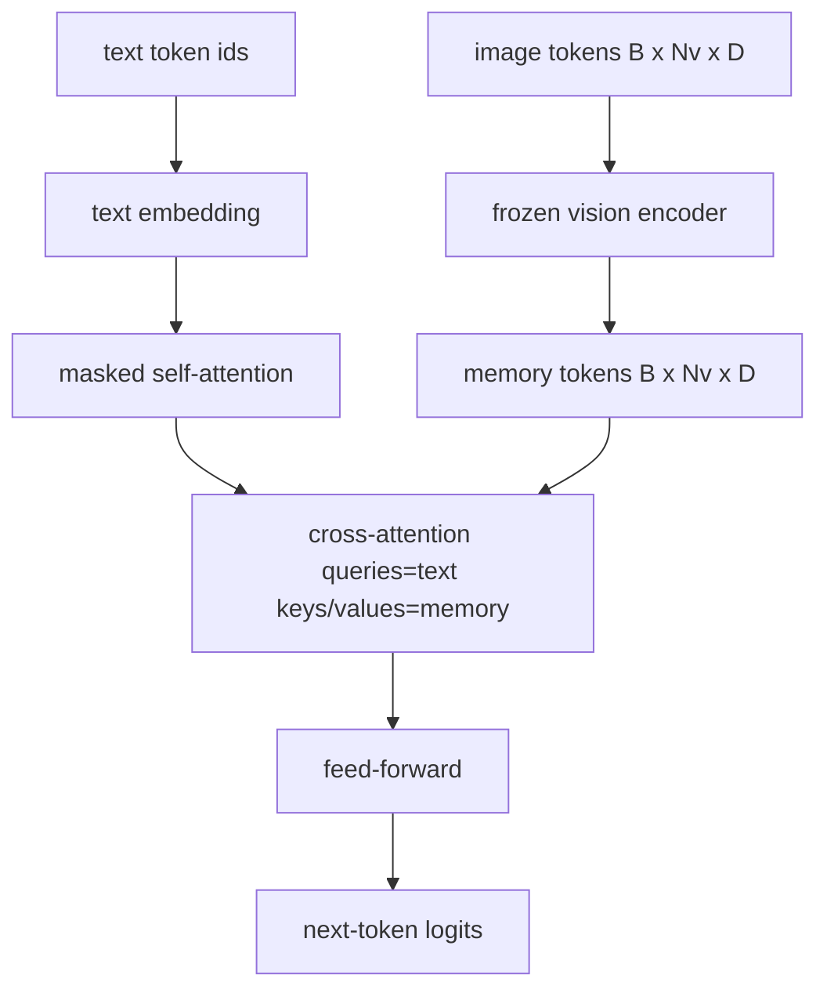
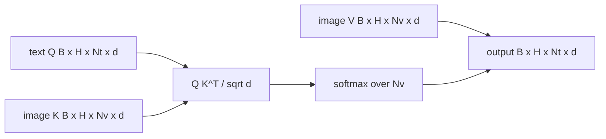

# 交叉注意力融合

> 投影層把一個影像向量與一個字幕向量對齊。一個真正的視覺語言解碼器，需要每一個文字詞元都能注意每一塊圖塊詞元，好讓模型能把每個字接地到某個區域上。交叉注意力就是那份接地發生的方式。文字負責提問；視覺的鍵與值負責回答。這一課要建出那個交叉注意力區塊、那個因果文字自注意力，以及讓兩者都合法的那些遮罩形狀。

**類型：** 實作
**程式語言：** Python
**先修單元：** 階段 19 第 30-37 課（B 軌基礎）
**時間：** 約 90 分鐘

## 學習目標

- 實作多頭交叉注意力，其中查詢流是文字、鍵／值流是視覺。
- 組合出一個解碼器區塊：因果自注意力 + 交叉注意力 + 前饋。
- 把遮罩形狀弄對：自注意力用因果遮罩、交叉注意力不用遮罩。
- 用批次化的文字詞元與一池固定的影像詞元跑一次前向傳遞。

## 那個問題

把影像詞元與文字詞元串接成一段序列，是一種融合選項（早期融合，Chameleon 與 Emu3 走的路）。交叉注意力是另一種（後期融合，Flamingo 引入、而其後每一個 Flamingo 形狀的解碼器都抄了的路）。在後期融合裡，文字解碼器只跑在純文字詞元上，並在每一層透過交叉注意力伸手到影像流裡去。

後期融合有兩項優勢。第一，文字流保持乾淨，而模型保住了純文字的能力。第二，影像流每張影像只算一次、每個解碼步驟都重複使用，所以就算字幕很長，生成也很便宜。代價是每個區塊多一個注意力子層。

## 那個概念





### 遮罩形狀

解碼器區塊內部那兩種注意力需要不同的遮罩：

| 注意力 | 查詢長度 | 鍵長度 | 遮罩 | 為什麼 |
|-----------|--------------|------------|------|-----|
| 自注意力 | `Nt`（文字） | `Nt`（文字） | 因果：下三角 `(Nt, Nt)` | 自迴歸期間文字詞元不得往前看 |
| 交叉注意力 | `Nt`（文字） | `Nv`（視覺） | 不用遮罩 | 整張影像對每一個文字位置都可見 |

這一課包含一個形狀驗證函式，好讓「把兩者搞混」這個錯誤以 `ValueError` 現形，而不是變成一條無聲壞掉的損失曲線。

### 為什麼交叉注意力不用遮罩

在任何文字被生成之前，影像就已經被完整觀察了。字幕的第 `t` 個詞元可以注意影像的任何一塊圖塊；影像圖塊之間沒有時間順序。有些 Flamingo 變體在把多張影像與多段文字交錯時，會加上逐樣本的遮罩樣式，但對單一張影像加一段字幕而言，交叉注意力看得見一切。

### 鍵／值快取

影像的鍵與值在解碼一開始就算一次，並存在一個快取裡。每一個新的文字詞元都用那份快取，不必重算。這就是讓推論時的字幕生成很快的原因：那個沉重的 ViT 只跑一次；交叉注意力在每一步都重用它的鍵與值。這一課把那份快取暴露出來，並測試那條快取命中路徑。

### 區塊的組成

一個解碼器區塊跑的是：pre-LN -> 自注意力 -> 殘差 -> pre-LN -> 交叉注意力 -> 殘差 -> pre-LN -> 前饋 -> 殘差。三個子層，每一個都有自己的 LayerNorm。Flamingo 那篇論文在交叉注意力上加了一個學出來的閘門，好讓模型能以訓練期穩定性為代價地選擇不走影像路徑；這裡用的那個經典基線沒有閘門。

```python
class DecoderBlock:
  def forward(self, text_tokens, image_tokens, text_mask, cross_mask):
      text_tokens = text_tokens + self.self_attn(self.ln1(text_tokens),
                                                 mask=text_mask)
      text_tokens = text_tokens + self.cross_attn(self.ln2(text_tokens),
                                                  image_tokens,
                                                  mask=cross_mask)
      text_tokens = text_tokens + self.ffn(self.ln3(text_tokens))
      return text_tokens
```

## 動手建

`code/main.py` 實作：

- `CrossAttention(hidden, heads)`，帶分開的 `q` 與 `kv` 投影的多頭交叉注意力。
- `CausalSelfAttention(hidden, heads)`，來自標準解碼器的遮罩自注意力。
- `DecoderBlock`，用 pre-LN 殘差把那三個子層組合起來。
- `VisionLanguageDecoder`，一個四層解碼器，由一份模擬視覺編碼器輸出與一張小型文字嵌入表餵養。
- `causal_mask(length)`，回傳一個 `(length, length)` 的下三角布林張量。
- 一個示範，餵進一批兩段、長度 10 的文字序列與長度 197 的影像記憶，並印出輸出形狀、自注意力遮罩形狀，以及逐位置的交叉注意力輸出範數。

跑它：

```bash
python3 code/main.py
```

輸出：解碼器產出一個 `(2, 10, text_vocab)` 的 logits 張量。遮罩形狀是 `(10, 10)`。那項 KV 快取重用檢查確認了快取路徑與非快取路徑的 logits 相同。

## 動手用

交叉注意力出現在兩個生產家族裡：

- **Flamingo 與 IDEFICS。** 每 K 個語言模型區塊插入一個交叉注意力子層，配一個凍結的語言模型。那個視覺語言轉接器，就是那個交叉注意力區塊加上它的閘門。
- **BLIP-2。** Q-Former 用交叉注意力，從一組固定的 32 個查詢詞元伸進影像特徵，再把那些查詢投影到語言模型的嵌入空間。

這一課那個區塊的形狀，直接對映到這兩者上。那份遮罩紀律（自注意力用因果、交叉注意力不用）是一樣的。

## 測試

`code/test_main.py` 涵蓋：

- 因果遮罩是下三角的，並符合預期的布林形狀
- 不論鍵長度為何，交叉注意力的輸出形狀都是 `(B, Nt, hidden)`
- KV 快取路徑與非快取路徑在浮點容差之內相符
- 文字流與影像流之間的形狀不符，會拋出一個清楚的 `ValueError`
- 一次完整的解碼器前向傳遞產出正確的批次與序列形狀

跑它們：

```bash
python3 -m unittest code/test_main.py
```

## 練習

1. 替交叉注意力的殘差加上一個學出來的 tanh 閘門（Flamingo 那個技巧），並驗證從接近零的初始閘門開始訓練仍會收斂。閘門從 0 開始；模型先恢復純文字行為，才把影像流混進來。

2. 實作交錯注意力，讓同一個解碼器消費多張影像加多段文字。建出那份逐樣本的交叉注意力遮罩，防止文字段 2 去注意影像 1。

3. 在 `Nt=64, Nv=576`（更高解析度下的 24x24 網格）上，替交叉注意力與自注意力層做效能剖析。交叉注意力的成本是 `Nt * Nv`，在高影像解析度下佔主導。

4. 在交叉注意力圖上加上查詢端的 dropout，並在示範裡量測字幕多樣性（交叉圖上的 dropout 會增加字幕樣本的變異）。

5. 把交叉注意力層換成一個 Q-Former 風格的注意力區塊，讓一池固定的 32 個查詢詞元每層對影像特徵注意一次。

## 關鍵術語

| 術語 | 它的意思 |
|------|---------------|
| 後期融合 | 文字與視覺待在各自的流裡；交叉注意力在每個區塊把它們橋接起來 |
| 交叉注意力 | Q 來自一條流，K 與 V 來自另一條 |
| 因果遮罩 | 防止自迴歸期間往前看的下三角布林遮罩 |
| KV 快取 | 只存一次、供每個解碼步驟重複使用的影像鍵與值 |
| 記憶詞元 | 解碼器伸手進去的那些凍結影像詞元 |

## 延伸閱讀

- Flamingo（2022），了解那套帶閘門交叉注意力的經典後期融合設計。
- BLIP-2（2023），了解那個 Q-Former —— 它就是一個打扮成「學出來的查詢池」的交叉注意力區塊。
- IDEFICS（2023），了解 Flamingo 配方的開放權重重現版。
