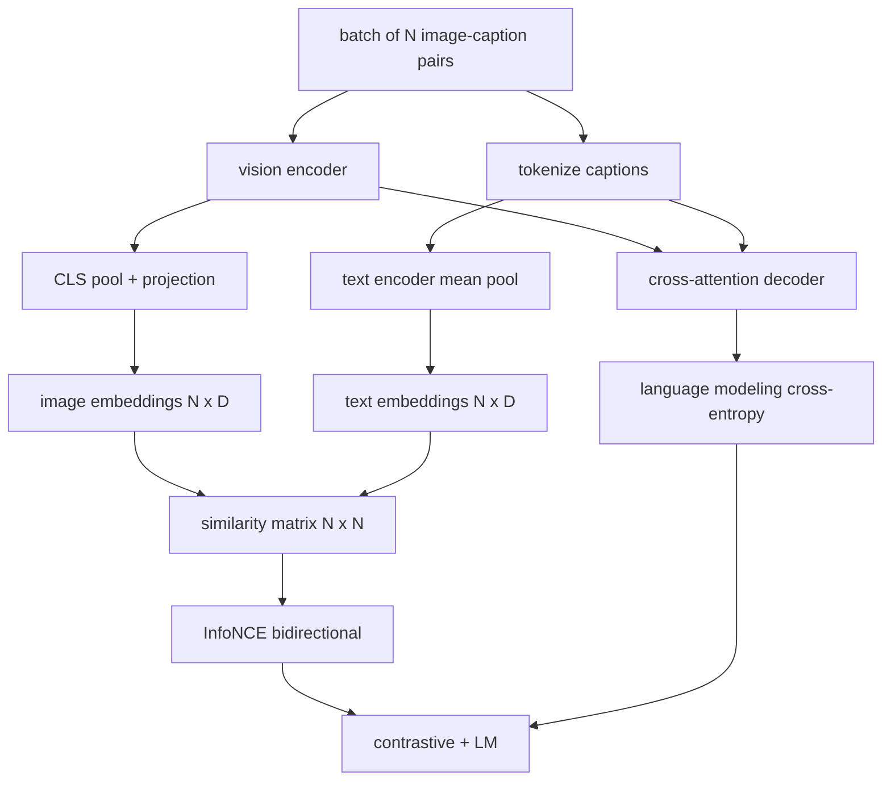

# 視覺語言預訓練

> 編碼器、投影與解碼器都接好了。現在把它們一起訓練。有兩個目標在驅動學習：一個對比式影像－文字損失（InfoNCE），把相符的配對在那個聯合嵌入空間裡拉在一起；以及一個語言建模損失，要求解碼器替每張影像寫字幕。合起來，它們教會這個網路兩件事：替一段字幕找到對的影像，以及替一張影像寫出字幕。

**類型：** 實作
**程式語言：** Python
**先修單元：** 階段 19 第 30-37 課（B 軌基礎）
**時間：** 約 90 分鐘

## 學習目標

- 在一批影像－字幕配對上實作 InfoNCE 對比損失。
- 把對比損失與自迴歸的語言建模損失組合起來。
- 合成一份 200 組配對的模擬影像－字幕語料，完全不必下載真實資料集。
- 跑一次 50 步的示範訓練迴路，並觀察兩個損失都在下降。

## 那個問題

一個視覺語言模型需要兩項技能。它必須會排序：給定一段字幕，從眾多影像中找出對的那張。它必須會生成：給定一張影像，寫出一段字幕。只針對其中一項技能做預訓練，你得到的是半套系統。CLIP 把排序做透了，卻不會寫字幕。GPT-4V 會寫字幕，但排序用的是另一個檢索頭。多目標預訓練一趟就把兩者都拿到手。

InfoNCE 處理排序那一半。對一批 N 組配對，模型把那 N 組相符配對當成正例、把 `N^2 - N` 組不相符的當成負例，然後在得到的 `(N, N)` 相似度矩陣上跑一個交叉熵損失。語言模型損失處理生成那一半：以影像為條件的標準下一詞元預測。兩個損失都可微，而且共享編碼器、投影器與解碼器的權重。

## 那個概念



### 一段話講完 InfoNCE

把那 N 個影像嵌入疊成列、那 N 個文字嵌入也疊成列。兩者都做 L2 正規化。計算那個 `N x N` 矩陣 `S = I T^T / tau`，其中 `tau` 是一個學出來的溫度。對角線上的項是相符配對；非對角線上的是負例。以「`argmax` 沿對角線跑」為目標套用交叉熵：第 `i` 列應該在第 `i` 欄有它的最高項。沿欄對稱地再做一次。總損失是兩者的平均。這就是八行寫完的 CLIP 損失。

### 溫度很要緊

溫度 `tau` 控制那個 softmax 有多尖。太小（例如 `tau = 0.01`），梯度就只來自那個最難的負例，訓練會很吵。太大，softmax 就攤平、梯度就消失。CLIP 把 `tau` 當成一個參數去學；這裡的示範也一樣。

### 語言建模損失

解碼器透過交叉注意力消費影像記憶詞元，並在每一個位置預測下一個文字詞元。損失是以下一位置為目標的標準交叉熵。填補位置會被從損失裡遮掉。

### 把兩個損失合起來

`total = contrastive + lm_weight * lm`，其中 `lm_weight` 是一個純量（常常是 1.0）。這兩個損失共享流進編碼器與投影的梯度；只有解碼器收得到語言模型損失的梯度。這就是 CoCa、BLIP 與 SigLIP 風格的模型全都在用的那份多任務配方，只是加權方式各有不同。

| 元件 | 損失面 | 影響 |
|-----------|--------------|---------|
| InfoNCE | 聯合空間裡的配對排序 | 編碼器 + 投影 + 文字頭 |
| LM | 以影像為條件的詞元預測 | 編碼器 + 投影 + 解碼器 |
| 合併 | 多任務 | 整個堆疊 |

### 為什麼 50 步對示範就夠

那份模擬語料是一組合成的 200 組配對，影像是隨機的、字幕 id 也是隨機的。在批次大小 16 下跑 50 個 SGD 步驟之後，兩個損失都明顯下降，就算絕對值仍高於真實資料模型能達到的水準也一樣。示範的重點是確認梯度管路端到端運作得起來，而且加上語言模型損失不會讓對比目標失穩。

```figure
ch-infonce-diagonal
```

## 動手建

`code/main.py` 實作：

- `MultimodalModel`，把一個小型 ViT 編碼器、那個 MLP 投影器、一個極小的文字端編碼器（對嵌入後的 id 做平均池化），以及第 61 課那個交叉注意力解碼器組合起來。
- `info_nce_loss(image_emb, text_emb, temperature)`，那個雙向的 CLIP 風格對比損失。
- `lm_loss(logits, target_ids, padding_id)`，帶遮罩的下一詞元交叉熵。
- `make_mock_corpus(seed, n_pairs)`，回傳 200 組確定性的（影像, caption_ids）配對。
- 一條訓練迴路，以批次大小 16、Adam 最佳化器與一個學出來的對數溫度參數跑 50 步。兩個損失每 5 步印一次。

跑它：

```bash
python3 code/main.py
```

輸出：對比損失從約 `ln(16) = 2.77` 掉向 2.4；語言模型損失從隨機均勻的基線 `ln(512) ≈ 6.24` 掉向約 4.7。兩者的下降都證明梯度接對了。真實模型會訓練上百萬步；那些動態是一樣的。

## 動手用

這就是下列模型所出貨的同一份損失配方：

- **CLIP（2021）。** 只有影像－文字對比，另配一個凍結編碼器的字幕探針。
- **CoCa（2022）。** 在同一個模型裡把影像－文字對比與影像字幕語言模型損失合起來。就是這一課所建的那個確切模式。
- **BLIP（2022）與 BLIP-2。** 對比加語言模型加一個影像－文字匹配頭。三個損失合起來。
- **SigLIP（2023）。** 把 InfoNCE 換成一個 sigmoid 配對損失；同樣的對比角色，不同的函數形式。
- **LLaVA 家族。** 兩階段訓練，第一階段是對齊（在凍結語言模型上做餘弦），第二階段加上語言模型損失並解凍語言模型。第 60 課對映到第一階段；這一課對映到第二階段。

## 測試

`code/test_main.py` 涵蓋：

- InfoNCE 損失在影像／文字列之間是對稱的
- 當相似度矩陣是一條由大正數構成的完美對角線時，InfoNCE 損失回傳 0
- 語言模型損失正確地遮掉填補位置
- 模型前向傳遞產出兩個損失且不出錯
- 一次 5 步的訓練迴路降低了合併損失

跑它們：

```bash
python3 -m unittest code/test_main.py
```

## 練習

1. 把 InfoNCE 換成 SigLIP 風格的 sigmoid 配對損失，並在那份模擬語料上比較收斂情況。

2. 加上一個困難負例挖掘步驟：每隔一個批次，從前一個批次選出最難的非對角配對並把它附加進去。訓練並檢查對比損失有沒有掉得更快。

3. 在那個聯合嵌入之上加上一個影像－文字匹配的二元頭（真／假：這兩者相符嗎？）作為第三個損失，重現 BLIP 那套三頭設定。

4. 把那份模擬語料換成「由一條馬可夫鏈抽出的字幕 id 序列」，而那條鏈的轉移矩陣以影像雜湊為條件。字幕損失應該會掉得更多，因為那裡真的有可學習的訊號。

5. 用 `lm_weight = 0` 訓練同一個模型，再用 `lm_weight = 1` 訓練一次。比較對比損失；語言模型損失不該讓那個排序目標退步。

## 關鍵術語

| 術語 | 它的意思 |
|------|---------------|
| InfoNCE | 雜訊對比估計：在一個相似度矩陣上做交叉熵 |
| 溫度 | 控制對比 softmax 有多尖的純量 |
| 困難負例 | 模型覺得容易混淆的非對角配對，拿來取樣很有用 |
| LM 損失 | 字幕那一側標準的下一詞元交叉熵 |
| 聯合嵌入空間 | 投影之後影像與文字向量所共處的那個空間 |

## 延伸閱讀

- CLIP 論文，了解最初那份對比配方。
- CoCa 論文，了解在同一個模型裡把對比與字幕合起來的做法。
- SigLIP 論文，了解那個 sigmoid 配對損失變體，以及它為什麼擴縮得更好。
