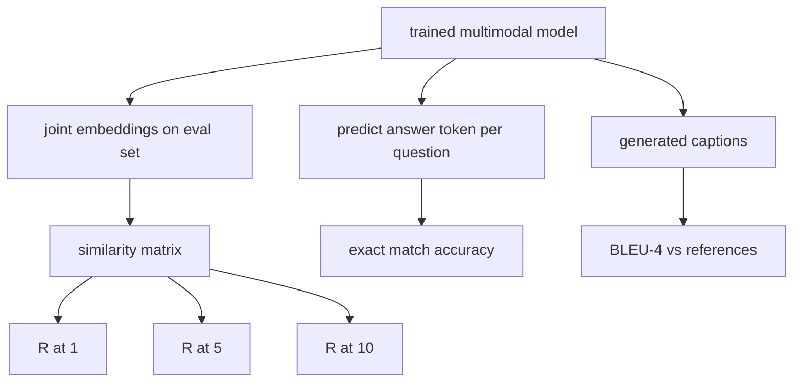

# 多模態評估

> 訓練是迴路的一半。另一半是量測。這一課從原語建出三個評估面：以 R@1、R@5、R@10 回報的影像－字幕檢索；以完全相符準確率回報的視覺問答；以及以 BLEU-4 回報的影像字幕生成。每一項指標都是一個作用在模型輸出上的函式，加上一套幾秒內就跑得完的合成評估組。

**類型：** 實作
**程式語言：** Python
**先修單元：** 階段 19 第 58-62 課（E 軌基礎：編碼器、transformer、投影、交叉注意力融合、預訓練）
**時間：** 約 90 分鐘

## 學習目標

- 從影像與字幕嵌入之間的相似度矩陣計算 Recall@K。
- 從一個把（影像, 問題）配對對映到固定答案詞彙的模型，計算完全相符的 VQA 準確率。
- 不用任何外部函式庫，從生成序列與參考序列計算 BLEU-4。
- 在第 62 課那個訓練好的模型之上，用一套合成評估組把這三項評估都跑一遍。

## 那個問題

當訓練損失趨於平緩時，人們會想宣告一個多模態模型完成了。訓練損失量的是在訓練分布上的貼合度；它量不出模型能不能在一個保留批次裡排序配對、回答問題，或寫出一段人類會接受的字幕。有三個標準的評估面：

- **檢索（R@1、R@5、R@10）。** 替一段查詢字幕建出聯合嵌入；依餘弦替評估池裡的每一張影像排序；回報那張相符影像有沒有落在前 1、前 5、前 10。對稱（影像對文字）的形式做法一樣。
- **視覺問答（完全相符）。** 給定（影像, 問題），模型輸出一個答案詞元。完全相符是逐樣本一位元：預測答案有沒有等於參考答案？在評估集上取平均。
- **字幕生成（BLEU-4）。** 生成一段字幕。對照參考字幕，計算 1-gram 到 4-gram 精確率的幾何平均，並加上簡短懲罰。多參考是那個標準形式（一張影像、數段參考字幕）。

每一項指標都是一個很薄的函式。這一課把它們全都寫成程式碼，好讓那些數學變得具體，也讓那個面維持在你的掌控之下。真實的基準套件（MS-COCO、VQA v2、GQA、OK-VQA）插進的是同樣的函式形狀。

## 那個概念



### 從相似度矩陣算 Recall@K

在影像與字幕嵌入之間建出那個 `(N, N)` 的餘弦相似度矩陣。對每一列，依相似度遞減把各欄排序。Recall@K 是「對角線欄索引落在前 K 個位置之內」的列所佔的比例。對稱的 Recall@K（字幕對影像）則在轉置矩陣上計算。兩個數字都要回報。對一個 N=100 的評估而言，R@1 = 0.6 代表 100 段字幕裡有 60 段把正確影像檢索成了最佳相符。

### VQA 完全相符

對每一組（影像, 問題, 答案），把影像編碼、把問題嵌入、透過解碼器融合，然後讀出下一個詞元。把預測出來的詞元 id 與參考 id 比較；相等就算對。在評估集上取平均。真實的 VQA 資料集每個問題附有多個人工標註答案，並用一條軟性準確率公式（10 位標註者中至少 3 位同意就給 1.0，低於此則按比例縮放）；這一課為求清楚，用的是單一答案的完全相符。

### BLEU-4

```text
BLEU-4 = BP * exp(mean(log p1, log p2, log p3, log p4))
```

其中 `p_n` 是修正後的 n-gram 精確率（生成的 n-gram 中出現在任一參考裡的裁切計數，除以生成的 n-gram 總數），而 `BP` 是簡短懲罰：

```text
BP = 1                if generated length > reference length
   = exp(1 - r/g)     otherwise, where r is reference length and g is generated
```

在某些 `p_n` 為零的小樣本情況下需要平滑。這個實作用的是 Chen 與 Cherry 的「方法一」（對任何為零的計數，把分子與分母各加 1），那是低計數區間下最安全的預設。

### 合成評估組

一套 50 個樣本的評估組，用與第 62 課相同的模擬語料樣式在記憶體裡建出來，種子則是保留出來的。這套組由三份清單構成：

- `pairs`：供檢索用的 50 組（影像, caption_ids）配對。
- `vqa`：50 組（影像, question_ids, answer_id）三元組。
- `caps`：50 筆（影像, [reference_caption_ids, ...]）條目，每張影像最多 3 個參考。

這套組由種子決定、確定性地產生，而且從訓練語料中保留出來，所以那些指標是在模型從沒看過的資料上算出來的。把這套組持久化成 JSON 留作練習（見下）。

| 指標 | 範圍 | 隨機基線（N=50） |
|--------|-------|------------------------|
| R@1 | 0 到 1 | 0.02（1 / N） |
| R@5 | 0 到 1 | 0.10 |
| R@10 | 0 到 1 | 0.20 |
| VQA EM | 0 到 1 | 1 / 詞彙量 |
| BLEU-4 | 0 到 1 | 很小但非零 |

對一次在合成資料上跑 50 步的訓練而言，這些指標並不預期會很高；預期的是它們高於隨機基線，而那正是示範所檢查的。

## 動手建

`code/main.py` 實作：

- `recall_at_k(sim_matrix, k)`，替兩個方向各回傳一個落在 `[0, 1]` 的浮點數。
- `vqa_exact_match(predictions, references)`，回傳 `int` 相等的平均值。
- `bleu4(generated, references, smoothing=True)`，支援多參考。
- `build_eval_suite(seed, n_samples, vocab_size, max_len)`，回傳三份確定性的評估清單。
- `evaluate(model, suite)`，跑完那三項指標並回傳一個數字的 `dict`。
- 一個示範，載入第 62 課那個剛初始化的多模態模型、評估它，接著訓練 50 步再評估一次，並印出前後的指標。

跑它：

```bash
python3 code/main.py
```

輸出：那張前後指標表顯示檢索從接近隨機往模型學到的訊號改善、VQA 改善到隨機之上，而 BLEU-4 也改善（那個合成結構足以撐起一次 4-gram 精確率的提升）。

## 動手用

每一項指標都直接對映到一個生產基準上：

- **檢索。** MS-COCO 5K 驗證集、Flickr30K、ImageNet 零樣本，全都是同一個相似度矩陣上的 R@K 問題。把合成評估換成真實檔案，函式簽章不變。
- **VQA。** VQA v2、GQA、OK-VQA 用的是同樣的完全相符形狀（VQA v2 用軟性準確率而不是單一答案的完全相符）。
- **BLEU-4。** MS-COCO 字幕生成、NoCaps、Flickr30K 字幕生成，全都用 BLEU-4 加 CIDEr 與 METEOR。加上 CIDEr 就是再多一個函式。

對真實基準而言，把 `build_eval_suite` 換成一個真的載入器，並保住那些函式主體。那些數學與基準無關。

## 測試

`code/test_main.py` 涵蓋：

- 在一個完美的單位相似度矩陣上 recall@k 回傳 1.0，而在一個翻轉過的矩陣上、當 k < N 時回傳 0.0
- recall@k 尊重 `k <= N` 這個上界
- 當生成序列恰好等於其中一個參考時，bleu4 回傳 1.0
- 在詞彙完全不相交時，bleu4 回傳 0.0
- VQA 完全相符等於相等配對的比例
- build_eval_suite 回傳預期數量的配對、VQA 項目與字幕條目

跑它們：

```bash
python3 -m unittest code/test_main.py
```

## 練習

1. 替字幕指標加上 CIDEr。CIDEr 在 n-gram 上用 TF-IDF 加權，這會獎勵資訊量高的詞元。

2. 實作軟性準確率的 VQA：每個問題有多個人工答案，只要有任何一個相符，準確率就是 `min(human_count / 3, 1)`。重現 VQA v2。

3. 加上一個對 NaN 安全的 `bleu4` 變體，能在生成序列為空時不當機。

4. 在 R@K 旁邊計算平均倒數排名（MRR）。MRR 對「正確項目落在前 K 之外的哪裡」很敏感；R@K 只對「有沒有落在前 K 之內」敏感。

5. 在訓練過程的五個檢查點（第 0、10、20、30、40、50 步）上跑那份評估，並把學習曲線畫出來。確認那些指標的軌跡與損失的軌跡一致。

## 關鍵術語

| 術語 | 它的意思 |
|------|---------------|
| R@K | 正確相符落在前 K 個結果之內的查詢所佔比例 |
| 完全相符 | 最簡單的 VQA 評分：預測答案等於參考答案 |
| BLEU-4 | 1 到 4-gram 精確率的幾何平均，並加上簡短懲罰 |
| 多參考 | 一項字幕指標，每張影像接受數段參考字幕 |
| 保留 | 評估集是從一個與訓練語料不相交的種子抽出來的 |

## 延伸閱讀

- VQA v2 論文，了解那條軟性準確率公式與資料集統計。
- CIDEr 論文，了解 TF-IDF 加權的 n-gram 字幕評分。
- 最初的 BLEU（Papineni 等人，2002），了解那些平滑變體。
- MS-COCO 字幕評估腳本，那是那份經典的參考實作。
