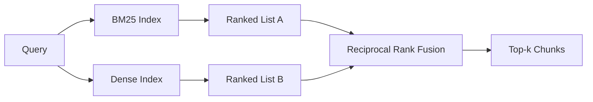

# 用 BM25 與稠密嵌入做混合檢索

> 詞彙式與語意式檢索在相反的查詢分布上失敗。帶倒數排名融合的混合檢索不做內插，它投票 —— 而那次投票在每一種查詢類別上都贏。

**類型：** 實作
**程式語言：** Python
**先修單元：** 階段 11 第 04（嵌入）、06（RAG）課；階段 19 B 軌基礎（第 20-29 課）；階段 19 第 64 課（切片策略）
**時間：** 約 90 分鐘

## 學習目標
- 依 Robertson 與 Sparck Jones 的表述從零實作 BM25，帶欄位加權、文件長度正規化，以及可調的 k1 與 b。
- 在一個確定性模擬嵌入之上建出一個稠密檢索器，好讓這條迴路離線跑得起來。
- 完全依 Cormack、Clarke 與 Buettcher 在 2009 年發表的樣子實作倒數排名融合，並解釋它為何勝過以分數加權的內插。
- 調整那個 RRF 的 k 常數與逐模態的權重，並在一份小型固定語料上讀出那些取捨。

## 那個問題

當查詢帶著一個語料裡逐字含有的字面識別字時，詞彙式檢索勝出。查詢 `AbortMultipartOnFail`，BM25 在微秒之內就回傳對的 Go 函式。同一個查詢被嵌入之後，坐在三個相似度聚類的邊界上，而稠密檢索器把錯的檔案排在第一。

當查詢被改寫得遠離語料的字面詞元時，稠密檢索勝出。一位使用者問「我們怎麼處理被取消的上傳」，從沒打過 abort 或 multipart 這些字。BM25 回傳的是「上傳大型檔案」那份文件片段，因為那一頁含有 uploads 這個字。稠密檢索則找到那個摘要裡提到取消的中止函式。

在兩者之間做選擇不是一次靜態的抉擇。查詢分布才是那個變數。一套生產 RAG 系統從同一個端點處理這兩類，所以檢索必須同時處理兩者。那就是混合檢索。而必須做對的，是那個合併步驟。

## 那個概念



### 一段話講完 BM25

BM25 替一組查詢－文件配對評分的方式，是對查詢詞項加總「逆文件頻率因子乘上一個會飽和的詞頻因子」，而後者含有一項長度正規化的修正。兩個旋鈕。`k1` 控制詞頻的飽和；預設 1.5 是已發表的建議值，沒有基準就別動它。`b` 控制文件長度有多要緊；預設 0.75 說較長的文件會被懲罰，但不是線性的。

那條 IDF 公式用的是平滑過的 Robertson 與 Sparck Jones 定義，也就是 `log((N - df + 0.5) / (df + 0.5) + 1)`。log 裡面那個加一，讓某個詞出現在超過半數語料時 IDF 仍為正。這在小語料裡很要緊，因為那裡的停用詞技術上很罕見。

欄位加權讓你告訴 BM25：符號名稱上的相符比本文裡的相符更值錢。實作是在建索引時對詞頻乘上一個倍數，不是在評分時。這讓數學保持一致，也避免了逐欄位再算一個分數。

### 一段話講完稠密檢索

用一個嵌入模型把每個片段嵌成一個定維向量。查詢時把查詢嵌入、依相似度對每個片段做餘弦排序，並回傳前 k 個。模型是那個決定品質的變數。檢索演算法本身是兩行：內積與排序。

這一課用一個確定性、以雜湊為基礎的嵌入，好讓你不必發網路呼叫就能讀懂那套融合數學。那個雜湊把以詞元為鍵的偏移量加總進一個 96 維向量並正規化。那些餘弦排名在各次執行間都是確定性的，而那正是測試套件所要求的。

### 倒數排名融合，那條已發表的公式

兩份排序清單。對出現在任一清單裡的每個候選，把它的倒數排名貢獻加總起來。2009 年那篇論文用的是 `1 / (k + rank)`，k 預設為 60。依總分排序。這就是整個演算法。

那個已發表的常數 k = 60 不是隨便來的。在 k = 60 之下，排名 1 的貢獻是 1 / 61，而排名 10 的貢獻是 1 / 70。貢獻衰減得很慢，所以較深的候選仍然投得到票。k 較小會讓最上面的結果佔主導。k 較大則把貢獻曲線攤平。

我們的實作有兩個可調旋鈕。那個 `k` 常數。以及一對逐模態的權重，好讓你在有先驗證據顯示某一方在你的語料上比較好時，去加強 BM25 或稠密那一側。把排名貢獻乘上那個權重，是最簡單而有原則的實作；它保住了排名衰減的形狀，也維持與尺度無關。

### 為什麼融合勝過以分數加權的內插

BM25 分數是無界的，而且隨語料而異。餘弦相似度被界在 -1 到 1 之間。一個線性組合 `alpha * bm25 + (1 - alpha) * cosine`，需要逐語料調整 alpha，而且每次你重建索引它就壞掉。以排名為基礎的融合不會。兩個排名跨模態是可比較的。自 2010 年以來，在每一場公開的 TREC 賽道上，已發表的 RRF 基線都打敗分數內插。

這就是你在 Vespa 與 Weaviate 文件裡聽到的、關於 RankFusion 對 RRF 的同一套論證。它們得到了同樣的結論：除非你有非常強的證據支持去內插分數，否則就待在以排名為基礎的做法上。

## 動手建

`code/main.py` 實作：

- `tokenize(text)` —— 一個快速的正規表示式分詞器。
- `BM25Index` —— 帶欄位加權，含 `add` 與 `search`，以及可調的 k1、b。
- `mock_embed`、`DenseIndex` —— 與第 64 課相同的確定性嵌入，好讓片段之間可比較。
- `rrf(rankings, k, weights)` —— 那條已發表的融合，帶多模態權重。
- `HybridRetriever` —— 把 BM25 與稠密結合起來。
- 一個示範用的 `main()`，載入一份小型固定語料、跑三個分別瞄準各檢索器強項與弱項的查詢，並印出各模態產出的排名加上那份融合後的清單。

跑它：

```bash
python3 code/main.py
```

把示範輸出並排來讀。那個字面識別字的查詢，落在 BM25 排名 1、稠密排名 4、RRF 排名 1。那個被改寫過的查詢，落在 BM25 排名 6、稠密排名 1、RRF 排名 1。那個模稜兩可的查詢，落在 BM25 排名 3、稠密排名 3、RRF 排名 1。那個融合不是一個打破平手的機制；它是在每一種查詢類別上都贏的那套系統。

## 調那些旋鈕

| 旋鈕 | 預設 | 什麼時候往上調 | 什麼時候往下調 |
|------|---------|----------------|------------------|
| BM25 k1 | 1.5 | 詞項在文件中重複出現，而你希望頻率更要緊 | 文件很短，而詞項重複只是雜訊 |
| BM25 b | 0.75 | 較長的文件真的每個字說得更少 | 文件長度與主題無關 |
| RRF k | 60 | 較深的候選應該繼續投票 | 第一名應該佔主導 |
| BM25 權重 | 1.0 | 你的語料含有字面識別字，而查詢會與它們相符 | 你的查詢是使用者改寫過的 |
| 稠密權重 | 1.0 | 查詢是改寫過的 | 查詢是字面的 |

靠重跑第 68 課的評估框架在你保留的查詢集上調，不要靠直覺。

## 示範會藏起來的失敗模式

**詞彙表外的詞元。** BM25 的 IDF 是從語料算出來的，所以只在查詢裡出現的詞項貢獻為零。稠密嵌入卻會替同一個詞項幻覺出一個向量。在語料外的識別字上，稠密那一側回傳的是看起來合理但其實錯的鄰居。那個融合吸收得了這件事，因為 BM25 什麼都沒回傳、那份排名貢獻就消失了 —— 但前提是你依文件而不是依片段去重。

**停用詞元的支配。** 對「the」這個字跑 BM25，會在整個語料上產出一份均勻排名。在索引器裡把停用詞元濾掉，或接受高 IDF 詞項自然會佔主導這件事。

**跨模態的內容完全相同。** 若你的語料小到 BM25 的第一名也是稠密的第一名，RRF 就給你同樣的第一名與同樣的鄰居。那是正確行為、不是失敗，但它讓那個融合看起來像不存在。在你的評估裡加上一對對抗性的查詢，以驗證那個融合真的在運作。

## 動手用

生產模式：

- BM25 在行程內建索引；瓶頸是那本詞頻字典，不是那些向量。
- 稠密向量索引在另一個儲存裡（這一課我們用一份扁平清單；在生產環境你會用 HNSW）。
- 平行跑兩個查詢；那個融合是對聯集做的常數時間合併。
- 把每一筆檢索命中的模態持久化下來，好讓下游的重排器看得到是哪個模態投票給它的。

## 產出交付

第 66 課拿這一課融合後的前 k 筆，用一個交叉編碼器重排。第 68 課以精確率、召回率、MRR 與 nDCG 評估整條管線。這一課的混合檢索器，是第 69 課那套端到端系統的第一階段。

## 練習

1. 把 `mock_embed` 換成你供應商那裡的一個真模型。重跑示範，並回報那個純稠密排名在改寫過的查詢上怎麼變。
2. 加上第三種模態：把片段摘要另外建索引，並當成第三份排序清單融合進去。量測那個增益。
3. 讓 RRF 的 k 掃過 10、30、60、100、200。畫出第 68 課的 recall@k 曲線。回報在你的語料上那條曲線達峰時的 k 值。
4. 把 BM25F 好好實作出來（逐欄位的長度正規化，而不是那個乘數技巧），並在「符號相符最要緊」的語料上做比較。

## 關鍵術語

| 術語 | 大家怎麼說 | 實際是什麼意思 |
|------|-----------------|------------------------|
| BM25 | 「詞彙式搜尋」 | 以「idf x 會飽和的 tf x 長度正規化」做的機率式排序 |
| RRF | 「排名融合」 | 跨排序清單加總 1 / (k + rank)；k 預設 60 |
| k1 | 「TF 飽和」 | 控制一個重複出現的詞項多快停止加分 |
| b | 「長度懲罰」 | 0 代表忽略文件長度，1 代表完全正規化 |
| 欄位加權 | 「符號加成」 | 在建索引時重複詞元，以加強該欄位上的相符 |
| 以排名對上以分數的融合 | 「為什麼 RRF 勝過線性」 | 排名跨模態可比較；分數不行 |

## 延伸閱讀

- Cormack、Clarke、Buettcher，〈Reciprocal Rank Fusion outperforms Condorcet and individual rank learning methods〉，SIGIR 2009
- Robertson、Walker、Beaulieu、Gatford、Payne，〈Okapi at TREC-3〉（最初那篇 BM25 論文）
- [Vespa: Hybrid Retrieval with BM25 and Embeddings](https://docs.vespa.ai/en/tutorials/hybrid-search.html)
- [Weaviate: Hybrid Search](https://weaviate.io/developers/weaviate/search/hybrid)
- 階段 11 第 06 課 —— RAG 基礎
- 階段 19 第 64 課 —— 其輸出在這裡被建索引的那些切片器
- 階段 19 第 66 課 —— 消費那份融合後前 k 筆的交叉編碼器重排器
