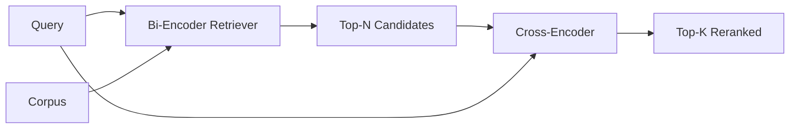

# 交叉編碼器重排器

> 雙編碼器各自獨立地嵌入查詢與文件。交叉編碼器把兩者串起來、一次讀完。交叉編碼器是最聰明的讀者，也是最慢的那一個。把它當成第二階段、套在雙編碼器的前 k 筆上，它就替自己付了本。

**類型：** 實作
**程式語言：** Python
**先修單元：** 階段 11 第 06 課（RAG）、階段 11 第 07 課（進階 RAG）；階段 19 B 軌基礎（第 20-29 課）；階段 19 第 65 課（餵養這個階段的混合檢索）
**時間：** 約 90 分鐘

## 學習目標
- 依輸入形狀、參數量與逐查詢成本，分辨雙編碼器檢索器與交叉編碼器重排器。
- 從零實作一個小型交叉編碼器：一個 transformer 區塊，吃下一段打包好的（查詢, 文件）序列，並產出單一個相關性純量。
- 接出一條兩階段的「先檢索再重排」管線：用一個便宜的檢索器取前 N 筆、用交叉編碼器把 N 筆重排成前 K 筆、回傳 K 筆。
- 在一份小型固定語料上量測延遲對品質的取捨，並替給定的延遲預算挑出對的 N。

## 那個問題

雙編碼器把查詢與文件對映到同一個向量空間，並依餘弦排序。那兩份編碼從不彼此照面。模型必須把一份文件所有有用的東西壓進單一個向量裡，而且對查詢毫無所悉。這很快 —— 建索引時每份文件一次嵌入、查詢時每則查詢一次嵌入 —— 而且它是唯一能在語料規模上做排序的方式。

代價是精確度。兩份整體主題相同的文件，就算其中一份回答得了那個查詢、另一份不行，嵌入也可能幾乎一模一樣。雙編碼器分不出它們。

交叉編碼器藉由把查詢與文件一起讀來解決這件事。模型收到 `[query] [SEP] [document]` 當成單一段序列、在那個接合處跑完整注意力，並產出一個相關性純量。文件的每一個詞元都能去注意查詢的每一個詞元。模型在完整脈絡下決定那個分數。

代價是吞吐量。雙編碼器嵌入一次就能永遠查詢，而交叉編碼器每一組（查詢, 文件）配對都要跑一次。對一份一千萬份文件的語料而言，那是每則查詢一千萬次前向傳遞。在一次請求的預算裡跑不動。

解法是分階段。用雙編碼器取前 N 筆。用交叉編碼器把 N 筆重排成前 K 筆。N 很小（50 到 200），而交叉編碼器的品質提升就集中在要緊的地方。總延遲留在請求預算之內。總品質是交叉編碼器的品質，上限則被雙編碼器在 N 處的召回率封住。

## 那個概念



### 交叉編碼器的輸入形狀

標準的打包方式是 `[CLS] query_tokens [SEP] document_tokens [SEP]`。CLS 位置的輸出被餵進一個單一的線性頭，輸出那個相關性純量。有些實作改用平均池化而不是 CLS；差別很小。重點在於模型每一組配對產出一個數字。

一個 2200 萬參數的交叉編碼器（已發表的 `ms-marco-MiniLM-L-6-v2` 那個權重量級）是典型的生產甜蜜點。更小的模型損失品質的速度快過它省下的延遲。更大的模型（例如 5.68 億參數的 `bge-reranker-v2-m3`）則保留給離線重排，或 K 很小的首頁重排。

### 為什麼這一課要訓練一個極小的

真的交叉編碼器是一個微調過的編碼器 transformer。在生產環境你載入一個檢查點就跑。這一課的目標是讓你看見這個模型的形狀、以及那條延遲－品質曲線的形狀，不是訓練一個最先進的排序器。所以我們建一個小小的 `nn.Module`，帶一個 transformer 區塊、多頭注意力（預設 4 個頭）與一個迴歸頭。它由一個種子確定性地初始化，好讓那個示範不必磁碟上有權重也可重現。

那個玩具模型從固定語料裡學到正確的形狀：相關的查詢－文件配對，預測分數高於不相關的配對。端到端管線把雙編碼器的輸出重排，而重排後的前 k 筆與黃金標籤相關。

### 延遲對上品質

那條兩階段管線有一個可調參數：N。在一份保留的查詢集上讓 N 從 5 掃到 100，你就得到那條曲線。

| N | 第二階段的 Recall@1 | 每則查詢的交叉編碼器前向傳遞次數 | 延遲 |
|---|--------------------|---------------------------------------|---------|
| 5 | 0.62 | 5 | 低 |
| 20 | 0.81 | 20 | 中 |
| 50 | 0.86 | 50 | 高 |
| 100 | 0.86 | 100 | 非常高 |

上面那些數字是那個形狀的示意，不是這份固定語料上的實測。那個形狀是真的。在大約 20 到 50 個候選處，總會有一個「重排提升飽和」的膝點。過了膝點你就是在花錢買空氣。

從那條評估曲線加上延遲預算去挑 N。交叉編碼器沒辦法把召回率拉到雙編碼器在 N 處的召回率之上，所以低的 N 封住的不只是延遲，還有品質。

```figure
rerank-funnel
```

## 動手建

`code/main.py` 實作：

- `CrossEncoder` —— 一個小型 `torch.nn.Module`：詞元嵌入、一個帶多頭注意力與前饋的 transformer 區塊、一個產出單一純量的平均池化頭。
- `tokenize_pair(query, document)` —— 把那兩個字串打包成單一段 id 序列，帶標出邊界的型別 id，確定性且只用標準函式庫。
- `train_tiny(pairs)` —— 在一份人工標註的（查詢, 文件, 相關性）三元組清單上做一趟監督式訓練，好讓模型在固定語料上產出合理的分數。
- `rerank(query, candidates, top_k)` —— 那個生產介面。
- `pipeline(query, retriever, top_n, top_k)` —— 那條兩階段流程。
- 一個示範用的 `main()`，依第 65 課的樣式載入語料、取前 N 筆、重排成前 K 筆、把兩份清單並排印出來，並回報每一階段的延遲。

跑它：

```bash
python3 code/main.py
```

輸出顯示雙編碼器的前 N 筆、交叉編碼器的前 K 筆，以及一份計時摘要。交叉編碼器每次呼叫花的時間比較久，但它不跑在整份語料上。兩階段的總和留在請求預算之內，同時挑出了雙編碼器排在第二或第三的那個答案。

## 示範會藏起來的失敗模式

**交叉編碼器不是對稱的。** `rerank(q, d)` 與 `rerank(d, q)` 是不同的分數。永遠先餵查詢。若你不小心對調，召回率就崩了。

**N 太低，暴露不出那個臭蟲。** 若你設 N = K，交叉編碼器就沒辦法重新排序；它只能重新加權。提升看起來是零。把 N 挑成至少 K 的三倍。

**訓練資料洩進評估。** 若那些人工標註的訓練配對含有評估查詢，那次重排看起來就像神蹟。就算在固定語料上，也要嚴格把訓練與評估分開。

**生產權重很稠密。** 一個 2200 萬參數的交叉編碼器在 float32 下是 88MB。在承諾 p95 低於 100 毫秒之前，先把模型伺服器的記憶體規劃好。

**批次很要緊。** 真的交叉編碼器會在同一個批次裡跑完那 N 個候選。這一課在 `_batch_encode` 裡就是這麼做的，它用 `torch.tensor(...)` 建出批次化的 id 與型別 id 張量，並跑一次前向傳遞。跳過批次，延遲就乘上 N。

## 動手用

生產模式：

- 把雙編碼器、交叉編碼器與 N 一起釘住。改動其中任何一個都會讓那份評估失效。
- 依（查詢, 文件 id）雜湊把重排器的輸出快取起來。同一個查詢對著一份穩定的語料，重排出來的順序一樣；快取命中替你買到免費的延遲削減。
- 記錄排名第一的交叉編碼器分數。若某則查詢的第一名分數低於一個語料專屬的門檻，那就是一次領域外的命中；把它以「我沒有把握」的形式呈現給 LLM。

## 產出交付

第 68 課端到端地評估這條兩階段管線。第 69 課把這個重排器接在第 65 課那個混合檢索器之後、答案產生器之前。這個重排器是那套端到端系統的第二階段。

## 練習

1. 讓 N 從 5 掃到 50，並把重排後輸出的 recall@1 畫出來。在這份固定語料上找出那個膝點。
2. 把交叉編碼器訓練十個週期而不是一個。量測每個週期正例與負例配對之間的分數間距。
3. 把平均池化換成一個 CLS 詞元頭。在這份固定語料上比較收斂情況。
4. 加上第二個交叉編碼器頭，預測一個二元的「這份文件裡有沒有這個答案」標籤。推論時兩個頭都用；一個用來排序、一個用來設門檻。
5. 把那個確定性的模擬雙編碼器換成第 65 課的那一個，並把兩個階段串起來。量測前 K 筆相對於「只有雙編碼器」的變化。

## 關鍵術語

| 術語 | 大家怎麼說 | 實際是什麼意思 |
|------|-----------------|------------------------|
| 雙編碼器 | 「向量檢索器」 | 各自獨立地編碼查詢與文件；用餘弦替它們排序 |
| 交叉編碼器 | 「重排器」 | 把（查詢, 文件）聯合編碼；輸出單一個相關性純量 |
| 兩階段管線 | 「先檢索再重排」 | 便宜的檢索器回傳 N 筆，昂貴的重排器留下 K 筆 |
| N（候選預算） | 「重排池」 | 交叉編碼器每則查詢要評分的候選數 |
| 平均池化頭 | 「最後隱藏層的平均」 | 把編碼器最後一層的輸出平均成一個向量 |

## 延伸閱讀

- Nogueira、Cho，〈Passage Re-ranking with BERT〉，2019 —— 那篇經典的交叉編碼器排序論文
- Reimers、Gurevych，〈Sentence-BERT: Sentence Embeddings using Siamese BERT-Networks〉，2019 —— 關於雙編碼器與交叉編碼器的比較
- [SentenceTransformers Cross-Encoders documentation](https://www.sbert.net/examples/applications/cross-encoder/README.html)
- [BGE Reranker v2 model card](https://huggingface.co/BAAI/bge-reranker-v2-m3)
- 階段 19 第 65 課 —— 餵養這個重排階段的混合檢索器
- 階段 19 第 68 課 —— 量測這次重排帶來多少提升的那份評估
