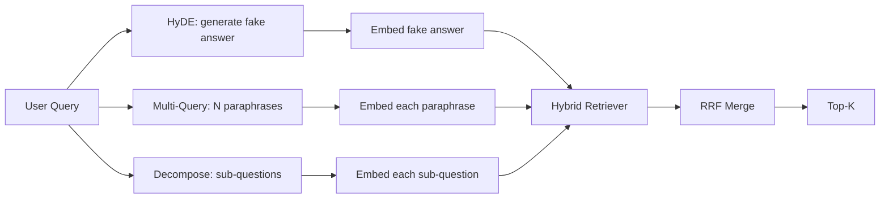

# 查詢改寫：HyDE、多查詢與分解

> 使用者打出來的那個查詢，不是你的檢索器想要的那個查詢。改寫在檢索之前把那道縫補起來，好讓索引看到的東西更接近答案的樣子。

**類型：** 實作
**程式語言：** Python
**先修單元：** 階段 11 第 04（嵌入）、06（RAG）課；階段 19 B 軌基礎（第 20-29 課）；階段 19 第 64 與 65 課
**時間：** 約 90 分鐘

## 學習目標
- 實作假想文件嵌入（HyDE）：生成一個假答案、把它嵌入、拿那個向量而不是查詢向量去檢索。
- 實作多查詢擴充：把一個查詢改寫成 N 個換句話說、各自檢索一次、用倒數排名融合把聯集合併起來。
- 實作查詢分解：把一個複雜問題拆成子問題、逐子問題檢索、再合併。
- 在一份固定語料上把這三種改寫器正面對決，並解釋每一種策略什麼時候勝出。
- 接上一個會產出確定性、貼合固定語料輸出的模擬 LLM，好讓那條改寫迴路離線跑得起來。

## 那個問題

一位使用者打出「我們團隊在上傳失敗而且預算用完時會怎麼做？」。語料裡有一份文件寫著「AbortMultipartOnFail 會中止一次進行中的 S3 分段上傳，並在上傳失敗時遞減該儲存桶的重試預算」。那個查詢與那份文件沒有共用任何名詞片語。BM25 沒抓到。雙編碼器把那份文件排在第三或第四，因為那個查詢向量落在嵌入空間裡一塊偏好「被取消的工作」而不是「被中止的上傳」的區域。若那份文件坐在前 N 筆裡，第 66 課那個兩階段重排還救得回答案；但若它連前 N 筆都進不去，重排器根本就看不到它。

修法是在查詢碰到檢索器之前先把它改寫掉。2023 年那篇〈Precise Zero-Shot Dense Retrieval without Relevance Labels〉（Gao 等人）引入了 HyDE：要一個 LLM 寫出「會回答這個查詢的那份文件」、把那份假想文件嵌入，並拿它的嵌入當作檢索向量。那份假想文件坐在嵌入空間裡對的區域，因為它是用語料的口吻寫的。那個查詢向量不是。

有兩種表親技巧與 HyDE 搭配。多查詢擴充（微軟 GraphRAG 用的那個詞）生成 N 個查詢的換句話說、各自檢索一次，再合併。分解（在 2024 年史丹佛 DSPy 的工作中以「子查詢分解」為人所知）把「我們團隊在上傳失敗而且預算用完時會怎麼做」拆成兩個問題：「上傳失敗時會發生什麼」與「重試預算用完時會發生什麼」。兩次檢索、一份合併結果，答案的兩塊都搆得到。

這一課把這三種都實作出來，並拿它們去跑同一份固定語料。

## 那個概念



### HyDE 的細節

HyDE 把使用者的查詢向量，換成一個由 LLM 寫出的假想文件向量。提示詞很短：

```
You are a domain expert. Write a one-paragraph passage that answers the question
below. Use the same vocabulary and phrasing the documentation in this domain would
use. Do not refuse. Do not say you do not know.

Question: {user_query}

Passage:
```

作為一個事實答案，那個 LLM 的回答是錯的，因為 LLM 不認識你的語料。那沒關係。檢索器不在乎事實正確性，只在乎詞元分布。那段假想段落含有「abort」、「multipart」、「bucket」、「budget」這些字，因為一段關於這個主題的文件就會那樣寫。把那段話嵌入。那個向量會落在真實段落附近。

生產環境裡你會把那份假想文件限制在兩三句。更長的假想會收進更多雜訊。更短的則會失去 HyDE 所需要的那份詞彙訊號。

### 多查詢擴充的細節

生成使用者查詢的 N 個換句話說。最簡單的提示詞：

```
Rewrite the following question in {N} different ways. Each rewrite must preserve
the original intent. Number them 1 to {N}. Do not add explanations.
```

替每個換句話說取前 k 筆。用 RRF（第 65 課那個相同的演算法）把那 N 份排序清單合併起來。便宜、可平行、確定性。

當使用者的說法只是眾多同樣有效問法之一，而任何一個改寫本來會問得更好時，多查詢就勝出。當所有改寫都一樣糟時就輸掉，因為原本那個查詢就是以同樣的方式糟。

### 分解的細節

一次檢索滿足不了一個多面向的問題。分解要 LLM 把問題拆成子問題，而系統逐子問題檢索。提示詞：

```
The following question may require information from multiple distinct topics.
Decompose it into a list of sub-questions. Each sub-question must be answerable
independently. If the question is already atomic, return it unchanged.

Question: {user_query}
```

逐子問題檢索。合併。對於含有連接詞、多子句比較，或兩個不相關主題的問題，分解是對的工具。對於原子性的問題則是錯的工具；分解器在那裡的工作，是把那個單一問題原樣回傳，而不是發明假的子問題。

### 為什麼三種都存在

這三種是互補的。HyDE 補上查詢與語料之間的詞元落差。多查詢涵蓋換句話說的變異。分解涵蓋多主題查詢。一套生產系統三種都跑，並逐查詢挑策略（第 69 課那套端到端系統展示了那個選擇器）。

## 那個模擬 LLM

這一課離線跑。那個模擬 LLM 是一張以使用者查詢為鍵的小型查找表，外加一條給沒見過查詢用的退路。那張查找表包含：

- 對每一個固定查詢：一段寫好的假想段落、三個換句話說，以及一份分解。
- 對一個未知查詢：一次確定性的變換 —— 取出查詢的內容詞、透過一張同義詞表擴充它們，並回傳結果。

要緊的是那個模擬的形狀，不是那些資料。在生產環境裡你把那個模擬換成一次真實的模型呼叫。檢索器不變。

```figure
cd-hyde-vector
```

## 動手建

`code/main.py` 實作：

- `MockLLM` —— 上面描述的那個確定性替身。
- `HyDERewriter` —— 呼叫 LLM 寫出那份假想文件，並以 `RewriteResult` 回傳改寫器輸出，含那段假想文字與檢索器該用的那個查詢。
- `MultiQueryRewriter` —— 呼叫 LLM 取 N 個換句話說，回傳一份查詢清單。
- `DecomposeRewriter` —— 呼叫 LLM 做分解，回傳子問題。
- `retrieve_with_rewriter` —— 吃下一個改寫器與一個檢索器、跑完那些改寫，並把結果融合起來。
- 一個示範，在一份固定語料上跑那三個改寫器，並印出哪一種策略最先回傳那份黃金答案文件。

檢索器的形狀沿用自第 65 課（混合 BM25 + 稠密）。融合是同一個 RRF。唯一的新形狀是那個改寫器介面，而它很小。

跑它：

```bash
python3 code/main.py
```

輸出是逐策略的排名與一份最終摘要。HyDE 在那個說法不匹配的查詢上勝出。多查詢在那個換句話說變異的查詢上勝出。分解在那個多主題查詢上勝出。那條退路（不用改寫器）至少在三者之一上輸掉。

## 示範會藏起來的失敗模式

**HyDE 把語料專屬的識別字幻覺錯了。** 模型發明了一個函式名稱。那份假想文件在正確文件上的 BM25 分數就塌了，因為那個發明出來的名稱現在成了一個索引裡沒有的高權重詞元。把假想文件的長度限制住，並在融合裡把 BM25 的權重調低。

**多查詢的改寫全都收斂了。** 一個弱模型產出三個幾乎一樣的換句話說。那 N 次檢索回傳同樣的前 k 筆。RRF 合併沒有比單一次檢索好。在改寫提示詞裡加上明確的多樣性指示，並用 Jaccard 偵測重複。

**分解切過頭。** 分解器把一個原子性的問題變成一份清單。那些檢索全都回傳同一份文件，但排名下降。那次合併比原本更糟。在扇出之前用一趟「這些子問題夠不夠不同」的檢查來偵測這件事。

**延遲會相乘。** HyDE 花一次 LLM 呼叫。多查詢花一次 LLM 呼叫生成 N 個改寫，再加 N 次檢索。分解花一次 LLM 呼叫做分解，再加 M 次檢索。那些檢索平行跑；那次 LLM 呼叫才是地板。

## 動手用

生產模式：

- 依查詢長度做逐查詢的策略選擇：原子性的短查詢走多查詢、複雜的多子句查詢走分解、術語密集的查詢走 HyDE。
- 依查詢雜湊把改寫器輸出快取起來。很多查詢會重複。
- 三種平行跑，並用 RRF 把三組結果融合成一份。成本是三次 LLM 呼叫與一次融合；品質是三種策略涵蓋範圍的聯集。

## 產出交付

第 69 課把這個改寫階段接在第 65 課的檢索器與第 66 課的重排器之前。第 68 課評估這個改寫器替檢索召回率帶來多少提升。

## 練習

1. 實作 RAG-Fusion（多查詢在 2024 年的一個變體），其中改寫器的換句話說被刻意做得多樣，然後由重排步驟（第 66 課）挑出最終清單。
2. 加上第四種策略：退一步提示（要 LLM 給出更一般化的問題、對它檢索，再收窄）。在固定語料上做比較。
3. 加上一個「這個問題是不是原子性的」頭，訓練分解器去認出原子性查詢。量測前後的過度切分率。
4. 把那個模擬 LLM 換成一次真實的模型呼叫。在你的堆疊上量測逐策略的延遲。
5. 替每一次改寫加上一個信心分數。把低於門檻的改寫丟掉。量測它對召回率的影響。

## 關鍵術語

| 術語 | 大家怎麼說 | 實際是什麼意思 |
|------|-----------------|------------------------|
| HyDE | 「假文件檢索」 | LLM 寫出答案；嵌入它並拿它而不是查詢去檢索 |
| 多查詢 | 「換句話說擴充」 | 對查詢做 N 次改寫；檢索 N 次，用 RRF 合併 |
| 分解 | 「子查詢切分」 | 多主題查詢被拆成子問題，各自檢索 |
| 原子性查詢 | 「單一主題」 | 不發明假子問題就分解不了 |
| 退一步 | 「把查詢抽象化」 | 問那個更一般化的問題、檢索，再收窄 |

## 延伸閱讀

- Gao、Ma、Lin、Callan，〈Precise Zero-Shot Dense Retrieval without Relevance Labels〉（HyDE），2023
- 微軟研究院，〈Multi-Query Expansion for Retrieval〉
- 史丹佛 DSPy，〈Subquery Decomposition for Multi-Hop QA〉
- [LlamaIndex query transformations documentation](https://docs.llamaindex.ai/en/stable/optimizing/advanced_retrieval/query_transformations/)
- 階段 11 第 07 課 —— 進階 RAG 模式
- 階段 19 第 65 課 —— 這個改寫器所餵養的檢索器
- 階段 19 第 68 課 —— 量測改寫器提升的那份評估
