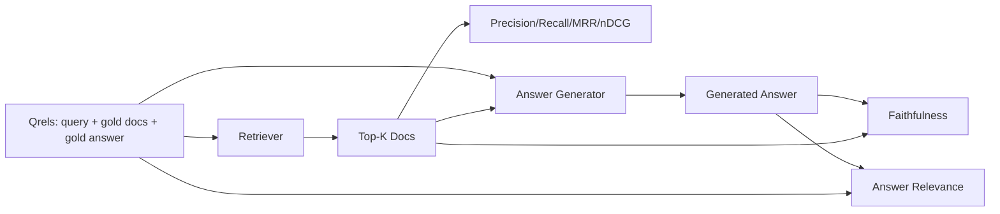

# RAG 評估：精確率、召回率、MRR、nDCG、忠實度、答案相關性

> 若你沒辦法同時替檢索與答案評分，你就出不了這套系統的貨。這兩者不是同一項指標，而同一段提示詞在不同軸上失敗。

**類型：** 實作
**程式語言：** Python
**先修單元：** 階段 11 第 06（RAG）、10（評估）課；階段 19 B 軌基礎（第 20-29 課）；階段 19 第 64、65、66、67 課
**時間：** 約 90 分鐘

## 學習目標
- 從黃金 qrels 計算四項檢索指標：precision@k、recall@k、MRR（平均倒數排名），以及 nDCG@k。
- 計算兩項答案等級指標：忠實度（每一項主張都接地在檢索脈絡上）與答案相關性（那個答案回應了那個問題）。
- 建出一份固定的 qrels 檔案（查詢、黃金文件 id、黃金答案文字），讓評估能端到端地讀它。
- 讀那些指標值，以診斷一條管線是在哪裡失敗的：檢索、排序、生成，還是接地。

## 那個問題

一套 RAG 系統至少有四塊活動元件：切片器、檢索器、重排器、產生器。它們之中任何一個都可能是錯誤答案的成因。沒有逐階段的指標，你就是在盲飛。

一位使用者回報了一個錯誤答案。是因為切片器把答案跨度切開了嗎？是因為檢索器沒把那個片段放進前 k 筆嗎？是因為重排器把對的片段推到第一名之後了嗎？是因為產生器忽略了那個片段、自己編了東西嗎？光看答案你分不出來。你需要：

- 檢索指標，替檢索器吐出來的東西評分。
- 排序指標，替對的片段坐在順序中的哪裡評分。
- 忠實度，替產生器有沒有待在檢索脈絡之內評分。
- 答案相關性，替那個答案究竟有沒有回應問題評分。

這一課在一份固定的 qrels 檔案之上，把這六項全都建出來。這份評估是離線且確定性的；在生產環境你把那個模擬的 LLM 裁判換成一個真的。

## 那個概念



### Precision@k

在檢索器回傳的前 k 份文件中，有多少比例在黃金集裡？若黃金集有三份文件，而前 3 筆回傳了其中兩份加一份錯的，precision@3 就是 2 / 3。當「檢索到不相關片段」的代價很高時（產生器在它身上浪費詞元，或那個片段毒害了答案），就用精確率。

### Recall@k

在那些黃金文件中，有多少比例在前 k 筆裡？若黃金集有三份文件，而前 5 筆含有全部三份，recall@5 就是 1.0。當「漏掉答案」的代價很高時（你寧可多看一份錯的片段，也不要完全漏掉那份答案片段），就用召回率。

在生產 RAG 裡，大家通常引用的指標是 recall@k。生成很容易就把不相關的片段丟掉；但它沒辦法從一份從沒看過的片段裡發明出答案。

### MRR（平均倒數排名）

對每一則查詢，找出排序清單中第一份相關文件的位置。倒數排名是 1 / 位置。在查詢集上取平均。MRR 是一個單一數字的摘要，說明檢索器把最佳答案擺到最上面的能力有多好。

MRR 對第一名的加權很重。黃金文件在排名 1 的查詢貢獻 1.0。排名 2 貢獻 0.5。排名 10 貢獻 0.1。這個指標由清單頂端主導。

### nDCG@k

正規化折損累積增益。完整公式替每一份被檢索到的文件指定一個增益（相關常為 1、不相關為 0）、依位置的對數做折損、加總，再除以理想 DCG（你排得完美時會有的那個 DCG）。範圍 0 到 1。

nDCG 容納得了分級相關性：黃金標註可以說「文件 A 是 3、文件 B 是 2、文件 C 是 1」。MRR 與 recall@k 把一切壓成二元。當語料裡每則查詢有多份部分相關的文件時，就用 nDCG。

### 忠實度

對生成答案裡的每一項主張，檢查那項主張有沒有被檢索脈絡所支持。標準實作用一段 LLM 裁判提示詞，吃下（主張, 脈絡）並回傳是或否。指標就是通過的主張比例。

忠實度抓的是「產生器發明內容」那個失敗模式。就算檢索器回傳了對的片段，一個會幻覺的產生器仍然是壞的。忠實度也被叫做接地性、支持度、歸屬。

這一課用一個確定性的模擬裁判實作忠實度，它檢查每項主張的詞元與檢索脈絡的重疊有沒有超過門檻。生產環境裡你換成一次真實的模型呼叫。這項指標的形狀是一樣的。

### 答案相關性

那個答案真的有回應那個問題嗎？忠實度問的是「這個答案有接地在脈絡上嗎？」。答案相關性問的是「這個答案有接地在問題上嗎？」。一個忠實但離題的答案，忠實度得分高、相關性得分低。一個簡短、切題但忽略脈絡的答案，相關性得分高、忠實度得分低。

標準實作同樣用 LLM 裁判：吃下（問題, 答案）並問那個答案有沒有回應那個問題。這一課實作的是一個「詞元重疊加裁判」的替身。

## 那份固定 qrels

```python
{
  "qid": "q1",
  "query": "what is the abort threshold for multipart uploads",
  "gold_doc_ids": ["d1", "d3"],
  "gold_answer_substring": "three failed parts",
  "graded_relevance": {"d1": 3, "d3": 2},
}
```

每一則查詢帶著：
- 那個查詢字串，
- 一組黃金文件 id（供 precision / recall / MRR 用），
- 一份分級相關性字典（供 nDCG 用），
- 那段黃金答案子字串（在每一筆 qrel 上保留為參考中繼資料；這一課的忠實度是靠「拿抽出來的主張去對照檢索脈絡評判」算出來的，不是拿去對照這段子字串）。

在生產環境裡這些是你標註出來的。這一課出貨一份手工建的固定資料，好讓那份評估開箱就跑得起來。

```figure
ci-rag-metric-ladder
```

## 動手建

`code/main.py` 實作：

- `precision_at_k(retrieved, gold, k)` —— 就是那個字面定義。
- `recall_at_k(retrieved, gold, k)` —— 就是那個字面定義。
- `mean_reciprocal_rank(retrieved_list_of_lists, gold_list)` —— 在各查詢上取平均。
- `ndcg_at_k(retrieved, graded_relevance, k)` —— DCG / IDCG，支援二元或分級增益。
- `extract_claims(answer)` —— 把一個答案切成句子形狀的主張。
- `faithfulness(claims, context_texts, judge)` —— 被判定為有支持的主張比例。
- `answer_relevance(question, answer, judge)` —— 判定那個答案有沒有回應那個問題。
- `MockJudge` —— 一個確定性的詞元重疊裁判，好讓評估離線跑得起來。
- `evaluate_pipeline(pipeline_fn, qrels, ks)` —— 跑完每一項指標的那個編排者。
- 一個示範，拿三種管線變體（切片器基線、混合檢索、混合 + 重排）去跑那份 qrels，並印出一張指標表。

跑它：

```bash
python3 code/main.py
```

輸出在同一張指標表裡，替每一種變體顯示 precision@k、recall@k、MRR、nDCG@k、忠實度與答案相關性。混合檢索那一列在召回率上打敗切片器基線；重排那一列在 MRR 上打敗混合。

## 讀那些指標來診斷失敗

| 症狀 | 可能的成因 | 該修什麼 |
|---------|-------------|-------------|
| recall@k 低、precision@k 低 | 切片器把答案切開了，或檢索器找不到它 | 切片器邊界（第 64 課）或檢索器模態（第 65 課） |
| recall@k 還行、MRR 低 | 對的片段在前 k 筆裡，但不在第一名 | 重排器（第 66 課） |
| MRR 高、忠實度低 | 脈絡是對的，產生器卻在發明內容 | 生成提示詞；強制「有引用才作答，否則拒答」 |
| 忠實度高、相關性低 | 答案有接地，但離題 | 查詢改寫器（第 67 課）或生成提示詞 |
| 四項都高，使用者還是抱怨 | 評估集不具代表性 | 用真實使用者查詢擴充 qrels |

## 示範會藏起來的失敗模式

**LLM 裁判的偏差。** 一個模型會把自己的輸出評得比實際更忠實。裁判用與產生器不同的模型家族，或人工評分一份樣本。

**Qrels 腐壞。** 隨著語料改變，那些黃金答案會漂移。一份在 2024 年 1 月是 q1 黃金答案的文件，到 2024 年 10 月就不再是對的答案了，因為團隊把那個函式改了名。排定每季一次的 qrels 檢視。

**忠實度的微觀檢查漏掉宏觀主張。** 逐句的忠實度可以全過，但整體答案的結構卻具誤導性。在自動化指標之上，加上一次樣本層級的質性審查。

**Recall@k 掩蓋逐查詢的失敗。** 90% 的平均召回率，可能藏著「某一類查詢永遠漏掉」這件事。依查詢類別（字面、換句話說、多主題）把 qrels 切片，並逐切片回報。

## 動手用

生產模式：

- 每一次檢索器或產生器改動都跑那份評估。把 recall@k 的退化當成一次測試失敗來對待。
- 逐查詢把指標軌跡持久化下來。使用者抱怨時，去查那筆相符的 qrels 條目，看看它本來抓不抓得到。
- 把 qrels 分層：一份 20 題的冒煙集在 CI 裡跑；一份 200 題的回歸集每晚跑；一份 2000 題的深度集每週跑。

## 產出交付

第 69 課把整條管線（切片器、檢索器、重排器、產生器）接起來，並拿這份評估去跑那套端到端系統。

## 練習

1. 加上第五項檢索指標：hit-rate@k。把它與 recall@k 比較。解釋它們什麼時候會不同。
2. 實作分級忠實度：0（沒有支持）、1（部分支持）、2（完全支持）。據此更新那項指標。
3. 把那個模擬裁判換成一次真實的模型呼叫。在固定資料上量測模擬裁判與真裁判之間的不一致。
4. 加上一個查詢類別切片（「字面」、「換句話說」、「多主題」）。回報逐切片的指標。
5. 加上一項「答案長度」指標，並把它與忠實度做相關分析。把曲線畫出來。

## 關鍵術語

| 術語 | 大家怎麼說 | 實際是什麼意思 |
|------|-----------------|------------------------|
| Precision@k | 「檢索出來的命中率」 | 前 k 筆中屬於黃金集的比例 |
| Recall@k | 「黃金集的命中率」 | 黃金集中落在前 k 筆的比例 |
| MRR | 「第一次命中的位置」 | 第一份相關文件排名倒數的平均 |
| nDCG@k | 「分級的排序品質」 | 前 k 筆的 DCG 除以理想 DCG |
| 忠實度 | 「接地性」 | 答案主張中被檢索脈絡所支持的比例 |
| 答案相關性 | 「它有回應那個問題嗎？」 | 那個答案是否符合問題的意圖 |
| Qrels | 「黃金標籤」 | 那組已標註的查詢，以及它們的黃金文件與答案 |

## 延伸閱讀

- Buckley、Voorhees，〈Evaluating Evaluation Measure Stability〉，SIGIR 2000 —— 關於排序指標那篇經典論文
- Jarvelin、Kekalainen，〈Cumulated Gain-based Evaluation of IR Techniques〉 —— 那篇 nDCG 論文
- [Ragas: Automated Evaluation of RAG Pipelines](https://docs.ragas.io)
- [Anthropic, Evaluating RAG](https://www.anthropic.com/news/evaluating-rag)
- 階段 11 第 10 課 —— 評估框架的基礎
- 階段 19 第 64-67 課 —— 這裡所評估的那些元件
- 階段 19 第 69 課 —— 這份評估所評分的那條端到端管線
