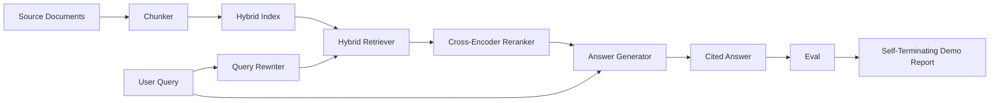

# 端到端 RAG 系統

> 六課的元件。一條管線。一條評估迴路。一個會自我終止的示範。這就是你要出貨的那套系統。

**類型：** 實作
**程式語言：** Python
**先修單元：** 階段 11 第 06（RAG）、10（評估）課；階段 19 B 軌基礎（第 20-29 課）；階段 19 第 64、65、66、67、68 課
**時間：** 約 90 分鐘

## 學習目標
- 把切片器、混合檢索器、查詢改寫器、交叉編碼器重排器與答案產生器，組合成單一條端到端管線。
- 實作一個以片段錨點替主張標註引用、並帶「信心低就拒答」退路的答案產生器。
- 拿第 68 課的評估去跑那條組裝好的管線，並證明「分階段建起來的系統」在每一項指標上都勝過那些孤立的相同元件。
- 建出一個會自我終止的 CLI 示範，攝取一份固定語料、跑一組固定查詢，並帶一份摘要報告以零結束碼退出。

## 那個問題

六個孤立的元件什麼都證明不了。切片器可以在語料上的 recall@5 勝出，卻在系統的 recall@5 上輸掉，因為檢索器排不了切片器吐出來的東西。重排器可以在一個合成候選池上把 MRR 拉高，卻在真實的雙編碼器候選上失敗，因為雙編碼器在那個重排預算處的召回率太低。查詢改寫器可以在一則查詢上把黃金文件推上去，卻在下一則上壞掉，因為那個 LLM 模擬回傳了一個退化的假想文件。

那個整合測試，就是拿整條管線去對著同一份固定 qrels、用同一項指標、以一個把一切接起來的編排者檔案，端到端跑一遍。這就是這一課要建的。若那條整合管線的指標，勝過每一階段孤立示範的指標，你就證明了這套系統。

## 那個概念



### 接線上的抉擇

這條管線是一張小圖。每一階段都是一個帶清楚簽章的函式。

| 階段 | 輸入 | 輸出 |
|-------|-------|--------|
| 切片器 | 文件文字 | 一份 Chunk 紀錄清單 |
| 檢索器 | 查詢字串 | 前 N 筆 Chunk 紀錄 |
| 改寫器（選配） | 查詢字串 | 一份改寫清單 + 假想文件 |
| 重排器 | 查詢、候選 | 帶交叉分數的前 K 筆 Chunk 紀錄 |
| 產生器 | 查詢、前 K 筆 Chunk 紀錄 | 帶引用的答案字串 |

當每個簽章都穩定時，那次組合就很直白。這一課的 `Pipeline` 類別持有那五個階段，以及一個依序跑它們的 `query` 方法。每一個階段都可抽換：傳入不同的切片器、檢索器、改寫器、重排器或產生器，管線照樣跑。

### 帶引用的答案產生器

產生器是最後一個階段，也是最容易壞的。這一課出貨一個確定性的模擬產生器，它會：

1. 拿下前 K 筆重排後的片段。
2. 選出最多兩個「文字與查詢的內容詞元重疊度最高」的片段。
3. 產出一個答案，內容是「從每個被選中片段各取一句」串接起來，每一句後面跟著一個 `[doc_id:chunk_index]` 錨點。
4. 若沒有任何片段的重疊高於一個拒答門檻，就產出「我不知道」，不帶引用。

在生產環境你把那個模擬換成一次真實的 LLM 呼叫，提示詞樣板是：

```
You are answering a question using only the snippets below.
Cite every claim with the anchor in parentheses.
If the snippets do not answer the question, say "I do not know".

Question: {query}

Snippets:
{enumerated chunks with anchors}

Answer:
```

那條「信心低就拒答」的路徑，就是把交叉編碼器第一名分數記錄下來的全部理由。若它坐在語料門檻之下，產生器就拒答。這是對付幻覺答案的那道安全閥。

### 那個會自我終止的示範

那個示範端到端地跑完一切。它印出某一則查詢的逐階段拆解、在那四筆固定 qrels 上跑評估、印出一張指標表，並在第 68 課那些指標全都達到示範所設門檻時以狀態零退出。若任何一項指標低於門檻，示範就以非零狀態退出，並附上一則點名那項失敗指標的訊息。

這就是一次 CI 冒煙測試該有的形狀。這條管線離線跑、很快、確定性。那些門檻在固定語料上被刻意設得很緊，好讓那六課裡任何一課的退化都讓示範失敗。

## 動手建

`code/main.py` 實作：

- `Chunk` —— 貫穿所有階段的那筆紀錄（在第 64 課的形狀上擴充了 chunk_index 與來源 doc_id）。
- `Chunker` —— 從第 64 課挑一種策略（預設遞迴切分）。
- `HybridIndex` —— 把第 65 課的 BM25 + 稠密 + RRF 綁在一起。
- `Rewriter`（選配）—— 依查詢長度與有無連接詞，從第 67 課的 HyDE、多查詢、分解裡挑一種。
- `Reranker` —— 第 66 課那個訓練好的交叉編碼器，配一組更小的固定訓練集，好讓它在幾秒內收斂。
- `Generator` —— 那個帶引用與「信心低就拒答」的確定性模擬產生器。
- `Pipeline` —— 把那五個階段組合起來，帶一個回傳 `Result(answer, top_k, latency_ms_per_stage)` 的 `query(question)` 方法。
- `run_demo()` —— 攝取語料、跑三則固定查詢、跑評估、印出結果，並依門檻設定結束碼。

跑它：

```bash
python3 code/main.py
```

輸出是一份印出來的查詢軌跡、那張完整的評估表，以及一個最終的通過／失敗狀態。在固定語料上回傳結束碼 0。

## 示範會藏起來的失敗模式

**切片器邊界漂移。** 若你在「標註評估 qrels 的那一趟」與「示範」之間換了切片策略，那些黃金文件 id 就對不上了。把切片策略鎖在那份 qrels 檔案裡。示範裡包含一個點名切片器的標頭。

**重排器的訓練集洩進評估。** 第 66 課那 14 組訓練三元組裡，有些查詢與評估查詢很像。在生產環境裡要嚴格把評估查詢保留出來。這個示範的評估查詢，刻意與重排訓練集不相交。

**模擬產生器藏起了幻覺風險。** 那個模擬幻覺不了，因為它只從被檢索到的片段裡吐文字。這一課會註記這件事，並把生產環境的換裝路徑指向一個真模型。

**沒有串流。** 這條管線在每一階段結束時回傳完整答案。生產系統會把產生器的輸出串流出去。串流不在範圍內；不管怎樣，那些答案等級指標都作用在最終字串上。

**延遲是離線的。** 那些模擬 LLM 呼叫是常數時間。真實的 LLM 呼叫才是主導。在請求範圍內規劃一份延遲預算；這一課的逐階段計時只量了 CPU 的工作。

## 動手用

生產模式：

- 把那個管線檔案放在單一個編排者之下、帶明確的階段介面出貨。不要把接線散布在整個儲存庫裡。
- 每一次動到某個階段的合併之前都跑那份評估。評估掉下去，那次合併就不許落地。
- 逐 CI 執行把指標軌跡持久化下來，好讓你能把退化歸因到某次階段抽換上。
- 加上一份 20 題的冒煙集（回歸集的子集），在 30 秒內跑完；完整的回歸集每晚跑。

## 產出交付

這一課那個管線檔案，就是階段 19 F 軌其餘課程所假設的形狀。後續課程會在上面加上攝取自動化、增量重新索引、遙測，以及一層服務層。檢索、重排、改寫與評估這幾半，在這裡都完成了。

## 練習

1. 在改寫器內部加上一個逐查詢的策略選擇器：用第 67 課的捷思（長度、連接詞、術語比例）去挑 HyDE、多查詢或分解。
2. 在一個環境變數旗標後面，替產生器加上一次真實的 LLM 呼叫。預設走模擬。量測那個延遲差值。
3. 把示範擴充成接受一個 `--corpus path` 旗標，載入一份真實語料。重跑評估與那項門檻檢查。
4. 替切片器加上一個 `--strategy` 旗標。量測每一種策略對端到端召回率的貢獻。
5. 加上一個串流產生器介面，並把它餵進評估。確認忠實度是在最終字串上算的，不是在串流出來的前綴上。

## 關鍵術語

| 術語 | 大家怎麼說 | 實際是什麼意思 |
|------|-----------------|------------------------|
| 管線 | 「RAG 管線」 | 從攝取到帶引用答案、組合起來的那些階段 |
| 引用錨點 | 「來源連結」 | 附在每一項主張上的（doc_id, chunk_index）參照 |
| 信心低就拒答 | 「我不知道」 | 重排器第一名分數低於門檻時，產生器不回答案 |
| 冒煙集 | 「CI 評估」 | 在每一次 PR 檢查裡都跑的那份最小 qrels 子集 |
| 階段介面 | 「函式簽章」 | 每一個管線階段那個穩定的輸入與輸出型別 |

## 延伸閱讀

- [Anthropic, Building search and retrieval](https://www.anthropic.com/news/contextual-retrieval)
- [Pinterest, MCP internal search](https://medium.com/pinterest-engineering) —— 生產架構的參考
- [Ragas: Automated Evaluation of RAG Pipelines](https://docs.ragas.io)
- 階段 11 第 06 課 —— RAG 基礎
- 階段 19 第 64-68 課 —— 這裡所組合的那些元件
