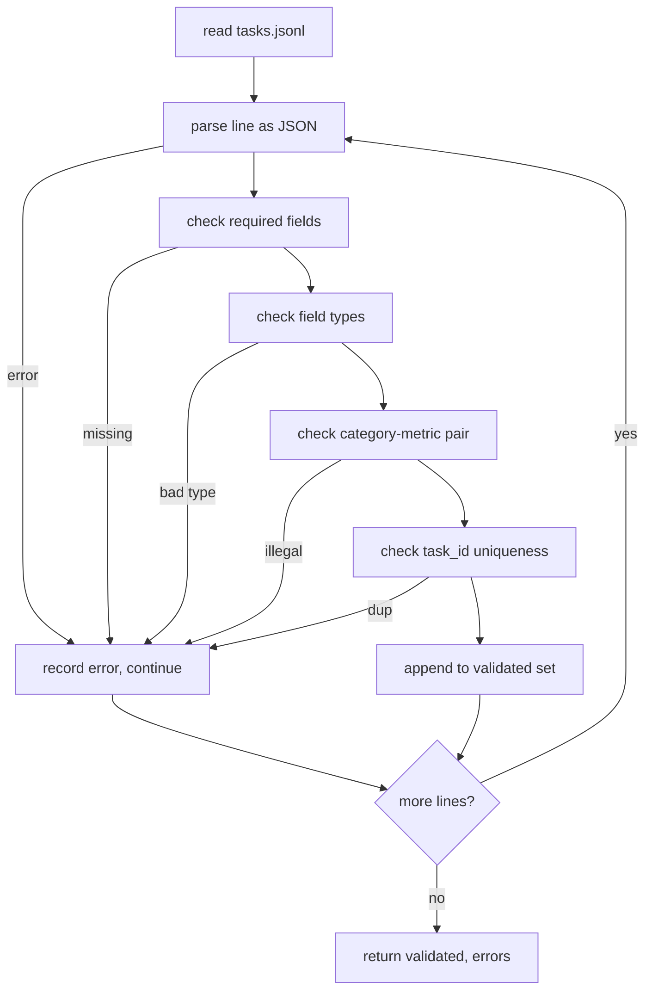

# 任務規格格式

> 一套評估框架，只跟它的任務所遵守的那紙契約一樣好。在你寫下第一個評分函式之前，先把 JSONL 的形狀與指標詞彙定死。

**類型：** 實作
**程式語言：** Python
**先修單元：** 階段 19 B 軌基礎
**時間：** 約 90 分鐘

## 學習目標

- 定義一份 JSONL 任務紀錄結構，用同一個形狀涵蓋算術、多選題、程式碼執行、分類與自由文字摘要。
- 釘住一套封閉的指標名稱詞彙，好讓下游課程（71-73）能只依單一欄位做派送。
- 把少樣本範例與後處理規則指定成任務的一部分，而不是執行器的一部分，好讓同一段提示詞在各模型上產出同樣的目標。
- 實作一個嚴格的驗證器，在畸形紀錄抵達執行器之前就把它們拒掉。
- 出貨一組 10 個任務的固定資料，演練這份規格的每一條分支，好讓驗證器有真東西可啃。

## 為什麼要一份定死的規格

一份研究程式碼庫，累積評估腳本的速度會比累積測試還快。六個月後，每一份筆記本都有自己的 JSON 形狀、每一項指標都被重新實作了兩遍，而且什麼都沒辦法跨執行比較。修法很無趣。挑一個結構。寫一個驗證器。其餘一律拒絕。這就是這一課做的事。

這個形狀借用了 BIG-bench、HELM 與 lm-eval 風格框架的想法，但那些欄位名稱是我們自己的。每個欄位都有唯一的主人。執行器讀那個任務。指標讀那些目標。後處理步驟把那份生成正規化。沒有任何欄位在管線中途是可變的。

## 那份紀錄形狀

一項任務是單一行上的一個 JSON 物件。框架讀 `tasks.jsonl`，並各自獨立地驗證每一行。壞掉的一行只中止那筆紀錄，不中止整次執行。

```json
{
  "task_id": "arith_001",
  "category": "arithmetic",
  "prompt": "Compute the result. Question: 17 + 24\nAnswer:",
  "targets": ["41"],
  "metric_name": "exact_match",
  "few_shot_examples": [
    {"prompt": "Question: 2 + 2\nAnswer:", "completion": "4"}
  ],
  "post_process": "strip_whitespace",
  "metadata": {"difficulty": "easy"}
}
```

必要欄位是 `task_id`、`category`、`prompt`、`targets`、`metric_name`、`post_process`。`few_shot_examples` 與 `metadata` 是選配的。未知的頂層欄位會驗證失敗。

## 欄位規則

`task_id` 是一個不含空白的字串。驗證器強制它在整個檔案中唯一。

`category` 是 `arithmetic`、`mcq`、`code_exec`、`classification`、`summary` 之一。類別約束了哪一組指標與後處理配對是合法的。`code_exec` 任務必須用 `metric_name = code_exec`，而 `mcq` 任務必須用 `metric_name = exact_match`，對著一個單一字母的目標。

`prompt` 是一個非空字串。驗證器禁止尾端空白，並拒絕那些提示詞本體裡已經含有少樣本區塊的紀錄。少樣本的渲染發生在執行器裡，不在作者手上。

`targets` 是一份非空的字串清單。對 `exact_match` 而言，任一元素相符就算數。對 `f1` 與 `rouge_l` 而言，得分最高的那個目標勝出。對 `mcq` 而言，清單裡恰好一個元素。

`metric_name` 是 `exact_match`、`f1`、`bleu_4`、`rouge_l`、`accuracy`、`code_exec` 之一。這套詞彙是封閉的。一項新指標需要一堂新課，以及這裡的一筆新條目。

`few_shot_examples` 是一份 `{prompt, completion}` 配對的清單。驗證器把清單上限設在八筆，好讓提示詞維持有界。

`post_process` 是 `none`、`strip_whitespace`、`lower`、`extract_letter`、`extract_code_block`、`extract_first_line` 之一。每一條規則都有唯一的確定性行為。驗證器禁止把規則組合起來。

## 驗證器的行為



驗證器回傳兩份清單：通過驗證的紀錄，以及帶有「那一行、被違反的規則、出錯的欄位」的錯誤紀錄。除非明確設了 `--allow-bad-tasks` 旗標，否則只要錯誤清單非空，執行器就拒絕啟動。

## 少樣本渲染

執行器把少樣本範例以一個空行分隔，串接在提示詞前面。同一條程式碼路徑對每一個模型都跑，所以唯一的變異來源就是模型本身。作者把範例寫一次，不必逐供應商各寫一次。

```python
def render(task):
    parts = []
    for ex in task.get("few_shot_examples", []):
        parts.append(ex["prompt"] + " " + ex["completion"])
    parts.append(task["prompt"])
    return "\n\n".join(parts)
```

## 後處理規則

後處理步驟在生成之後、指標之前執行。它是確定性且無狀態的。

- `none` 原封不動回傳那個字串。
- `strip_whitespace` 去掉頭尾空白。
- `lower` 把字串轉小寫。
- `extract_letter` 回傳第一個符合 `[A-E]` 的字元，供多選題使用。
- `extract_code_block` 回傳第一個三重反引號圍籬區塊的本體，供程式碼執行使用。
- `extract_first_line` 回傳第一個非空行，供摘要分類使用。

需要這份清單之外規則的任務，屬於另一堂課。

## 這一課不做什麼

它不評分。它不呼叫模型。它不執行程式碼。那些會在第 71、72 與 75 課出現。這一課定死的是那紙它們全都要遵守的契約。

那組 10 個任務的固定資料涵蓋兩個算術項、兩個多選題項、兩個程式碼執行項、兩個分類項與兩個摘要項。驗證器在全部 10 個上都通過。另一份固定資料（`tasks_bad.jsonl`）踩過每一條規則，而驗證器恰好回傳那麼多錯誤。

## 怎麼讀那些程式碼

`main.py` 定義了 `TaskSpec`、`validate_task`、`validate_file`，以及一個 CLI 進入點。固定資料載入器是 `load_fixtures`。渲染與後處理的輔助函式就住在驗證旁邊，好讓第 75 課的執行器只需匯入單一個模組。

從頭到尾讀一遍 `main.py`。然後讀 `code/tests/test_spec.py`。那些測試釘住了每一條驗證規則與每一種後處理行為。`main.py` 底部的示範會驗證那份打包好的固定資料並印出摘要。

## 再往前走

真實的評估套件長類別的方式，就像資料庫結構長欄位一樣。清醒的做法是：不同時加上一項指標、一條後處理規則，以及至少一個固定任務，就拒絕新增類別。把這份規格當成資料庫遷移來看。每一次改動都要被審查、被版本化，並附上測試。這一課的驗證器就是那道閘門。
