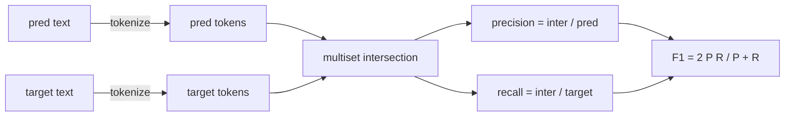
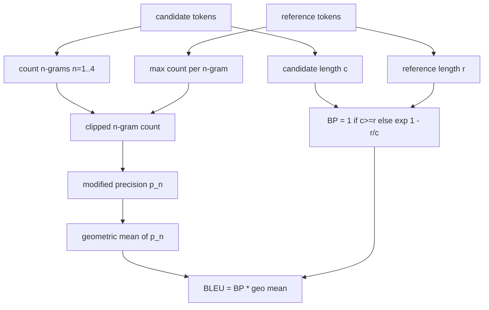

# 古典指標

> BLEU、ROUGE-L、F1、完全相符、準確率。五項指標，至今仍占了已發表 LLM 評估數字的大宗。從第一原理把每一項都實作出來，好讓你知道那個數字是什麼意思。

**類型：** 實作
**程式語言：** Python
**先修單元：** 階段 19 B 軌基礎、第 70 課
**時間：** 約 90 分鐘

## 學習目標

- 以明確的分詞規則，實作詞元層級的完全相符、F1 與準確率。
- 從頭實作 BLEU-4：修正 n-gram 精確率、n 從 1 到 4 的幾何平均、簡短懲罰。
- 用最長共同子序列實作 ROUGE-L，並以 F-beta 把精確率與召回率結合起來。
- 依第 70 課那個 metric_name 欄位做派送，好讓執行器與指標無關。
- 用取自手算範例、而不是第三方函式庫的參考向量，把那些行為釘住。

```figure
cd-bleu-overlap
```

## 為什麼要重新實作

你會讀到一篇論文回報 BLEU 28.3，另一篇回報 BLEU 0.283。你會發現兩個函式庫的 ROUGE-L 分數差了十分，因為其中一個會轉小寫、另一個不會。停止困惑最快的辦法，就是自己把那些指標寫一遍，然後指著「決定分詞器」的那一行，以及「套用平滑」的那一行。在那之後，跨論文比較數字就變成一件「讀懂那份指標設定」的事，而不是為了函式庫吵架。

標準函式庫加 numpy 就夠了。BLEU 是計數加一次箝制。ROUGE-L 是動態規劃。F1 是詞元上的集合交集。最難的部分是挑一個分詞器並認定它。

## 分詞

分詞器是 `re.findall(r"\w+", text.lower())`。轉小寫、取英數字元段、丟掉標點。這一課的每一項指標都用這個確切的分詞器。執行器沒得選。你換了分詞器，你跑的就是另一份基準。

```python
TOKEN_RE = re.compile(r"\w+", re.UNICODE)
def tokenize(text):
    return TOKEN_RE.findall(text.lower())
```

這是刻意的簡化。生產環境的設定會在意中日韓文、縮寫與程式碼識別字。這一課的重點在於：分詞器是一紙契約，不是一個旋鈕。

## 完全相符

```python
def exact_match(pred, targets):
    return float(any(pred.strip() == t.strip() for t in targets))
```

它每項任務回傳 1.0 或 0.0。在一份資料集上的彙總值是平均。這是算術、多選題與短分類任務的主力。

## 詞元層級的 F1

替預測與目標各建一個詞元多重集合。精確率是多重集合交集除以預測的多重集合。召回率是同一個交集除以目標的多重集合。F1 是調和平均。這個實作處理了預測為空與目標為空的邊界情況。



對多目標的任務，我們取目標清單上最好的那個 F1。那與文獻中被廣泛回報的 SQuAD 風格行為一致。

## BLEU-4

BLEU 是機器翻譯的經典指標，而它至今仍出現在摘要工作裡。我們用的表述是語料層級的 BLEU-4，配上標準的簡短懲罰，並在修正 n-gram 計數上做加一平滑，好讓少了一個 4-gram 不會把分數壓成零。

對每一組候選－參考配對，我們計算 n 為 1、2、3、4 的修正 n-gram 精確率。修正精確率會把候選的 n-gram 計數，以「該 n-gram 在任一參考中的最大計數」箝制住，所以候選沒辦法靠重複同一個片語灌水。那四個精確率的幾何平均，再被簡短懲罰包起來。



那條平滑規則就是 Lin 與 Och 稱之為方法一的那個：在取對數之前，把每一個 n-gram 精確率的分子與分母各加一。這避免了參考中沒有相符 4-gram 時的 `log 0`，而在長候選上又貼近未平滑的值。

## ROUGE-L

ROUGE-L 比較候選與參考詞元序列的最長共同子序列。LCS 捕捉了詞序，卻不強求連續，這就是它成為摘要預設指標的原因。我們用一張標準的動態規劃表算出 LCS 長度，然後把召回率導成 `lcs / 參考長度`、精確率導成 `lcs / 候選長度`，並以 beta 等於一的 F-beta（也就是對稱的 F1 形式）把兩者結合。

```python
def lcs_length(a, b):
    n, m = len(a), len(b)
    dp = numpy.zeros((n + 1, m + 1), dtype=int)
    for i in range(n):
        for j in range(m):
            if a[i] == b[j]:
                dp[i+1, j+1] = dp[i, j] + 1
            else:
                dp[i+1, j+1] = max(dp[i+1, j], dp[i, j+1])
    return int(dp[n, m])
```

那張 numpy 表讓實作變得好讀；純 Python 清單也行得通。選用 ROUGE-L 的任務，每項任務要付 O(n m) 的成本。對典型的摘要長度而言，那維持在一毫秒之內。

## 準確率

對多目標的分類任務而言，準確率化約成「對照單一個正規化後目標的完全相符」。我們把它暴露成一個獨立的函式，好讓派送器能依 `metric_name` 派送，而不必在執行器內部去做字串比較。

## 派送契約

唯一的進入點是 `score(metric_name, prediction, targets)`。它回傳一個落在 `[0, 1]` 的浮點數。執行器不依指標名稱分支。它把呼叫交出去，然後把結果寫下來。這就是第 75 課會把它與第 70 課任務規格黏起來的那個介面。

```python
def score(metric_name, pred, targets):
    if metric_name == "exact_match":
        return exact_match(pred, targets)
    if metric_name == "f1":
        return max(f1_score(pred, t) for t in targets)
    if metric_name == "bleu_4":
        return max(bleu4(pred, t) for t in targets)
    if metric_name == "rouge_l":
        return max(rouge_l(pred, t) for t in targets)
    if metric_name == "accuracy":
        return accuracy(pred, targets)
    raise ValueError(f"unknown metric_name: {metric_name}")
```

`code_exec` 在第 72 課處理，並在那裡被塞進這個派送器。

## 這一課不做什麼

它不呼叫模型。除了第 70 課那些後處理規則已經做過的，它不再對生成做正規化。它不算信賴區間。它不做 BLEURT 或 BERTScore（那些需要一個模型，住在另一堂課）。重點在那個地板：五項指標、一個分詞器、一張派送表。

## 怎麼讀那些程式碼

`main.py` 把每一項指標定義成一個自由函式，外加那個派送器。那些參考向量住在檔案底部的 `_reference_examples` 區塊裡。示範拿派送器跑八個範例，並印出逐指標的分數。`code/tests/test_metrics.py` 裡的測試釘住了那些參考向量，並對每一種邊界情況施壓（預測為空、參考為空、沒有共用詞元、完全相符、重複片語的箝制）。

從頭到尾讀一遍 `main.py`。那些函式依複雜度排序。exact_match 與 accuracy 各一行。F1 六行。BLEU 與 ROUGE-L 是重頭戲，而它們含有關於平滑規則與 LCS 遞迴式的詳細註解。

## 再往前走

古典指標是必要的，不是充分的。它們獎勵表面重疊、錯過意義。修法是在你信任那個古典地板之後，往上疊以模型為基礎的指標（BLEURT、BERTScore、GEval）。那是後面的課。就現在而言：把這五個弄好、用測試把它們釘住，你就有了一套可稽核、快速且可重現的指標堆疊。
