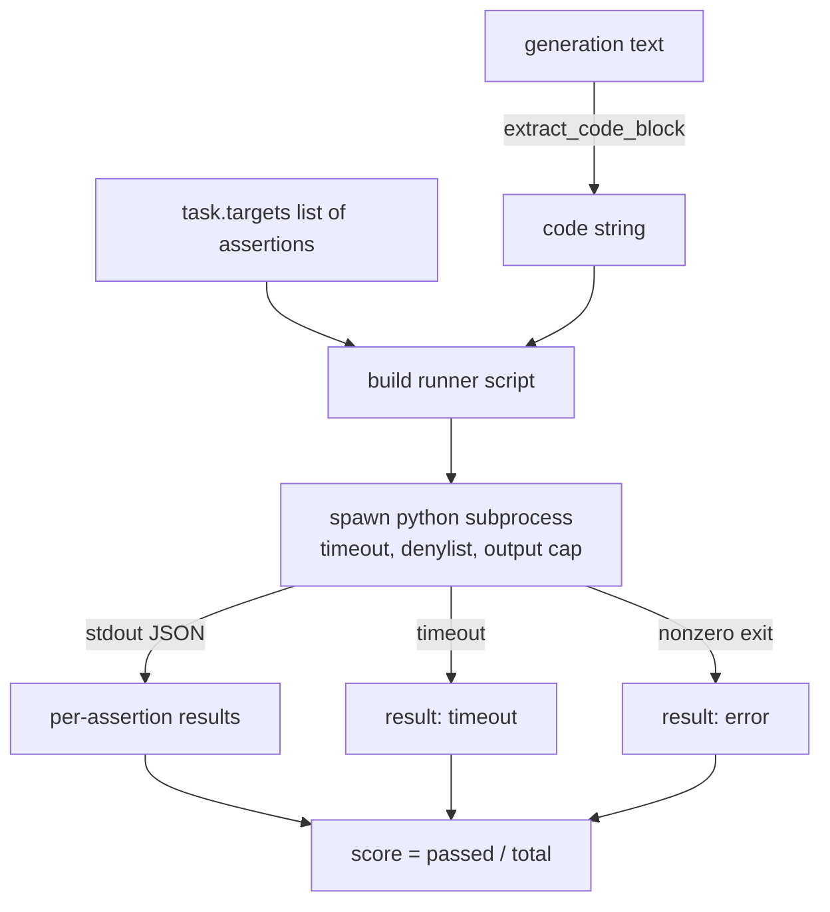
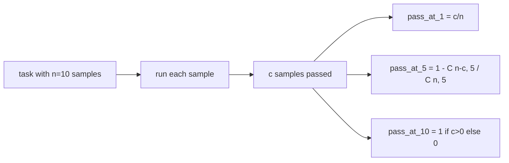

# 程式碼執行指標

> 生成出來的程式碼，通過測試才算對。評估框架必須抽出程式碼、在不弄垮主機的前提下執行它，並誠實地統計通過率。這一課要建的就是那個介面。

**類型：** 實作
**程式語言：** Python
**先修單元：** 階段 19 B 軌基礎、第 70 與 71 課
**時間：** 約 90 分鐘

## 學習目標

- 以與第 70 課後處理規則相符的方式，從一段自由格式的生成中抽出一個程式碼區塊。
- 在一個隔離的子行程中執行候選程式碼，並帶實際時間逾時、輸出上限與一份匯入拒絕清單。
- 把一項任務的分數評成「所提供的斷言字串中，對著候選通過的比例」。
- 替那些從一個模型抽出多份生成的任務計算 pass-at-k。
- 把沙箱當機、語法錯誤與逾時，當成帶各自結束碼、可供執行器記錄的一等失敗模式。

```figure
sandbox-runner
```

## 為什麼要用隔離的子行程

行程內的 `exec` 是一項資安與穩定性風險。一段生成出來的 `while True: pass` 會把評估永遠卡住。一段生成出來的 `import shutil; shutil.rmtree('/')`，就跟它聽起來一樣災難。修法是替每個候選衍生一個全新的 Python 直譯器、把程式碼從 stdin 傳進去、把斷言結果寫到 stdout，並在它超時的時候把那個行程殺掉。主機的評估行程繼續跑。

HumanEval、MBPP、BigCodeBench 與 LiveCodeBench 這些真實評估全都用子行程沙箱。有些還在上面疊 Docker。我們停在子行程是有理由的：它可攜、它是標準函式庫，而且它抓得到那些對教學型評估要緊的失敗模式。生產部署會加上 seccomp、網路隔離與唯讀檔案系統。關於加固的下一課住在這條軌之外。

## 一項程式碼執行任務的形狀

一項 `code_exec` 任務在 `targets` 裡帶著斷言字串。執行器從那段生成中抽出一個圍籬程式碼區塊、在它周圍建一套測試框架，然後跑那個結果。



分數是一個落在 `[0, 1]` 的比例。一項有三個斷言、其中兩個通過的任務得 0.667。不管什麼失敗了，執行器都回傳同樣的形狀：子行程的當機被對映成一個正規化的錯誤碼，而不是一個冒到框架上來的 Python 堆疊追蹤。

## 那份拒絕清單

拒絕清單是以匯入為基礎的。在跑候選程式碼之前，執行器腳本會把危險模組的匯入改寫成一個會拋出 `ImportError("denied")` 的存根。這份清單刻意保守：`os.system`、`subprocess`、`socket`、`requests`、`urllib`、`urllib.request`、`urllib.error`、`urllib.parse`、`ctypes`、`shutil`、`http.client`、`asyncio.subprocess`。

我們不假裝這是刀槍不入的。在 Python 裡，鐵了心的對抗性程式碼逃得出任何行程內沙箱。這份拒絕清單是一道後盾。那個實際時間逾時與那個輸出上限，才是承重的控制。

```python
DENIED = {
    "os.system": True,
    "subprocess": True,
    "socket": True,
    "shutil": True,
    "requests": True,
    "urllib": True,
    "ctypes": True,
}
```

我們把候選包起來，前面加上 `import sys` 與一段把 `os.system` 猴子補丁成會拋例外的守衛。完整的樣板在 `main.py` 裡。

## 實際時間逾時

每個子行程拿到三秒實際時間的預設預算。執行器用 `subprocess.run(..., timeout=t)`。逾時觸發時，執行器捕捉 `TimeoutExpired`、把那個行程殺掉，並替該任務記下一個 `timeout` 的退出理由。那項任務的分數是零。執行器繼續往下走。

那個逾時可以透過 `task.metadata.timeout_s` 逐任務設定。長時間執行的單元測試可以要求更多；第 70 課那個驗證器把值封頂在三十秒，好讓整套維持有界。

## 輸出上限

子行程可以把 stdout 灌爆，耗光主機記憶體。執行器把 stdout 串流進一個緩衝區，並在累計總量一跨過 256 KB 就把子行程殺掉。結果被記成 `exit_code = error`，細節字串為 `"output overflow"`。當某段生成不小心寫出一個會印東西的無限迴圈時，這在實務上就會出現。

## Pass-at-k

Pass-at-k 是 HumanEval 那一系所用的那個無偏估計量。給定每項任務 `n` 份獨立樣本、其中 `c` 份通過，那麼從那 `n` 份中抽出大小為 `k` 的樣本至少含有一份通過解的機率是：

```
pass_at_k(n, c, k) = 1 - C(n - c, k) / C(n, k)
```

當 `n - c < k` 時分子未定義，而該值為 `1`。實作直接處理了那個邊界情況。我們暴露 `pass_at_k(n, c, k)`，供第 74 課的排行榜層使用。



## 結束碼

執行器每項任務回傳五種結果之一：

- `pass`，當每一個斷言都通過。
- `assertion_fail`，當程式碼跑起來了但至少一個斷言失敗。
- `syntax_error`，當程式碼匯入不了或有 SyntaxError。
- `timeout`，當實際時間到期。
- `error`，任何其他當機，包括踩到拒絕清單與輸出溢位（溢位會以 `"output overflow"` 這個細節現形）。

分數仍然是一個比例。結束碼是中繼資料。下游課程可以自行決定要把逾時算成零，還是算成遺漏資料。

## 這一課不做什麼

它不給你一個真的沙箱。它不執行來自開放網路的不受信任程式碼。它不處理像檔案 I/O 或網路呼叫這類有狀態的任務。那些需要一個容器或一台 microVM。這一課的重點在那紙契約：一個隔離的子行程、一份拒絕清單、一個逾時、一個輸出上限、一套乾淨的結束碼詞彙，以及那套 pass-at-k 的數學。

## 怎麼讀那些程式碼

`main.py` 定義了 `extract_code`、`run_candidate`、`score_code_exec` 與 `pass_at_k`。那個子行程執行器腳本是以字串組出來、再以 `-c` 傳給一個全新的 Python 直譯器。`code/tests/test_exec.py` 裡的測試，對照取自 HumanEval 風格的手算範例，演練那四種結束碼加上 pass-at-k。

從頭到尾讀一遍 `main.py`。那個執行器樣板是承重的那一塊。盯著那個斷言迴路看，直到你預測得出它寫回父行程的那個 JSON 信封長什麼樣。

## 再往前走

一旦那個子行程的形狀行得通，下一個關注點就是可攜性。不同的 Python 版本在 Windows 上處理 SIGKILL 的方式不一樣。最乾淨的修法是把那個執行器放進一個 Docker 映像檔。再之後的下一件事，是把斷言字串換成真正的單元測試檔案，好讓那份評估與生產 CI 所做的事一致。到那個時候就別再把斷言字串叫做測試了；它們是玩具測試，也有玩具等級的失敗模式。
