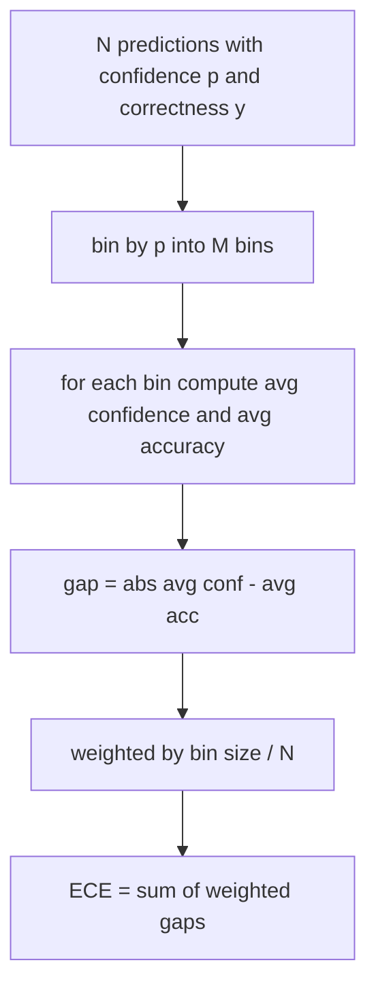
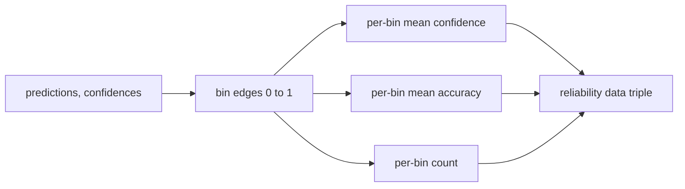

# 困惑度與校準

> 若你的模型在一千個答案上說九成有把握，卻只對了六百個，那它就沒有被好好校準。校準是可信賴評估的一半。另一半是困惑度，它告訴你模型究竟覺不覺得那份保留文本說得通。

**類型：** 實作
**程式語言：** Python
**先修單元：** 階段 19 B 軌基礎、第 70 與 71 課
**時間：** 約 90 分鐘

## 學習目標

- 從模型轉接器提供的詞元負對數機率，在一份保留語料上計算詞元層級的困惑度。
- 從分箱後的預測機率，計算一個分類器或多選題評估的期望校準誤差（ECE）。
- 計算 Brier 分數（對照正確與否指示變數的均方誤差），並解釋它什麼時候做得到 ECE 做不到的事。
- 建出繪製「信心對準確率」曲線所需的可靠度圖資料。
- 把這三者接進評估框架，好讓執行器能替一份模型報告掛上 `perplexity`、`ece` 與 `brier` 這些數字。

```figure
cd-reliability-diagram
```

## 困惑度告訴你什麼

困惑度是每詞元平均負對數概似的指數。愈低愈好。困惑度為一，代表模型對每一個實際詞元都給了機率一。困惑度等於詞彙量，代表模型是均勻的、什麼都沒學到。真實的數字落在中間：一個強的 2026 年基礎模型在 WikiText-103 上大約落在八到十二。一個差的在同一份文本上落在五十以上。

框架自己不算對數機率。那些來自模型轉接器。框架做的是彙總：它吃下一份逐詞元對數機率清單、一份逐序列的詞元數清單，並回傳語料困惑度。

```python
def perplexity(neg_log_probs, token_counts):
    total_nll = sum(neg_log_probs)
    total_tokens = sum(token_counts)
    return math.exp(total_nll / total_tokens)
```

實作處理了零詞元的邊界情況，並斷言那些負對數機率非負。一個常見的錯誤是忘了取負號：一個回傳 `log p` 而不是 `-log p` 的轉接器，會產出低於一的困惑度，而那不可能。這個函式把它當成一次違約抓下來。

## ECE 量的是什麼

期望校準誤差把預測依信心分進固定數量的箱子，然後量測各箱之間「信心與準確率」平均落差，並以箱子大小加權。



標準表述在 `[0, 1]` 上用十個等寬箱。實作支援任何正整數的箱數。我們暴露一個 `bins` 參數，好讓執行器在發表慣例（10）與比較慣例（15）之間做選擇。

ECE 會被箱數與樣本數所偏誤。在十個箱、一百個預測之下，你分不出 0.02 的 ECE 與隨機雜訊。實作在回傳 ECE 的同時也回傳有資料的箱數，好讓執行器能在樣本太少時拒絕回報單一個數字。

## Brier 分數做得到 ECE 做不到的事

ECE 只在乎平均落差。一個在一半的箱上過度自信、在另一半上信心不足的模型，可以有很低的 ECE，卻在局部上校準得很糟。Brier 分數逐預測量測「對照真實結果的平方誤差」，所以它直接懲罰那個散布。

對二元結果而言，Brier 是 `mean((p_i - y_i)^2)`。它可以分解成可靠度、鑑別度與不確定性。我們計算那個分數與那份分解。執行器回報那個純量，但把分解記錄下來供儀表板使用。

```python
def brier(p, y):
    return float(np.mean((p - y) ** 2))
```

## 可靠度圖的資料

可靠度圖把每個箱裡的預測信心對經驗準確率畫出來。那條對角線就是完美校準。這個函式回傳三個陣列：逐箱的平均信心、逐箱的平均準確率，以及逐箱的計數。繪圖的程式碼住在下游；這一課停在那個資料形狀上。



回傳的那個元組，就是呼叫層要畫那張圖、或要計算某種自訂 ECE 變體（適應性 ECE、掃描 ECE 等）所需要的東西。我們回傳 numpy 陣列，好讓下游程式碼不必再轉換。

## 信心的來源

框架不假設信心來自 softmax。它接受每個預測一個落在 `[0, 1]` 的數字。對多選題任務而言，自然的信心是「在各選項對數概似上做 softmax」。對自由文字而言，自然的信心是模型自報的機率，或平均對數概似的指數。評估只是消費那個數字。它從哪來是轉接器的工作。

## 邊界情況

- 所有預測都錯：ECE 是那個平均信心、Brier 很高，而困惑度就是模型對那份文本的看法。
- 所有預測都對且信心很高：ECE 接近零、Brier 接近零。
- 在 p=0.5 上完全不確定的預測器：ECE 是 0.5 減去準確率，Brier 是 0.25 減去一個修正項。
- 空輸入：ECE、Brier 與可靠度回傳 `0.0`（或填零的陣列）。困惑度在零詞元的情況回傳 `NaN`。這些路徑都不發警告；由執行器去檢視那些值並決定要回報還是跳過。

這些情況都被烤進測試裡。一個跑在真實基準上的真實模型不會撞到它們，但一個有臭蟲的轉接器或一份極小的樣本會，而執行器不該當機。

## 派送

校準不是像 F1 那樣的逐任務指標。它是一份逐模型的報告。執行器在整份評估上累積 `(confidence, correct)` 配對，並一次算出 ECE、Brier 與可靠度資料。困惑度則是在一份保留文本語料上算的，與逐任務的評分分開。

介面是：

```python
report = CalibrationReport.from_predictions(confidences, correct)
report.ece          # float
report.brier        # float
report.reliability  # tuple of three numpy arrays
report.populated_bins  # int
```

`PerplexityResult.from_token_nll(neg_log_probs, token_counts)` 回傳那個困惑度，以及每詞元的平均負對數概似。

## 這一課不做什麼

它不呼叫模型。它不實作 softmax。它不從輸出詞元估計信心；那是轉接器的工作。它不做溫度縮放或 Platt 縮放；那些是事後的修正，住在另一堂課。這一課的重點，是讓那三個數字（困惑度、ECE、Brier）變得可信賴且可重現。

## 怎麼讀那些程式碼

`main.py` 定義了 `perplexity`、`expected_calibration_error`、`brier_score`、`reliability_diagram`，以及 `CalibrationReport` / `PerplexityResult` 這兩個 dataclass。示範跑在一批標準答案已知的合成預測上：一個校準良好的模型、一個過度自信的，以及一個信心不足的。`code/tests/test_calibration.py` 裡的測試釘住了每一種邊界情況，加上那些合成預測器的參考值。

從頭到尾讀一遍 `main.py`。函式的排序是從純量到向量再到報告。每個函式都有一段短短的說明字串，寫著那些數學與那紙契約。

## 再往前走

在已發表的評估裡，校準是最被忽略的那條軸。多數排行榜回報單一個準確率數字就當作結束。一個在準確率上贏、在 Brier 上輸的模型，作為生產部署，比一個準確率低幾分、但可靠地回報自身不確定性的模型更糟。一旦你把那套校準管路擺好，就在一份保留驗證切片上加上溫度縮放、重算 ECE，並看著那個落差縮小。那是另一堂課，但那個地板住在這裡。
