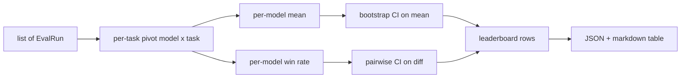
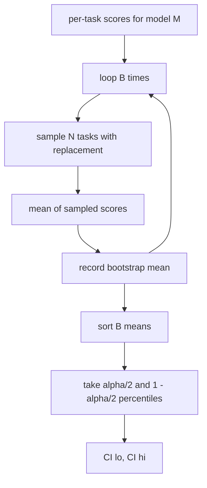

# 排行榜彙總

> 逐任務的分數很容易。跨異質任務的逐模型排名比較難。而一千筆預測的排行榜上的統計顯著性，是每個人都會跳過的那部分。這一課不跳過。

**類型：** 實作
**程式語言：** Python
**先修單元：** 階段 19 B 軌基礎、第 70、71、73 課
**時間：** 約 90 分鐘

## 學習目標

- 把跨多個模型與多項任務的逐任務分數，彙總成一份整齊的逐模型列。
- 把異質分數正規化，好讓通過率與 BLEU 值不會對彙總值造成過度影響。
- 依平均值與依勝率替模型排名，並解釋各自什麼時候才是對的摘要。
- 對逐模型的平均分數與成對差值計算自助法信賴區間。
- 把排行榜輸出成一份 JSON 報告，以及一張第 75 課執行器可以貼進 CI 留言的 markdown 表。

```figure
ci-leaderboard-ci
```

## 輸入的形狀

彙總器消費一份 `EvalRun` 紀錄清單：

```python
@dataclass
class EvalRun:
    model_id: str
    task_id: str
    metric_name: str
    score: float          # in [0, 1]
    category: str
```

第 75 課的執行器每一組 `(model, task)` 配對產出一筆紀錄。彙總器不在乎那個分數是怎麼產出來的。它預期正規化早就做過了：每一個分數都落在 `[0, 1]` 之內。

## 輸出

會出來三張表：



排行榜的那一列含有：`model_id`、`mean_score`、`mean_ci_lo`、`mean_ci_hi`、`win_rate`、`tasks_completed`，以及一個選配的 `categories` 對映，帶逐類別的平均值。

## 正規化

若一項任務的分數落在 `[0, 1]`、另一項落在 `[0, 100]`，第二項就會無聲地主導那個平均。彙總器驗證每一個輸入分數都坐在 `[0, 1]` 裡，否則就拒絕那次執行。修法住在上游：指標本來就該回傳一個比例。第 71 到 73 課強制了那紙契約。

## 平均值與勝率

那兩套排名機制服務不同的目標。

平均分數是某個模型逐任務分數的平均。它是排行榜回報的頭條數字。它對離群值與任務不平衡都很敏感。

勝率數的是一個模型在同一項任務上打敗其他所有模型的次數。對每一項任務，分數最高的模型獲勝（平手則均分）。勝率等於獲勝次數除以「該模型有分數的任務數」。它對離群值與尺度差異比較不敏感，但損失了資訊。

```python
def win_rate(model_id, runs_by_task, all_models):
    wins, total = 0, 0
    for task_id, runs in runs_by_task.items():
        scores = {r.model_id: r.score for r in runs if r.model_id in all_models}
        if model_id not in scores:
            continue
        total += 1
        best = max(scores.values())
        if scores[model_id] >= best:
            wins += 1
    return wins / total if total else 0.0
```

框架兩個都回報。第 75 課的執行器預設依平均值排名；那個勝率欄位就擺在那裡，以防使用者比較偏好它。

## 自助法信賴區間

逐模型的平均值會附上一個由「在任務上做自助法重抽」估出來的信賴區間。我們對任務 id 做放回重抽、在重抽出來的集合上算平均、重複 `B` 次，並在水準 `alpha` 上取百分位區間。



做成對比較時，我們對逐任務的差值 `score_A - score_B` 做自助法、取百分位區間，並回報它。使用者讀出那個區間有沒有排除零。若有，那個差異在水準 alpha 上就是顯著的。若沒有，排行榜就把那兩個模型視為平手。

底層的輔助函式（`bootstrap_mean_ci`、`bootstrap_pairwise_diff`）預設 `B=1000`；公開的彙總器（`aggregate`、`pairwise_diffs`）預設 `b=500`，好讓示範與測試跑得快。預設 alpha 是 0.05。這一課讓自助法維持純 numpy，不用 scipy。

## 類別

若 `EvalRun.category` 有設，彙總器還會回報逐類別的平均值。這就是每一張排行榜上那些寫著 `math`、`reasoning`、`code`、`safety` 的欄位。它讓執行器看得出某個模型是不是整體不錯、但在程式碼上很弱 —— 而那正是頭條平均值所藏起來的資訊。

## Markdown 渲染

排行榜被渲染成一張 markdown 表：

```text
| Rank | Model | Mean | 95% CI | Win rate | Tasks |
|------|-------|------|--------|----------|-------|
| 1    | gpt   | 0.78 | 0.74-0.82 | 0.62 | 50 |
| 2    | claude| 0.75 | 0.71-0.79 | 0.34 | 50 |
| 3    | random| 0.10 | 0.07-0.13 | 0.04 | 50 |
```

那張表依平均分數排序。信賴區間渲染到小數第二位。很長的模型 id 會被截斷到二十個字元。

## 這一課不做什麼

它不跑模型。它不呼叫指標層。它不實作適應性 ECE 或其他校準變體；那些是第 73 課。它不實作任務加權。這裡每一項任務都算同樣的分量。生產排行榜會替任務加權；我們透過 `weight` 欄位把那個掛鉤留著，但彙總器忽略它。若你需要，就在後續課程裡把加權加上去。

## 怎麼讀那些程式碼

`main.py` 定義了 `EvalRun`、`LeaderboardRow`、`aggregate`、`bootstrap_mean_ci`、`bootstrap_pairwise_diff` 與 `render_markdown`。示範建出一套三個模型、十二項任務的合成組、做彙總，並印出那張排行榜加上那張成對差值表。`code/tests/test_leaderboard.py` 裡的測試釘住了自助法、markdown 渲染、勝率的邊界情況，以及空輸入的行為。

從頭到尾讀一遍 `main.py`。資料形狀（EvalRun、LeaderboardRow）排最前面，接著是彙總器，第三是自助法，渲染排最後。每個函式都有一份聚焦的契約。

## 再往前走

自然的下一步，是用配對任務的顯著性檢定取代未配對的自助法。若模型 A 與 B 都跑了同樣那一百項任務，適當的檢定就是在逐任務差值上做配對自助法，而那我們實作了。再往上走，你會想要一個尊重任務族群的階層式自助法（數學題彼此並不獨立；一種算術錯誤樣式會影響其中十題）。那是後續。這一課的重點，是把那個地板做對，好讓評估回報出一個你辯護得了的數字。
