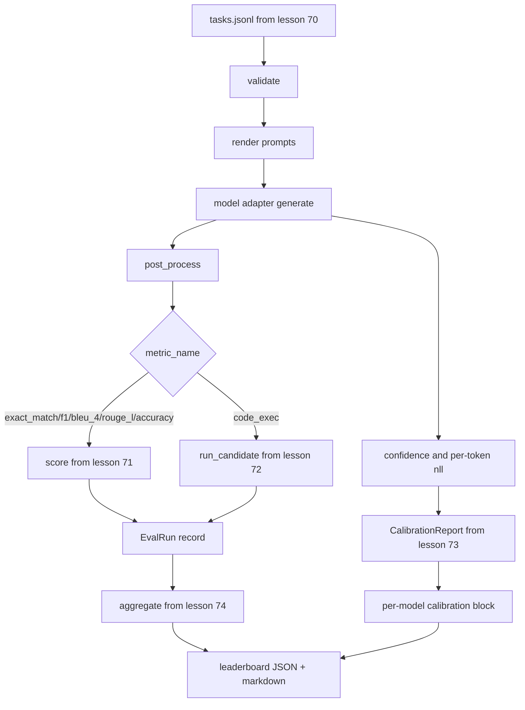

# 端到端評估執行器

> 五課的管路，一課把它們黏起來。執行器讀第 70 課的任務規格、透過一個轉接器呼叫模型、用第 71 與 72 課評分、掛上第 73 課的校準報告，並產出第 74 課的排行榜。示範會自我終止。

**類型：** 實作
**程式語言：** Python
**先修單元：** 階段 19 B 軌基礎、第 70 到 74 課
**時間：** 約 90 分鐘

## 學習目標

- 定義一個 `ModelAdapter` 介面，讓任何模型（模擬、本地、API）都能以一小片方法介面滿足它。
- 在一份固定的 JSONL 檔案上跑評估，並跨一個工作者池平行執行任務。
- 在同一趟裡，把指標層（exact_match、F1、BLEU-4、ROUGE-L、code_exec）與校準層組合起來。
- 產出逐模型的 `EvalRun` 紀錄，並把它們直接餵進排行榜彙總器。
- 同時輸出一份 JSON 報告與一張 markdown 表；乾淨執行時以零結束碼自我終止，驗證或執行期失敗時以非零退出。

```figure
eval-grid
```

## 那條管線



執行器是那個整合點。第 70 到 74 課各自擁有一個模組，由執行器把它們組合起來。執行器不重複那些模組裡的任何邏輯：它匯入它們。

## 那個轉接器介面

轉接器是執行器與任何模型之間的那道接縫。這個介面刻意做得很小。

```python
class ModelAdapter:
    model_id: str

    def generate(self, prompt: str, task: TaskSpec) -> Generation: ...
```

`Generation` 是一個 dataclass，帶：

- `text`：模型的自由格式輸出
- `confidence`：一個落在 `[0, 1]` 的浮點數，代表模型對那個答案自報的機率
- `token_nll`：選配，生成詞元上的負對數概似總和
- `token_count`：選配，生成的詞元數

執行器裡的模擬轉接器提供三種口味：`RuleBasedAdapter`（確定性、接近完美）、`NoisyAdapter`（過度自信、常常答錯），以及 `BiasedAdapter`（在某一類別上很好、在另一類別上很糟）。示範在第 70 課那份固定資料上把三個都跑一遍。

## 平行執行

執行器用 `concurrent.futures.ThreadPoolExecutor` 逐模型平行地跑那些任務。工作者數預設取「八」與「任務數」之中較小的那個。用執行緒就夠了，因為真實模型呼叫的瓶頸是網路 I/O。程式碼執行那條路徑會在任務內部衍生自己的子行程，而那個執行器只是排程那次等待。

為了讓測試具確定性，執行器暴露 `run_eval(adapters, tasks, parallel=False)`，好讓測試能把執行順序釘住。

## 那個單趟評分迴路

對每一項任務：

1. 渲染那段提示詞（少樣本前綴加上提示詞本體）。
2. 呼叫轉接器並替那次呼叫計時。
3. 依那項任務的規則對生成做後處理。
4. 派送到指標層。
5. 建出一筆帶分數與指標中繼資料的 `EvalRun` 紀錄。
6. 把那組 `(confidence, correct)` 配對附到校準緩衝區上。

那個 `correct` 訊號，對完全相符類的指標（`exact_match`、`accuracy`、`code_exec`）是 `score >= 1.0`，對分級指標則是 `score >= 0.5`。那個門檻住在 `_correct_from_score` 裡，而執行器不暴露公開的覆寫介面。

## 彙總

在每一項任務都有結果之後，執行器呼叫第 74 課的 `aggregate` 與 `pairwise_diffs`，以及第 73 課的 `CalibrationReport.from_predictions`。輸出是單一個 JSON 信封：

```json
{
  "leaderboard": [...],
  "pairwise": [...],
  "calibration": {
    "model_id_a": {"ece": 0.04, "brier": 0.10, "populated_bins": 8, ...},
    ...
  },
  "summary": {
    "tasks": 10,
    "models": 3,
    "wall_seconds": 1.2
  }
}
```

執行器也會把一張 markdown 表寫到 stdout，好讓使用者能把結果貼進一次 PR 審查裡。

## 會自我終止的示範

示範在第 70 課那十項固定任務上跑三個模擬轉接器。實際時間應該落在十秒之內。乾淨執行時結束碼為零。

乾淨執行的判準是：

- 每一項任務都通過第 70 課的驗證。
- 每一項任務都在第 71 與 72 課之下被評了分。
- 那份校準報告在第 73 課之下彙總完成、沒有出錯。
- 排行榜把那個規則式轉接器排在隨機轉接器之上，且嚴格較高。

若其中任何一項壞掉，執行器就以非零退出，並在那個 JSON 信封裡帶一個結構化的錯誤。

## 這一課不做什麼

它不呼叫真實模型。它不實作 API 金鑰流程或速率限制處理。它不實作串流或部分生成；轉接器每次呼叫回傳一份生成。它不做重試或快取。那些關注點住在轉接器層；執行器與指標無關、也與供應商無關。

## 怎麼讀那些程式碼

`main.py` 就是那次整合。它透過一個小小的 `_load_sibling` 輔助函式，以相對路徑解析出另外五課的模組並匯入它們。`Generation`、`EvalReport` 與 `ModelAdapter` 這幾個 dataclass 在本地定義。那些模擬轉接器在檔案底部。

從頭到尾讀一遍 `main.py`。快速掃過那些匯入，然後看 `run_eval`、再看 `_score_one`、然後看那些轉接器。最後那個示範就是進入點。

`code/tests/test_runner.py` 裡的測試釘住了轉接器介面、那個單趟迴路、平行與序列的等價性、那個校準緩衝區，以及那個 JSON 信封的形狀。

## 再往前走

這個執行器是那個地板。一套生產評估系統會加上：一份以 `(task_id, model_id, model_version)` 為鍵的結果快取、一本追蹤每次執行金額與詞元的成本帳、一層遇到速率限制就退避的重試、一套供 pass-at-k 任務用的抽樣政策，以及一種供長套件用的串流輸出格式。這每一項都是一個獨立關注點，把執行器包起來、而不動到指標或彙總層。那份分離，就是這紙契約的重點。

在你把那些模擬弄好之後，替一家真實供應商加一個轉接器。挑一家有免費層的、寫三十行黏合程式碼，看著排行榜亮起來。然後再加第二家供應商，讓那套框架去做事。
