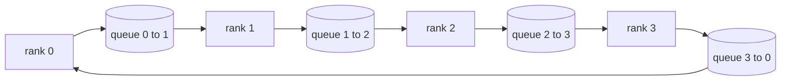

# 從零打造集合通訊操作

> 撐起分散式訓練的那四個集合通訊操作是 allreduce、broadcast、allgather 與 reduce_scatter。訓練框架提供的其他每一個原語，都是包在這幾個外面的一層。在一張 `multiprocessing.Queue` 網格上把它們建一次、對照一份參考實作驗證它們，這條軌其餘的部分就變成管路工程了。

**類型：** 實作
**程式語言：** Python
**先修單元：** 階段 19 C 軌第 42-49 課
**時間：** 約 90 分鐘

## 學習目標

- 以兩趟（先 reduce-scatter 再 allgather）實作環狀 allreduce，並證明每個 rank 的通訊量是每元素 2(N-1)/N 位元組。
- 在跑於 `multiprocessing.Queue` 之上的點對點傳送上，建出 broadcast、allgather 與 reduce_scatter。
- 對同樣的輸入，把每一個原語拿去與 `torch.distributed` 的 gloo 參考實作驗證。
- 依叢集形狀、延遲地板與頻寬天花板，替「環還是樹」這個選擇辯護。

## 那個問題

一個天真的、跨 N 個 rank 的 allreduce，會把張量送 N 次給一個根節點、再廣播 N 次回來。每個 rank 的頻寬以 O(N) 成長、那個根節點變成瓶頸，而實際時間的地板是「最慢那條連結乘上 N」。環狀 allreduce 把它攤平成 2(N-1) 塊大小為 T/N 的片段，於是每個 rank 的位元組數降到 2T(N-1)/N，與叢集大小無關。在 N 很小、連結延遲很高時，樹狀 allreduce 勝出，因為深度是 log2(N) 跳而不是 2(N-1)。替叢集形狀挑錯拓撲，最慢的那張 GPU 就決定了每一步的時間。

你在這條軌會讀到的每一個分散式訓練框架，都依賴這四個原語。PyTorch DDP 每個參數桶做一次 allreduce 來同步梯度。ZeRO 用 reduce_scatter 把最佳化器狀態分片、用 allgather 廣播更新後的參數。FSDP 把整個前向變成 allgather 加 reduce_scatter。管線平行需要 broadcast 在階段群組之間傳激活。若你實作不出這四個集合通訊，你就沒辦法推理「訓練為什麼卡住」、「梯度不匹配為什麼出現在 rank 3」，或「換了拓撲之後管線氣泡為什麼翻倍」。

## 那個概念



### 兩趟走完的環狀 allreduce

把張量切成 N 塊等大的片段，索引 0..N-1。每個 rank 擁有與它 rank 相同索引的那一片。第一趟，reduce-scatter，跑 N-1 步。在第 s 步，rank r 把片段 (r - s) mod N 送給 rank (r + 1) mod N，並從 rank (r - 1) mod N 收到片段 (r - s - 1) mod N，把收到的片段累加進它的本地副本。N-1 步之後，rank r 擁有片段 r 的完整總和。第二趟，allgather，再跑 N-1 步，把那些完成的片段沿環繞一圈，直到每個 rank 都持有每一片的完整總和。

| 原語 | 每個 rank 的位元組 | 步數 | 什麼時候用 |
|-----------|---------------|-------|-------------|
| 環狀 allreduce | 2T(N-1)/N | 2(N-1) | T 很大、粗管線的同質叢集 |
| 樹狀 allreduce | T log2(N) | 2 log2(N) | T 很小，或連結延遲很高 |
| Broadcast | T | log2(N) 樹 | 參數初始化、純量設定 |
| Allgather | T(N-1)/N | N-1 | 分片式前向、ZeRO 解分片 |
| Reduce_scatter | T(N-1)/N | N-1 | ZeRO 的梯度分片 |

### 拿佇列網格當 NCCL 的替身

NCCL 跑在 PCIe 與 NVLink 上，並帶硬體卸載的歸約。在 CPU 上你沒有那個。每條環邊一個 `multiprocessing.Queue`，就給了你一個「單一生產者、單一消費者」的有序點對點遞送。歸約發生在使用者空間，所以你要付 Python 的開銷，但線上的樣式與 NCCL 的環狀 allreduce 完全一樣。在佇列版本上推理正確性，叢集上的行為就跟著成立。

### 對照 gloo 驗證

每一個原語落地時都附上一項單元測試，把它的輸出，與以 gloo 後端初始化、在同樣世界大小上跑同一個張量的 `torch.distributed` 做比較。若你的環狀 allreduce 與 gloo 的差距超過 float32 的 epsilon，那項測試就失敗。對照參考實作做驗證沒得商量；沒有它，那個原語會一直看起來正確，直到一次真實訓練的第 10000 步。

```figure
ci-ring-allreduce
```

## 動手建

`code/main.py` 實作：

- `Mesh` 類別，把 N 個 `multiprocessing.Queue` 實例接成一個環，並逐 rank 暴露 `send(dst, tensor)` 與 `recv(src)`。
- `ring_allreduce(mesh, rank, world_size, tensor)`，跑那個兩趟演算法。
- `broadcast(mesh, rank, world_size, tensor, src)`，跑在一棵對數樹上。
- `allgather(mesh, rank, world_size, tensor)`，用 N-1 次旋轉。
- `reduce_scatter(mesh, rank, world_size, tensor)`，就是 allreduce 的前半段。
- `_gloo_reference(op, world_size, tensor)`，把同樣的輸入透過 gloo 跑一遍 `torch.distributed`，以做位元對等的比較。

跑它：

```bash
python3 code/main.py
```

輸出：一張逐原語的驗證表，比較佇列網格與 gloo 的輸出，接著是一個逐 rank 的位元組計數器，證明那個 2T(N-1)/N 的縮放。

## 現實世界裡的生產模式

有三種模式，把這些原語加固到足以出貨。

**在 allreduce 之前把梯度分桶。** 一個十億參數的模型有好幾萬個梯度張量。每個張量一次 allreduce，就要付 N 次延遲地板。DDP 把梯度分成約 25 MB 的桶，每個桶發一次 allreduce；那些小張量搭著大的順風車。沒有分桶，延遲開銷就主導了那一步。

**把通訊與運算重疊起來。** 反向以相反順序逐層計算梯度。最後一層的梯度一準備好，就在下一層還在算的時候把它的 allreduce 發動出去。PyTorch DDP 用「桶就緒」掛鉤把這件事接起來。當網路有餘裕時，這個重疊把看得見的通訊時間砍半。

**依訊息大小挑環或樹，不要憑信仰。** NCCL 出貨一個拓撲偵測器，對大於約 1 MB 的訊息挑環、小於的挑樹。那個交叉點是頻寬對延遲之爭：超過 1 MB，那個 2T(N-1)/N 的頻寬項佔主導，環勝出；低於 1 MB，那個 log2(N) 的跳數勝出。硬寫死一種拓撲，就在錯的訊息大小上賠掉吞吐量。

## 動手用

生產模式：

- **PyTorch DDP。** 在反向之後對分桶後的梯度呼叫 `dist.all_reduce`。桶大小可調；對 100Gbit 乙太網路而言，預設的 25 MB 算合理。
- **DeepSpeed ZeRO。** 發 reduce_scatter 把梯度分片、發 allgather 在前向之前重建完整參數。這一課的原語就是 ZeRO 所做的那些呼叫。
- **FSDP。** 前向從 allgather 解分片那一層開始、做運算，再用 reduce_scatter 歸約並丟掉那份解分片。同樣的原語，不同的排程。

## 產出交付

在第 77-81 課裡使用這些佇列網格原語。第 77 課把 allreduce 接進 DDP。第 78 課把 reduce_scatter 接進 ZeRO。第 79 課把 broadcast 接進管線激活。第 81 課把四者組合進那個端到端示範。

## 練習

1. 加上一個樹狀 allreduce 變體，並依訊息大小在環與樹之間切換。量測那個交叉點。
2. 加上一個 `recv_timeout_ms`，好讓卡住的 rank 浮現一個逾期錯誤，而不是永遠掛著。
3. 把那四個原語底下的 `multiprocessing.Queue` 換成 TCP socket。同樣的測試，真實的線路。
4. 加上一個頻寬檢測掛鉤，好讓那個逐 rank 位元組計數器記錄到 JSONL。
5. 在 4 個 rank 上，對大小為 1KB、1MB、16MB 的張量比較環與樹的實際時間。以實證替那個交叉點辯護。

## 關鍵術語

| 術語 | 大家怎麼說 | 實際是什麼意思 |
|------|----------------|------------------------|
| Allreduce | 「跨 rank 加總」 | 呼叫之後每個 rank 都持有同一個歸約後的張量 |
| 環 | 「那個快的拓撲」 | N-1 塊大小為 T/N 的片段沿著那個環繞兩圈 |
| 樹 | 「那個對數拓撲」 | 歸約沿一棵二元樹進行；深度是 log2(N) 跳 |
| Allgather | 「把分片串起來」 | 每個 rank 最後都有其他每個 rank 的分片 |
| Reduce_scatter | 「把總和切開」 | 每個 rank 最後只拿到一塊片段的總和 |
| 桶 | 「把小張量融合起來」 | 把 N 次小的 allreduce 合併成一次大的 |

## 延伸閱讀

- [PyTorch Distributed: NCCL collectives](https://pytorch.org/docs/stable/distributed.html#collective-functions)
- [Horovod ring allreduce paper](https://arxiv.org/abs/1802.05799)
- [NCCL topology and algorithm selection](https://docs.nvidia.com/deeplearning/nccl/user-guide/docs/index.html)
- [Patarasuk and Yuan, Bandwidth optimal allreduce algorithms](https://www.cs.fsu.edu/~xyuan/paper/09jpdc.pdf)
- 階段 10 第 05 課 —— 分散式訓練總覽
- 階段 19 第 77 課 —— 建在這些原語之上的 DDP
