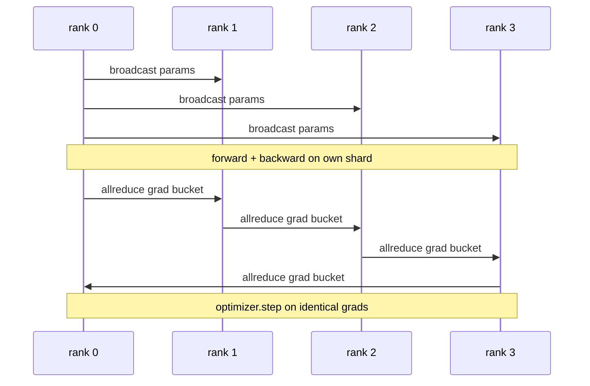

# 從零打造資料平行 DDP

> DistributedDataParallel 是疊在 allreduce 之上的一個掛鉤。把一個模型包起來、從 rank 0 廣播初始參數好讓每個 rank 起點相同、在每一個參數上裝一個會替梯度發 allreduce 的反向掛鉤，其餘就是梯度下降。整套模式 200 行。

**類型：** 實作
**程式語言：** Python
**先修單元：** 階段 19 C 軌第 42-49 課
**時間：** 約 90 分鐘

## 學習目標

- 接出一個 `DistributedDataParallel` 形狀的包裝，它廣播初始參數，並在反向之後對梯度做 allreduce。
- 用 `torch.multiprocessing.spawn` 在 gloo 後端、配以檔案為基礎的會合機制，衍生 N 個 CPU rank。
- 用同一份資料把同一個模型依序訓練一遍，並展示逐步的參數等價性，藉此證明梯度同步的正確性。
- 替「分桶（梯度融合）」與「重疊（在反向期間通訊）」辯護 —— 那是把一個能動的 DDP 變成一個生產 DDP 的那兩項改動。

## 那個問題

一個十億參數、帶 12 GB 激活的模型，塞不進一張消費級 GPU。就算塞得進，訓練也要好幾週。資料平行把批次切給 N 個 rank，每個 rank 在自己那一片上算前向與反向，而在每一步，每個 rank 的梯度都被加總起來，好讓那 N 份副本維持一致。那個加總後的梯度，就是最佳化器所踩的東西。

沒有梯度同步，那 N 份副本在第 2 步就分岔了。那個模型不再是「一個在更多資料上訓練的模型」，而是 N 個剛好共用初始權重的獨立模型。若梯度同步做得很糟（每個參數一次 allreduce、沒有重疊、沒有分桶），網路就是瓶頸，而那些 GPU 就閒著等線路。DDP 的手藝，在於讓梯度同步相對於運算幾乎免費。經典的 PyTorch DDP 靠著把梯度分桶、把 allreduce 與下一層的反向重疊，以及在 NVLink 上用 NCCL，達成了那件事。我們在 CPU 上用 gloo 也能做到這三件事，並學到同樣的教訓。

## 那個概念



### DDP 需要的那三個操作

| 階段 | 集合通訊 | 為什麼 |
|-------|-----------|-----|
| 初始化 | 從 rank 0 廣播 | 每個 rank 都以同樣的參數起步 |
| 反向之後 | 對每個梯度做 allreduce | 最佳化器所踩的是那個平均梯度 |
| 有時候 | 廣播緩衝區 | 讓批次正規化的運行統計保持同步 |

### 為什麼是平均而不是總和

Allreduce-SUM 除以 world_size，得到的是平均梯度。那個平均對 world_size 不變：在一個 rank 上調好的學習率，在四個 rank 上也管用，因為每一步的梯度大小不變。Allreduce-SUM 不做那次除法，就逼你每次改叢集大小都要重調學習率。DDP 把 SUM 包起來並做除法；在這一課裡也照做。

### 為什麼要把梯度分桶

一個 transformer 有好幾千個參數張量。每個張量一次 allreduce，就要付好幾千次 gloo 的延遲地板。DDP 把梯度分成約 25 MB 的桶，每個桶發一次 allreduce。線上流動的總位元組數一樣，但延遲被攤到整個桶上。對這一課那個極小的模型而言，我們把一切分進一個桶；帶得走的是那個結構。

### 為什麼要把種子釘住

每個 rank 在洗牌時都必須呼叫 `torch.manual_seed(seed + rank)`，但在參數初始化時要呼叫 `torch.manual_seed(seed)`。單一個共享種子代表每個 rank 看到同樣的批次順序（那就打敗了資料平行的意義）；而替參數用逐 rank 的種子，會讓初始參數差了一個浮點 epsilon，於是梯度同步就再也無法讓那些副本一致。把那個種子的樣式做對，否則參數等價性的測試在第 1 步就失敗。

```figure
ci-ddp-grad-sync
```

## 動手建

`code/main.py` 實作：

- `MiniMLP`：一個三層 MLP，小到幾秒就收斂、大到足以把那些接線攤開來。
- `DistributedDataParallel(model, world_size)`：在建構時廣播參數，並回傳一個包裝，其 `sync_grads` 會把 allreduce 加總後的梯度除以 world_size。
- `worker(rank, world_size, ...)`：完整的訓練迴路，含在 gloo 上做 `torch.distributed` 初始化、前向、反向、同步、走一步。
- `_reference_single_process_loop(...)`：在單一個 rank 上，用同一份資料依序訓練同一個模型，供測試用來檢驗每一步之後參數的位元對等。

跑它：

```bash
python3 code/main.py
```

輸出：一張逐步的訓練表，把單行程的損失與參數校驗和，拿去與那次 4 個 rank 的 DDP 執行比較。這兩條路徑產出的損失曲線在浮點 epsilon 之內完全相同，證明那次梯度同步是正確的。

## 現實世界裡的生產模式

有三種模式，把 DDP 加固到足以出貨。

**找出未使用的參數。** 有些前向路徑會有條件地跳過參數（提早退出、專家混合的路由器）。被跳過的參數沒有梯度，但 DDP 的「桶就緒」掛鉤仍然在等它們，而那次 allreduce 就死鎖了。`find_unused_parameters=True` 告訴 DDP 在歸約之前先看看哪些參數拿到了梯度。代價是每一步多走一次圖，所以除非你的前向會分支，否則就把它關著。

**靜態圖最佳化。** 當前向在各步之間穩定時，`static_graph=True` 讓 DDP 預先算好那份分桶排程。這項最佳化在規模上要緊：預先算好每一步省下幾毫秒，而那在一萬步上會累積起來。

**梯度累積需要小心。** 在 K 個微批次上累積梯度、而不逐微批次同步，是一次十倍的吞吐量勝利。DDP 把 `no_sync()` 暴露成一個脈絡管理器，用來暫停反向後的 allreduce。忘了那個管理器，你就白白做了 K 次 allreduce；吞吐量會掉到地板。

## 動手用

生產模式：

- **PyTorch DDP。** 那份經典實作。`torch.nn.parallel.DistributedDataParallel(model)` 接好了分桶、重疊，以及那個 no_sync 脈絡。
- **HuggingFace Accelerate。** 加上一個處理 `torchrun` 環境變數與模型包裝的啟動器。底下是同一個 DDP。
- **Megatron-LM 的資料平行。** 對大型模型把 DDP 與張量平行結合起來；資料平行那一塊就是同樣的「反向之後 allreduce」模式。

## 產出交付

第 78 課（ZeRO 分片）把逐參數的 allreduce 換成 reduce_scatter，好讓每個 rank 只儲存它那一片的最佳化器狀態。第 81 課把 DDP 與 ZeRO 組合進那個端到端示範。

## 練習

1. 加上大小可設定的梯度桶，並在一個更深的模型上量測它相對「每參數一次 allreduce」的加速。
2. 把 `no_sync()` 實作成一個脈絡管理器，並驗證在 K 個微批次上的梯度累積與單行程基線相符。
3. 加上一個 `find_unused_parameters` 模式，其中前向有時會跳過某一個 MLP 層；沒有那個旗標，那次執行應該會死鎖。
4. 把 gloo 換成只用 `torch.distributed.barrier()` 的同步，去感受「以 allreduce 為基礎」與「以屏障為基礎」的同步之間的差別。
5. 在批次大小 1、16、256 上，量測梯度同步開銷佔步驟時間的比例，並解釋那個縮放。

## 關鍵術語

| 術語 | 大家怎麼說 | 實際是什麼意思 |
|------|----------------|------------------------|
| DDP | 「資料平行」 | 每一步廣播參數、並對梯度做 allreduce 的那層包裝 |
| 桶 | 「把梯度融合」 | 把 N 次小的 allreduce 併成一次大的 |
| 重疊 | 「把通訊藏起來」 | 在後面的層還在算反向時就發出 allreduce |
| no_sync | 「累積」 | 為了梯度累積而跳過反向後的 allreduce |
| find_unused | 「會分支的前向」 | 在歸約之前偵測出沒有梯度的參數 |

## 延伸閱讀

- [PyTorch DistributedDataParallel docs](https://pytorch.org/docs/stable/generated/torch.nn.parallel.DistributedDataParallel.html)
- [PyTorch DDP internals tutorial](https://pytorch.org/tutorials/intermediate/ddp_tutorial.html)
- [Li et al, PyTorch Distributed: Experiences on Accelerating Data Parallel Training](https://arxiv.org/abs/2006.15704)
- 階段 19 第 76 課 —— DDP 所建立於其上的那些集合通訊
- 階段 19 第 78 課 —— ZeRO 分片把逐參數的 allreduce 換成 reduce_scatter
