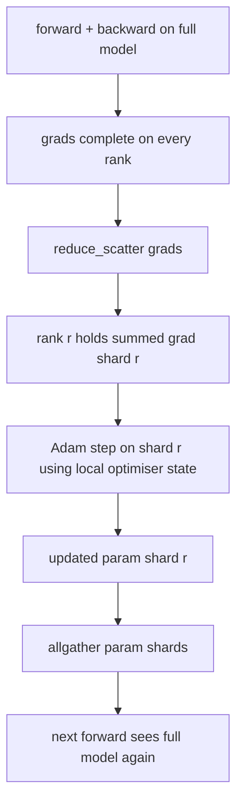

# ZeRO 最佳化器狀態分片

> Adam 每個參數存兩個動差估計，兩個都是 float32。一個 70 億參數的模型帶著 56 GB 的最佳化器狀態。ZeRO 第一階段把它切給 N 個 rank；每個 rank 擁有那個最佳化器的 1/N。本地那一步走完之後，更新過的參數分片再廣播回去，每個 rank 重建出完整模型，然後下一步開始。收穫是「訓練堆疊裡最大的那一塊配置」出現線性的記憶體下降。

**類型：** 實作
**程式語言：** Python
**先修單元：** 階段 19 C 軌第 42-49 課
**時間：** 約 90 分鐘

## 學習目標

- 把最佳化器狀態（一階動差、二階動差、fp32 主副本）切給 N 個 rank，讓每個 rank 擁有 1/N。
- 用 reduce_scatter 只把「自己那一片的梯度總和」交給每個 rank，再用 allgather 把更新後的參數分片廣播回去。
- 算出第一、第二、第三階段相對於普通 DDP 的記憶體節省表。
- 依模型大小與頻寬預算，替「第一階段對第二階段對第三階段」這個選擇辯護。

## 那個問題

普通的 DDP 什麼都複製：參數、梯度與最佳化器狀態在每一個 rank 上都完整存在。對一個 fp16 的 70 億參數模型而言，那代表每個 rank 有 14 GB 參數、14 GB 梯度，以及 28 GB 最佳化器狀態。最佳化器狀態是最大的那一項，也是最容易分片的，因為它只在走那一步時被碰到，前向與反向都不碰。

ZeRO 第一階段把最佳化器狀態分片。每個 rank 持有 Adam 動差的 1/N。反向之後，ZeRO 不是把完整梯度做 allreduce 再在本地走一步，而是做 reduce_scatter，好讓每個 rank 只收到自己那一片的梯度總和。那個 rank 把最佳化器步驟套用在它那一片主參數上。更新後的參數分片接著 allgather 回去，好讓每個 rank 在下一次前向時都有完整模型。最佳化器記憶體降為 1/N。每一步的線上流量與 DDP 相同：一次 reduce_scatter 加一次 allgather，在頻寬上等於一次 allreduce。記憶體贏了，吞吐量守住了。

## 那個概念



### ZeRO 的各階段

| 階段 | 分了什麼片 | 每個 rank 的記憶體 | 每一步的通訊 |
|-------|----------------|------------------|---------------|
| DDP | 什麼都沒分 | 參數 + 梯度 + 最佳化器 | 1 次 allreduce |
| ZeRO-1 | 最佳化器狀態 | 參數 + 梯度 + 最佳化器/N | 1 次 reduce_scatter + 1 次 allgather |
| ZeRO-2 | 最佳化器 + 梯度 | 參數 + 梯度/N + 最佳化器/N | 1 次 reduce_scatter + 1 次 allgather |
| ZeRO-3 | 最佳化器 + 梯度 + 參數 | 參數/N + 梯度/N + 最佳化器/N | 每層 1 次 allgather + 每層 1 次 reduce_scatter |

第一階段是最便宜的勝利，因為最佳化器狀態主導了預算。第二階段需要梯度分片的累積邏輯，但頻寬一樣。第三階段（FSDP）替每一次前向與反向付出逐層的通訊，換到參數分片的記憶體下降。這一課完整實作第一階段。

### 記憶體的算術，真實數字

對一個以 Adam、混合精度訓練、參數量為 P 的模型而言：

| 項 | 普通版 | ZeRO-1 | 為什麼 |
|------|---------|--------|-----|
| fp16 參數 | 2P 位元組 | 2P 位元組 | 前向需要 |
| fp16 梯度 | 2P 位元組 | 2P 位元組 | 反向需要 |
| fp32 主副本 | 4P 位元組 | 4P/N 位元組 | 只有最佳化器用它 |
| fp32 一階動差 | 4P 位元組 | 4P/N 位元組 | 只有最佳化器用它 |
| fp32 二階動差 | 4P 位元組 | 4P/N 位元組 | 只有最佳化器用它 |
| 合計 | 16P 位元組 | 4P + 12P/N 位元組 |   |

在 N=8 時：普通版 16P、ZeRO-1 為 5.5P，降了 65%。在 N=64 時：普通版 16P、ZeRO-1 為 4.19P，降了 74%。

### 為什麼 reduce_scatter 勝過「先 allreduce 再分片」

Allreduce 給每個 rank 完整的梯度總和。若你只需要分片 r，那被歸約出來的 (N-1)/N 梯度在 rank r 上就是浪費。Reduce_scatter 恰好交出每個 rank 所擁有的那一片；每個 rank 的位元組數與 allreduce 相同（因為 allreduce 就是 reduce_scatter + allgather），但後半段被稍後那次參數分片的 allgather 取代了。淨線上流量與 DDP 一模一樣，記憶體卻被除掉了。

## 動手建

`code/main.py` 實作：

- `flatten_params(module)` 與 `unflatten_into(module, flat)`，把一個模型的參數打包進一個連續張量、再解開回去。那個扁平佈局，正是讓「依 rank 分片」變成一次簡單切片的原因。
- `ZeroOptimizer(model, world_size, rank, lr)`，擁有該 rank 那一片主副本與 Adam 動差。
- `step()`，對那個扁平梯度跑 reduce_scatter、把 Adam 套用在該 rank 那一片上，再把更新後的參數 allgather 回去。
- 一個示範，把一個三層 MLP 訓練 20 步，並把逐步的記憶體預算與一條普通 DDP 基線並排印出來。

跑它：

```bash
python3 code/main.py
```

輸出：逐步的損失，以及那張記憶體表 —— 它顯示 ZeRO-1 在每個 rank 上只持有最佳化器狀態的 1/N，而 DDP 持有完整副本。

## 現實世界裡的生產模式

有三種模式，把 ZeRO 加固到足以出貨。

**分片檢查點很要緊。** ZeRO-1 的最佳化器狀態被切在各 rank 上；那個檢查點必須記下誰擁有什麼。第 80 課建出那份分片檢查點清單，好讓一次 ZeRO 執行能在同樣的世界大小上續跑。少了它，存下來的狀態在重啟時讀不了。

**混合精度才是重點。** ZeRO 是一項混合精度技術；被分片的正是那份 fp32 主副本。不用混合精度跑 ZeRO，就是替那份 fp32 主副本付了記憶體稅，卻沒拿到對應的 fp16 前向收穫。生產執行永遠把 ZeRO 與 autocast 或 bf16 權重配在一起。

**第一階段是近乎免費的勝利。** 在頻寬上通訊與 DDP 完全相同。記憶體節省隨 N 線性成長。唯一的代價是最佳化器分片的記帳。生產堆疊預設用第一階段，除非參數分片的記憶體也成了問題；那時就用第二或第三階段拿通訊去換記憶體。

## 動手用

生產模式：

- **DeepSpeed ZeRO。** 那份參考實作。`deepspeed_config.json` 選擇第 1/2/3 階段與分割大小。
- **PyTorch FSDP。** PyTorch 原生的等價物。`ShardingStrategy.SHARD_GRAD_OP` 是 ZeRO-2；`FULL_SHARD` 是 ZeRO-3。
- **HuggingFace Accelerate。** 用一份統一的設定把 DeepSpeed 與 FSDP 都包起來。

## 產出交付

第 79 課（管線平行）是那條正交的分片軸：管線不是在同一個模型上分最佳化器狀態，而是把層切給各 rank。第 81 課在那個端到端示範上把 DDP + ZeRO 組合起來。

## 練習

1. 藉由把梯度分片擴充到 ZeRO-2：每個 rank 只儲存自己那一片的梯度，做法是在反向之後把非本片的部分歸零。
2. 加上一個記憶體剖析器，印出 rank 0 上實際的 fp32 位元組用量，並與公式預測比較。
3. 量測普通 DDP 與 ZeRO-1 逐步的實際時間，並拆解成前向、反向、通訊。
4. 在 ZeRO-1 之下實作梯度裁剪：那個 L2 範數必須透過對本地範數平方做 allreduce，跨所有分片算出來。
5. 實作一個用 allreduce 而不是 reduce_scatter 的「天真版 ZeRO」，量測線上時間差。用數字替 reduce_scatter 這個選擇辯護。

## 關鍵術語

| 術語 | 大家怎麼說 | 實際是什麼意思 |
|------|----------------|------------------------|
| ZeRO-1 | 「把最佳化器分片」 | 每個 rank 持有 fp32 主副本 + Adam 動差的 1/N |
| ZeRO-2 | 「梯度也分片」 | 每個 rank 在 reduce_scatter 之後也把非本片的梯度丟掉 |
| ZeRO-3 | 「把參數分片」 | 每個 rank 持有 fp16 參數的 1/N；前向時逐層 allgather |
| 主副本 | 「fp32 權重」 | 最佳化器所更新的那份高精度參數副本 |
| Reduce_scatter | 「把總和切開」 | 只把每個 rank 那一片的梯度總和交給它 |

## 延伸閱讀

- [Rajbhandari et al, ZeRO: Memory Optimizations Toward Training Trillion Parameter Models](https://arxiv.org/abs/1910.02054)
- [DeepSpeed ZeRO documentation](https://www.deepspeed.ai/tutorials/zero/)
- [PyTorch FSDP documentation](https://pytorch.org/docs/stable/fsdp.html)
- 階段 19 第 76 課 —— 這一課所站立的 reduce_scatter 與 allgather
- 階段 19 第 80 課 —— ZeRO 狀態必須使用的分片檢查點
