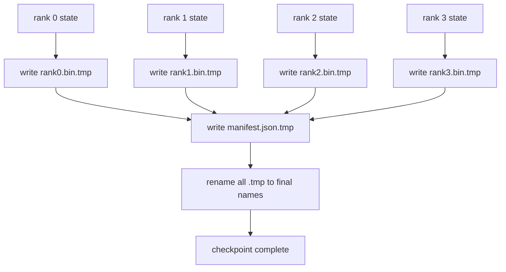

# 分片檢查點與原子續跑

> 一個 700 億參數的訓練工作，每幾個小時就被一次節點故障暫停一次。檢查點格式決定你損失的是 30 分鐘還是 30 小時。一份分片檢查點平行寫出每個 rank 的分片，並在一份清單裡記下歸屬。續跑時每個 rank 從自己那個檔案載入它的分片，在同樣的世界大小上重建狀態，然後最佳化器就像什麼都沒發生過那樣往前踩。原子寫入讓一份寫到一半的檢查點沒辦法毒害下一次續跑。

**類型：** 實作
**程式語言：** Python
**先修單元：** 階段 19 C 軌第 42-49 課
**時間：** 約 90 分鐘

## 學習目標

- 把一份多 rank 檢查點存成「逐 rank 的分片檔」加上一份記錄誰擁有什麼的清單。
- 用原子寫入樣式（先寫到暫存路徑再改名），好讓寫到一半的當機永遠不會產出一份寫了一半的檢查點。
- 從那份清單續跑，並在每個 rank 上驗證 fp16 參數與 ZeRO 最佳化器狀態都位元對等。
- 替那份清單綱要辯護，抵禦那三種失效模式：世界大小改變、分片數不符，以及部分寫入。

## 那個問題

普通的檢查點把所有參數與最佳化器狀態讀進 rank 0、做 gather，再寫成單一個檔案。對一個 700 億參數的模型而言，那是 1.1 TB 的狀態穿過一個 rank 的網路埠。那次寫入把其他每個 rank 都擋住，因為它們閒著等那次 gather。IO 頻寬是最慢那張 GPU 的網路連結，不是總合。在真實叢集上，那個「先 gather 再寫」的步驟可能比前一個訓練小時還久，那代表這個工作一個訓練日出不到一份檢查點。

分片檢查點把樣式翻過來：每個 rank 平行地把自己那一片寫到自己的檔案。那份清單記下哪個 rank 擁有哪一片，好讓續跑能把每一片放回它原本的地方。總寫入頻寬隨叢集擴展。一份透過一個 rank 要花 4 小時的 1 TB 檢查點，透過 64 個 rank 只花 4 分鐘。而且那份清單給了你一紙關於「不相容續跑」的契約：世界大小改變偵測得到、部分寫入偵測得到，而那條載入路徑可以大聲失敗，而不是無聲地用了過期資料。

## 那個概念



### 清單綱要

```json
{
  "world_size": 4,
  "step": 1234,
  "wall_clock_seconds": 4521,
  "shards": [
    {"rank": 0, "path": "rank0.bin", "sha256": "...", "param_shard_offset": 0, "param_shard_numel": 65536},
    {"rank": 1, "path": "rank1.bin", "sha256": "...", "param_shard_offset": 65536, "param_shard_numel": 65536}
  ],
  "schema_version": 1
}
```

有三個欄位承重。`world_size` 讓在不同大小上的續跑大聲失敗，而不是無聲地毀壞。逐分片的 `sha256` 抓出部分或損壞的寫入。逐分片的 `param_shard_offset` 與 `param_shard_numel` 讓載入器能在正確的位置上重建那個扁平參數張量。

### 原子寫入

那個標準樣式：把每一片寫到 `<name>.tmp`、把清單寫到 `manifest.json.tmp`、各自 fsync，然後改名。POSIX 在同一個檔案系統之內的改名是原子的；不是新檔完整就位，就是舊檔還在。在最後那次改名之前當機，會讓前一份檢查點仍然是活的那一份。少了原子寫入，一次當機可能留下一份殘缺的分片，而清單就在那裡指著它，於是續跑時那次載入就把最佳化器狀態弄壞了。

### 綱要必須抵禦的那三種失效模式

| 失效 | 徵狀 | 防禦 |
|---------|---------|---------|
| 世界大小改變 | 用 N=4 的清單在 N=8 上續跑 | 清單裡的 world_size 不符，大聲失敗 |
| 分片數不符 | 續跑看到的 rank*.bin 檔比清單裡的分片少 | 逐一列舉分片，驗證每一個都存在 |
| 部分寫入 | 分片檔在刷寫途中被截斷 | 載入時做 sha256 驗證 |

每一項防禦都提早否決那次糟糕的載入；另一條路是無聲的毀壞，等到 100 步之後損失變成 NaN 才浮出來。

### 為什麼是逐 rank 的檔案，不是一個大檔

透過 `O_APPEND` 對同一個檔案做並行寫入，在 POSIX 上對位元組對齊的寫入是行得通的，但實務上一片之內的偏移量橫跨數 MB 大小的區域，而鎖就成了主導。逐 rank 的檔案沒有爭用，而且在底層檔案系統是平行式（Lustre、GPFS）時還能受惠於條帶化。生產堆疊（DeepSpeed、FSDP、NeMo）全都基於那個理由用逐 rank 的檔案。

```figure
ci-sharded-checkpoint
```

## 動手建

`code/main.py` 實作：

- `ShardManifest` dataclass，帶上面那份綱要加上 `to_json`／`from_json`。
- `save_sharded(state_dict_per_rank, dir, step)`，用「先暫存再改名」的原子樣式把每個 rank 的二進位狀態寫到自己的檔案，然後寫出那份清單。
- `load_sharded(dir, expected_world_size)`，讀那份清單、驗證每一片的 sha256，並回傳逐 rank 的狀態字典。
- 一項來回測試：建出逐 rank 的狀態、存檔、載入、斷言位元對等。

跑它：

```bash
python3 code/main.py
```

輸出：寫出 4 個分片檔加上清單，然後重新載入並做位元對等驗證。

## 現實世界裡的生產模式

有三種模式，把這份檢查點加固到足以出貨。

**非同步寫入。** 生產堆疊在另一條執行緒或行程上發出那次檢查點寫入，好讓訓練繼續。那道屏障擺在下一次檢查點：上一次還沒完成之前，不要開始下一次存檔。DeepSpeed 的 `async_io` 旗標做的正是這件事。這一課讓寫入維持同步，好讓那些步驟看得見。

**先本地快碟，再非同步上傳。** 寫到本地 NVMe（快），然後非同步上傳到 S3 或 GCS。這個兩層樣式讓叢集內的檢查點在續跑時保持快速，同時把一份耐久副本運出叢集歸檔。那份清單帶著本地路徑；另一份上傳清單帶著遠端路徑。

**輪替很要緊。** 生產執行保留最近 K 份檢查點（通常 3 到 5 份）並輪掉最舊的。沒有輪替，磁碟會在執行途中塞滿，下一份檢查點就失敗。有輪替，下一次存檔會先刪掉最舊的，把預算空出來。

## 動手用

生產模式：

- **DeepSpeed 檢查點。** `deepspeed.save_checkpoint(tag=step)` 寫出逐 rank 的檔案，以及一個指向作用中標籤的 `latest` 檔。
- **PyTorch FSDP 檢查點。** `torch.distributed.checkpoint` 用一個決定逐 rank 佈局的 `Planner` 存下分片狀態。
- **NeMo。** 用一套加上中繼資料的統一 `save_to_checkpoint` API，把 DeepSpeed 與 FSDP 包起來。

## 產出交付

第 81 課替那次端到端的 DDP+ZeRO 執行存下一份分片檢查點，並在同樣的世界大小上重新載入，以證明那紙續跑契約成立。

## 練習

1. 加上非同步寫入：在一條執行緒上啟動那次存檔並讓訓練繼續。把下一次存檔擋住，直到上一次完成。
2. 加上一套 `last_5_steps` 輪替：保留最近 5 份檢查點，存新的之前刪掉最舊的。
3. 替內圈重新載入加上一條只做 CRC 的快速驗證路徑（輪替會把某份檢查點轉成新的作用中那一份，而不做完整的 sha256）。
4. 加上跨世界大小的載入：讀那份清單、串接起來、再重新分片，把分片從 N=4 重新平衡到 N=8。
5. 加上一次上傳到假 S3（第二個目錄），並寫出那份上傳清單。替那套兩層儲存政策辯護。

## 關鍵術語

| 術語 | 大家怎麼說 | 實際是什麼意思 |
|------|----------------|------------------------|
| 分片檢查點 | 「逐 rank 存檔」 | 每個 rank 平行地寫出自己的分片檔 |
| 清單 | 「索引」 | 記下分片路徑、偏移量與 sha256 的 JSON 檔 |
| 原子寫入 | 「先 tmp 再改名」 | 寫到 .tmp 再用 POSIX 改名，好讓當機時前一份檔案仍是活的 |
| 部分寫入 | 「被截斷的分片」 | 寫入途中當機產出一份損壞的分片；sha256 抓得到 |
| 輪替 | 「留最後 K 份」 | 寫新的之前刪掉最舊的檢查點，把磁碟用量框住 |

## 延伸閱讀

- [DeepSpeed checkpointing](https://deepspeed.readthedocs.io/en/latest/model-checkpointing.html)
- [PyTorch torch.distributed.checkpoint](https://pytorch.org/docs/stable/distributed.checkpoint.html)
- [POSIX rename atomicity](https://pubs.opengroup.org/onlinepubs/9699919799/functions/rename.html)
- 階段 19 第 78 課 —— 這份檢查點為之塑形要存下的那些 ZeRO 狀態
- 階段 19 第 81 課 —— 那個端到端示範會把存下的狀態來回跑一遍
