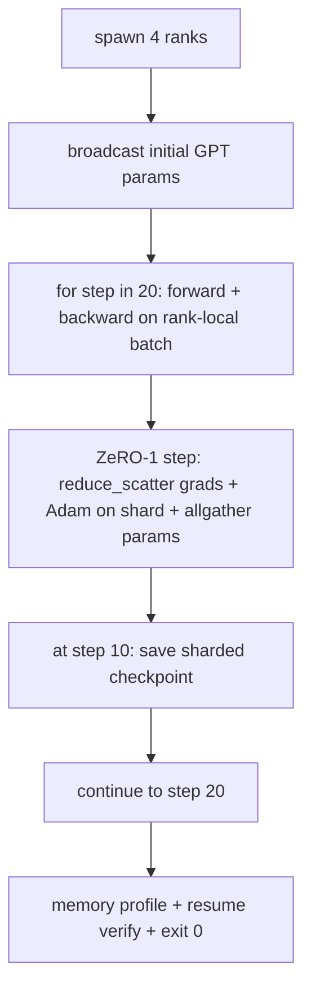

# 端到端分散式訓練

> 第 76 到 80 課各自建了一塊。這一課是那次組裝：一個極小的 GPT 跨 4 個模擬 rank 訓練，用 DDP 做梯度同步、用 ZeRO-1 做最佳化器狀態分片，並在中途存一份分片檢查點。示範跑 20 步、自我終止、印出一條損失曲線加一份記憶體剖析，並寫出一份續跑得了的檢查點。

**類型：** 實作
**程式語言：** Python
**先修單元：** 階段 19 C 軌第 42-49 課
**時間：** 約 90 分鐘

## 學習目標

- 把 DDP（第 77 課）加 ZeRO-1（第 78 課）加分片檢查點（第 80 課）組合進一個訓練迴路。
- 在一小份合成語料上，跨 4 個模擬 rank 把一個兩層 transformer 語言模型訓練 20 步。
- 印出一張逐步損失表、一份逐 rank 記憶體剖析，以及一份在同樣世界大小上位元對等續跑的檢查點清單。
- 替那次組合辯護：每一塊在較早的課裡都能獨立測試，而這一課證明它們組得起來。

## 那個問題

一個 capstone 就是「這些塊拼得起來」的證明。第 76 課實作了集合通訊。第 77 課把它們包成 DDP。第 78 課用 reduce_scatter 把最佳化器狀態分片。第 79 課分析了管線。第 80 課存下一份分片檢查點。每一課都自成一體、有自己的測試。一次真實的訓練執行同時用上每一個原語；若那次組合是錯的，損失就發散、檢查點就拒絕續跑，或是逐 rank 記憶體在該縮的時候反而長大。

這一課跑那個端到端示範，並驗證四項不變量：(a) 在浮點雜訊之內，損失在那 20 步裡單調下降；(b) 每一步每個 rank 都持有同樣的參數範數；(c) 逐 rank 的最佳化器記憶體等於 ZeRO-1 那個 12P/N 位元組的公式；以及 (d) 第 10 步那份檢查點在重啟時位元對等地重新載入。示範會自我終止：20 步、單一個指令、結束碼 0。

## 那個概念



### 那個迷你 GPT

這個模型刻意做得很小：2 個 transformer 區塊、嵌入維度 32、4 個注意力頭、詞彙表 64、序列長度 16、批次 4。幾千個參數。大到足以演練每一項接線決策（多頭注意力跑標準的遮罩路徑；LayerNorm 有權重要同步；LM 頭是一層另外的線性投影回詞彙表）。又小到 4 個 CPU rank 上跑 20 步幾秒就完。

### 那些組合規則

| 課的那一塊 | 它擁有什麼 | 它留給迴路什麼 |
|--------------|--------------|----------------------------|
| DDP 廣播 | 初始參數同步 | 建構時呼叫一次 |
| ZeRO-1 步 | 梯度同步、主副本更新、參數廣播 | 每一步呼叫一次，取代 optimiser.step |
| 分片檢查點 | 持久化逐 rank 狀態、帶 sha256 的清單 | 在 rank 0 上呼叫，狀態透過 allgather 收集 |
| 訓練迴路 | 前向、反向、損失記錄 | 依序呼叫上面那三個 |

那個迴路不知道 reduce_scatter 或會合檔案的事。ZeRO 與檢查點模組暴露的是窄窄的介面，由迴路把它們組起來。

### 為什麼是迷你 GPT 而不只是一個 MLP

第 77 課那個 MLP 足以驗證梯度同步。一個迷你 GPT 多加三件事：一個跨詞彙表的獨立 LM 頭（在這一課裡為求清楚而不綁定；完整的 GPT 通常把頭與詞元嵌入綁在一起）、softmax + 交叉熵當損失（數值上的邊界情況比 MSE 多），以及一條不對稱的前向（先嵌入、再逐層注意力、再 MLP）。capstone 若還抱著 MLP，就會藏住「那次組合有沒有正確處理 LayerNorm 或嵌入層的梯度形狀」。

### 自我終止代表結束碼 0

那個迴路跑固定的 20 步然後結束。沒有 `while True`、沒有人為介入、沒有從外部狀態續跑。一個你能丟著跑、回來就看到一份完整記錄的 capstone，才是一個證明系統接線正確的 capstone。若任何一塊死鎖，那個示範就永遠不回來，而測試台會抓到它。

## 動手建

`code/main.py` 實作：

- `MiniGPT`：兩層 transformer，帶遮罩自注意力與一個獨立的 LM 頭。
- `make_corpus(seed, total_tokens)`：確定性的「預測下一個詞元」資料。
- `_train_worker`：逐 rank 衍生；廣播初始參數、跑那個迴路、呼叫 ZeRO 那一步、在第 10 步寫出那份分片檢查點。
- `verify_resume`：在主執行之後，於行程內重新載入第 10 步那份檢查點，並斷言存下的主分片與記憶體中的快照逐位元相符。
- `main`：編排整個示範，印出那張損失表、那份記憶體剖析，以及那個驗證結果。

跑它：

```bash
python3 code/main.py
```

輸出：一張 20 列的損失表、一份 4 列的逐 rank 記憶體剖析、一份檢查點清單，以及成功時的一行 "RESUME VERIFIED"。

## 現實世界裡的生產模式

有三種模式，替真實執行把那次組合收尾。

**每 K 分鐘存一次檢查點，而不是每 K 步。** 步驟時間隨序列長度與微批次數變動。10 分鐘的檢查點節奏，不管模型多大都抓住同樣多的運算量。這一課為求簡單用以步數為準；生產用以實際時間為準。

**提早偵測發散。** 生產執行在反向之後加一道 NaN 守衛與一個損失尖峰偵測器；若損失一步之內跳超過 2 倍，就回捲到前一份檢查點，而不是讓最佳化器一路走進一個退化狀態。這一課的損失曲線很平滑，所以那道守衛沒被用到，但那個掛鉤留著。

**把記憶體剖析跨 rank 彙總。** 在真實執行裡逐 rank 的記憶體因 rank 而異（持有最大管線階段的那個 rank 拿著較多激活）。生產記錄跨 rank 的最大值加上平均值；這一課印逐 rank 的值，好顯示那個公式相符。

## 動手用

生產模式：

- **DeepSpeed。** 在一份設定之下把 DDP + ZeRO + 管線 + 激活檢查點結合起來。這一課那次組合就是 DeepSpeed 形狀的縮小版。
- **PyTorch FSDP。** 那個原生的等價物。配 `ShardingStrategy.SHARD_GRAD_OP` 的 `FullyShardedDataParallel` 就是 ZeRO-2。
- **NeMo 與 Megatron-LM。** 替最大的那些模型加上張量平行；除此之外那次組合是同樣的形狀。

## 產出交付

整條軌在此結束。這 6 課合起來，就是一支真實團隊在採用 DeepSpeed 之前會自己建的那套分散式訓練子系統；那層抽象已經對照 gloo 證明過，而那些失效模式也演練過了。階段 17（基礎設施與生產）是把這套帶上真實叢集的地方。

## 練習

1. 加上注意力頭的張量平行切分，並驗證損失與單 rank 基線相符。兩個 rank：每個 rank 一半的頭，注意力輸出做 allreduce。
2. 跨 4 個微批次加上梯度累積，並證明那個梯度等於一個大批次的梯度。
3. 加上一條「從第 10 步續跑」的路徑，讓它真的繼續訓練到第 20 步，並產出與原本那次執行相同的最終損失。
4. 加上一份指標匯出（損失、梯度範數、步驟時間）到 JSONL，好讓那次執行事後能被視覺化。
5. 加上一道 NaN 守衛，在損失尖峰時回捲到前一份檢查點，並用一個單步的學習率乘數硬逼出一個尖峰來演練那次回捲。

## 關鍵術語

| 術語 | 大家怎麼說 | 實際是什麼意思 |
|------|----------------|------------------------|
| 端到端 | 「全部接起來」 | 一次執行組合每一塊，而不是一塊一項單元測試 |
| 記憶體剖析 | 「每個 rank 幾 GB」 | 每個 rank 上為參數、梯度、最佳化器狀態所持有的位元組數 |
| 續跑契約 | 「存檔與載入」 | 檢查點來回一趟之後，逐 rank 狀態位元對等 |
| 自我終止 | 「有界的執行」 | 固定步數、完成時結束碼 0、迴路裡沒有人 |

## 延伸閱讀

- [DeepSpeed end-to-end training tutorial](https://www.deepspeed.ai/getting-started/)
- [PyTorch FSDP advanced tutorial](https://pytorch.org/tutorials/intermediate/FSDP_advanced_tutorial.html)
- [Megatron-LM training script reference](https://github.com/NVIDIA/Megatron-LM)
- 階段 19 第 76-80 課 —— 這一課所組合的每一塊
- 階段 17 —— 把那次組合搬到真實叢集
