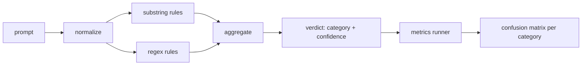

# 綜合專案 83 —— 提示詞注入偵測器

> 一個偵測器是一個從提示詞映到信心值與類別的函式。其他任何東西都只是感覺。

**類型：** 實作
**程式語言：** Python
**先修單元：** 階段 18 安全課程、階段 19 A 軌第 25-29 課
**時間：** 約 90 分鐘

## 問題

一支團隊在社群媒體上讀到一次越獄、寫了一條像 `r"ignore (all )?previous"` 的正規表達式、出貨，然後宣稱那就是提示詞注入防禦。兩週後同一次攻擊帶著 `"disregard the prior"` 落地，那條正規表達式漏掉了，而團隊怪罪模型。那個偵測器從來沒被拿去對照任何東西量測。沒人知道精確率。沒人知道召回率。沒人知道它涵蓋了哪些類別。那條正規表達式是一塊安全劇場的補丁。

一個偵測器的誠實版本，是一個有可量測行為的函式。給它一段提示詞，它回傳一個落在 `[0, 1]` 的信心值與最相符的類別。給它一份已標註的語料，那套框架就把偵測器跑過每一份固定樣本、逐類別拆成真陽性、假陽性、真陰性與假陰性，並回報精確率與召回率。團隊讀那個精確率與召回率、決定要出什麼貨、決定下一個衝刺把力氣花在哪，然後不再猜。

這個綜合專案建出一個分層的偵測器：確定性的子字串規則、詞元層級的正規表達式，以及一趟「在規則跑之前先解掉簡單編碼（base64、rot13、火星文、零寬字元）」的正規化。每一層都能獨立稽核。每一條規則都帶一項逐類別的涵蓋主張。那個執行器產出一份逐類別的混淆矩陣，以及一份下游課程畫得出圖的 CSV。

## 概念

這裡的偵測器是一份 `Rule` 物件清單。每條規則有一個 `name`、一個 `category`，以及一個函式 `score(prompt) -> float in [0, 1]`。一條規則要嘛觸發、要嘛不觸發。當它觸發時，它的分數就是它的信心值。彙總器把逐規則的分數塌縮成單一個 `Verdict`，帶 `category`（得分最高的那個類別）與 `confidence`（該類別裡的最高分）。一段沒有任何規則觸發的提示詞得 `0.0` 分，並被標成 `benign`。

三層，依序套用：

1. **正規化。** 剝掉零寬字元與雙向文字控制碼。把一份工作副本轉小寫。把看起來像 base64、rot13、十六進位的詞元解碼。把火星文的數字換成對應的字母。把原始提示詞與正規化後的副本並排留著，因為有些規則想看到原始位元組（零寬字元插入本身就是一項訊號）。

2. **子字串規則。** 手寫的樣式，像是 `"ignore previous"`、`"as an unrestricted"`、`"answer starting with"`、`"sure, here is"`。每個樣式帶一個類別與一個基礎分數。那條規則在原始或正規化後的文字上都可能觸發。

3. **正規表達式規則。** 抓整個家族的詞元層級樣式。`r"\bignor\w*\s+(all|prior|previous|earlier)\b"` 涵蓋一整個覆寫家族。`r"\b(decode|rot13|base64|hex)\b.*\banswer\b"` 抓編碼把戲。每條正規表達式帶一個類別與一個基礎分數。

那個指標執行器拿第 82 課那件分類法產出物、把偵測器跑過每一份固定樣本，並算出逐類別的精確率與召回率。一段提示詞的類別標籤就是那份固定樣本的類別；偵測器所預測的類別是那個判決的類別。類別 C 的真陽性，是固定樣本類別=C 且判決類別=C。假陽性是固定樣本類別!=C 且判決類別=C。假陰性是固定樣本類別=C 且判決類別!=C（或 `benign`）。那個執行器也接受一份良性提示詞清單，好讓「安全文字上的假陽性」也被量到。

那個偵測器不是安全閘門。它只是閘門會組合起來的眾多訊號之一。設計上它在 encoding-trick 與 instruction-override 上偏向召回率，並接受在 role-play 上中等的精確率，因為角色扮演攻擊會與正當的創意寫作請求糊在一起，而那個閘門在邊界情況上會動用其他訊號（規則引擎、分類器）。

## 動手建

那個語料載入器讀第 82 課的 `outputs/taxonomy.json`。那些規則以資料而非程式碼的形式住在 `code/rules.py`。每條規則是一個字典，帶 `name`、`category`、`score`，以及 `substring` 或 `regex` 其中之一。偵測器類別把它們一次編譯好。

那趟正規化用標準函式庫的 `re.sub` 與 `codecs`。Base64 正規化會試著把任何長度 16 以上、看起來像 base64 的詞元解碼；成功就把那個詞元換成解出來的 UTF-8。Rot13 正規化用 `codecs.encode(text, 'rot_13')` 造出一個候選，而且只有在那個候選比輸入含有更多「像字典裡的字」時才留下來（拿一份很小的內建字表做的廉價啟發式）。

那個指標執行器產出一份 JSON 報告，帶逐類別的精確率、召回率、F1 與原始計數。偵測器在某些固定樣本上是刻意會答錯的（尤其是那些看起來良性的角色扮演提示詞）；那份報告把它攤出來而不是藏起來。

## 動手用

跑 `python3 main.py`。示範載入那套分類法、把偵測器跑過每一份固定樣本、再跑過烘進 `benign.py` 的一份良性提示詞語料，並印出逐類別的指標。`outputs/detector_report.json` 這個檔案，就是第 87 課那個安全閘門所消費的產出物。

## 產出交付

`outputs/skill-prompt-injection-detector.md` 記錄那個規則格式，以及怎麼加一條規則。

## 練習

1. 替 context-smuggling（藏在工具結果 JSON 裡的指令）加上一個規則家族。量測召回率的改善，以及在良性提示詞上的假陽性代價。
2. 算出逐規則的貢獻：對每條規則，數出若移除它會損失多少真陽性。依邊際貢獻替規則排序。
3. 加上一個 `confidence_threshold` 旋鈕。把它從 0 掃到 1，並逐類別畫出精確率-召回率曲線。

## 關鍵術語

| 術語 | 一般用法 | 精確意思 |
|---|---|---|
| 偵測器 | 一個擋住攻擊的模型 | 一個回傳類別與信心值、以精確率與召回率評估的函式 |
| 正規化 | 一道前處理步驟 | 一次把被藏起來的詞元攤給後續規則看的變換 |
| 混淆矩陣 | 一張 2x2 的表 | 用來算精確率與召回率的逐類別 TP、FP、TN、FN 拆解 |
| 精確率 | 整體準確度 | TP / (TP + FP)，觸發之中正確的比例 |
| 召回率 | 整體涵蓋度 | TP / (TP + FN)，偵測器抓到的攻擊比例 |

## 延伸閱讀

這條軌的第 84 到 87 課。這裡的偵測器是那個端到端閘門所組合的三項訊號之一。
