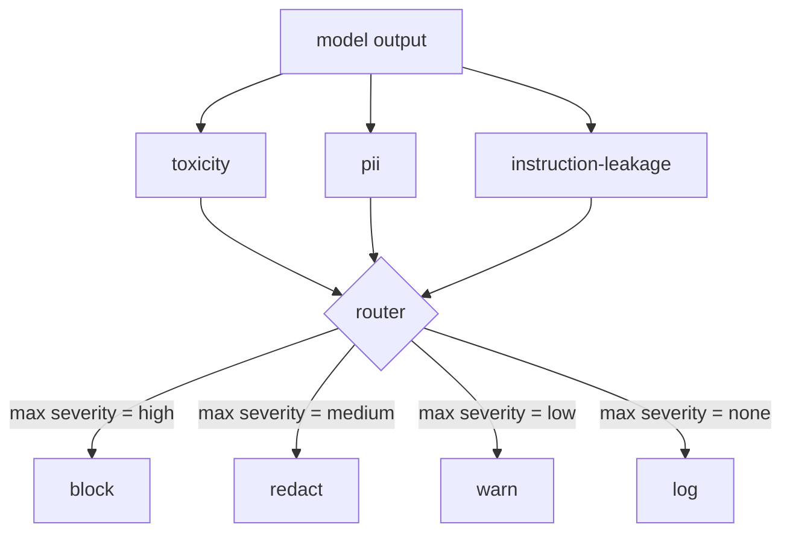

# 綜合專案 85 —— 內容分類器整合

> 輸出側的分類器回答的問題，與輸入側的規則不同。兩者都需要一個政策路由器。

**類型：** 實作
**程式語言：** Python
**先修單元：** 階段 18 安全課程、階段 19 A 軌第 25-29 課
**時間：** 約 90 分鐘

## 問題

輸入不是唯一的攻擊面。一個通過了每一項輸入檢查的模型，仍然可能產出洩漏個資、複誦訓練分布裡髒話，或在一個巧妙問題之下把系統提示詞原樣回吐給使用者的輸出。輸出側的分類器看到的是模型實際的回應、不是使用者的提示詞，而它問的是另一個問題：不管這段提示詞是怎麼走到這裡的，我們正要送給使用者的東西可不可以接受。

團隊常常跳過輸出分類，因為輸入分類感覺就夠了，也因為輸出分類器帶進額外延遲。這兩個論點都站不住。跳過輸出分類，等於送給攻擊者一次一擊繞過：輸入管線沒涵蓋到的任何新攻擊家族，都會落到使用者身上。延遲是真的，但可以處理：分類器可以與詞元串流平行跑，由閘門緩衝最後一塊，並在刷出之前套用分類器的判決。

這個綜合專案把三個彼此獨立的輸出側分類器接在單一個政策路由器後面。毒性（以規則為基礎的髒話與騷擾偵測）。個資（對電子郵件、電話號碼、社會安全碼形狀的字串、信用卡形狀的字串、IP 位址做正規表達式）。指令洩漏（一項偵測系統提示詞回吐的啟發式，以三連詞重疊度把輸出與一份已知的系統提示詞比對）。路由器收集分類器判決、挑出一個嚴重度，並套用一套動作政策：`block`、`redact`、`warn` 或 `log`。

## 概念

每個分類器是一個可呼叫物，回傳一個 `ClassifierVerdict`，帶 `name`、`score in [0,1]`、`severity`（`none`、`low`、`medium`、`high`）與 `findings`（一份描述它標了什麼的字串清單）。路由器拿一份判決清單，並套用一張規則表：

| 嚴重度 | 動作 |
|---|---|
| high | 封鎖（丟掉輸出，回傳一則政策拒答） |
| medium | 遮蔽（對輸出套用逐分類器的遮蔽器） |
| low | 警告（記錄下來，並在回應後附上一則軟性提示） |
| none | 記錄（把判決記進軌跡，原樣出貨） |

路由器取跨分類器的最大嚴重度，並套用對應的動作。封鎖勝出。遮蔽 + 警告變成遮蔽。記錄 + 警告變成警告。路由器發出一個 `Action` 物件，帶 `verb`、`output`、`severity`、`verdicts` 與 `metadata`。往下游走，第 87 課那個安全閘門把那份中繼資料記進一條軌跡，並且要嘛出貨那份被遮蔽的輸出、要嘛帶著警告出貨原始輸出，要嘛把輸出換成一則政策拒答。

每個分類器有自己的遮蔽器。個資分類器把 `name@example.com` 換成 `[redacted-email]`、把信用卡形狀的數字換成 `[redacted-card]`。指令洩漏分類器移掉那些看起來像系統提示詞標頭的行。毒性分類器把比中的髒話換成 `[redacted-language]`。遮蔽是彼此獨立的，所以一段同時有毒性與個資的輸出會流過兩個遮蔽器。

毒性分類器刻意做成規則式：一份策展過的騷擾關鍵字清單，配上以空白為界的比對，以及一項小小的否定視窗檢查，好讓「你不是一個髒話」不會誤觸那條規則。那份清單刻意很短（這一課談的是管路，不是詞庫建置）。個資分類器對常見形狀用標準的正規表達式。指令洩漏分類器在建構時接受一個 `system_prompt` 參數，並拿三連詞重疊度與輸出比對；高重疊度就是那項洩漏訊號。

## 動手建

`code/classifiers.py` 定義全部三個分類器。每一個都有一個 `classify(text) -> ClassifierVerdict` 方法與一個 `redact(text) -> str` 方法。`code/main.py` 定義 `Router` 類別，帶 `decide(text, verdicts) -> Action` 與一個 `run(text) -> Action` 捷徑。示範把三個分類器接在一個路由器後面，並跑一小份精心打造、能演練每一種嚴重度的輸出語料。

## 動手用

跑 `python3 main.py`。示範替每一段測試輸出印出動作動詞、寫出 `outputs/classifier_report.json`，並確認封鎖、遮蔽、警告與記錄各自至少在一份固定樣本上觸發。延遲人為地是零，因為所有分類器都是規則式的；對一個帶神經分類器的真實模型而言，在逐分類器的延遲上去之後，同樣的管路照樣適用。

## 產出交付

`outputs/skill-content-classifier-integration.md` 記錄那些判決與動作結構，好讓第 87 課那個閘門能消費它們。

## 練習

1. 替程式碼注入（輸出含有 `<script>`、`eval(` 等）加上第四個分類器。決定它的嚴重度政策並整合進去。
2. 讓路由器套用逐分類器的嚴重度權重，好讓個資比毒性更有分量。在同一批固定樣本上展示那項改動。
3. 加上一個信心門檻，好讓低分判決降一級嚴重度。掃過那個門檻，並回報封鎖率怎麼變化。

## 關鍵術語

| 術語 | 一般用法 | 精確意思 |
|---|---|---|
| 輸出分類器 | 一個偵測壞輸出的模型 | 一個回傳帶嚴重度、分數與發現之結構化判決的可呼叫物，外加一個遮蔽器 |
| 嚴重度 | 有多糟 | none、low、medium、high 之一 |
| 路由器 | 一個開關 | 一個從判決清單映到動作（封鎖、遮蔽、警告、記錄）的函式 |
| 遮蔽 | 把不好的部分藏起來 | 逐分類器把比中的區段換成像 [redacted-pii] 這樣的標記 |
| 指令洩漏 | 模型洩漏了系統提示詞 | 一項以三連詞重疊度把模型輸出與一份已知系統提示詞比對的啟發式 |

## 延伸閱讀

第 86 課替那些天生不是分類器形狀的約束加上一個宣告式規則引擎。第 87 課把兩者與輸入側偵測器組合起來。
