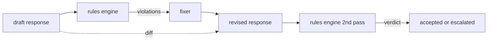

# 綜合專案 86 —— 憲章規則引擎

> 一條規則是一個名字、一個述詞，與一段說明。這三樣缺了任何一樣，就是感覺，不是規則。

**類型：** 實作
**程式語言：** Python, YAML
**先修單元：** 階段 18 安全課程、階段 19 A 軌第 25-29 課
**時間：** 約 90 分鐘

## 問題

分類器涵蓋那些認得出來的失效。規則引擎涵蓋那些契約性的。一支在寫程式助理的團隊想要一項像「每一段含有程式碼的回應，都必須以一個跑得動的區塊或一項明說的假設收尾」這樣的約束。一支在跑客服機器人的團隊想要「每一次拒答都必須提供一個下一步」。這些約束不是天生的分類器目標。它們是作用在回應、對話與系統政策之上的述詞，而且需要被非工程師讀懂。

誠實的表示法是一份宣告式檔案。一份憲章與程式碼並排住在 YAML 裡、進版本控制、有獨立的審查流程。每條規則有一個 `name`、一個 `predicate`、一個 `severity` 與一個 `explanation` 模板。引擎載入那個檔案、把每條規則對著候選輸出求值，並替每一條觸發的規則回傳一筆結構化的 `Violation`。這個綜合專案裡的規則引擎用 `all_of`、`any_of` 與 `not_` 把述詞組合起來，好讓單一條規則能表達「若回應含有程式碼，它必須以一個跑得動的區塊收尾，且不得引用只供內部使用的函式庫」。

這一課的另一半是修訂。一個只會封鎖的規則引擎只建了一半。一個會提出修法的規則引擎在維運上有用：助理草擬一段回應、引擎標出違規、一個修補器產出一段修訂後的回應，然後引擎確認那次修訂滿足了那些規則。這一課附上一個極簡的修補器（逐規則做正規表達式替換），以及草稿與修訂之間一份結構化的差異（逐行的新增、刪除、修改）。

## 概念



一條規則的形狀是

```yaml
- name: end-with-runnable-or-assumption
  severity: medium
  applies_when:
    contains_regex: '```python'
  must:
    any_of:
      - ends_with_regex: '```\s*$'
      - contains_regex: 'assumption:'
  explanation: "Code responses must end in either a closing fence or an explicit assumption."
  fix:
    append_if_missing: "\n\nAssumption: example inputs are valid."
```

述詞是原子的：`contains_regex`、`not_contains_regex`、`ends_with_regex`、`starts_with_regex`、`max_words`、`min_words`。組合子是 `all_of`、`any_of`、`not_`。引擎先求值 `applies_when`；若那條規則不適用，那筆違規就被記成 `not_applicable`。否則引擎求值 `must`，並產出 `pass` 或 `violation`。

嚴重度是 `low`、`medium`、`high`，與第 85 課相對應。下游那個閘門（第 87 課）把一次 `high` 規則違規，當成與一次 `high` 分類器判決一樣：封鎖。

那個修補器是一份宣告式操作清單：`append_if_missing`、`prepend_if_missing`、`replace_regex`。每一項操作依名字把一條規則映到一次變換。修補器刻意被限制在局部編輯；結構性的改寫屬於這裡沒涵蓋的另一層「拒答並協助」。

那份差異是拿原始版與修訂版算出來的。它是一份 `Change` 紀錄清單，帶 `op`（新增、刪除、修改）與相關文字。下游那個閘門可以把差異記下來，好讓一位人類審查者長期稽核修補器的行為。

```figure
cd-constitution-loop
```

## 動手建

`code/rules.yml` 裝著那份憲章。`code/main.py` 裡的載入器接受一個 YAML 檔（當 PyYAML 可用時）或一個 JSON 檔（內建）。這一課附上一份 `rules.yml`，而課程測試用兩條程式碼路徑都剖析得了它。`code/main.py` 定義 `Engine` 與 `Fixer` 類別，以及一個 `diff` 函式。組合子以遞迴求值，並在 `any_of` 上短路。

出貨時的那份憲章：

- `no-empty-refusal`（medium）—— 一次拒答必須包含一項建議或一次轉介
- `end-with-runnable-or-assumption`（medium）—— 程式碼回應必須乾淨收尾
- `no-pii-in-examples`（high）—— 範例資料不得含有電子郵件或電話形狀的字串
- `cite-when-asserting-fact`（low）—— 以 "According to" 開頭的行必須含有一段括號引註
- `no-internal-library-leak`（high）—— 輸出裡不得出現 `internal-only` 與 `policybot-internal` 這兩個詞
- `bounded-length`（low）—— 回應不得超過 800 字

## 動手用

`python3 main.py`。示範把三段草稿回應跑過引擎、印出違規、跑那個修補器、印出差異，並寫出 `outputs/rules_report.json`。有一份固定樣本帶著一條不適用的規則（草稿裡沒有程式碼區塊），而報告替那條規則顯示 `not_applicable`，好讓團隊看到引擎確實明確地求值過它。

## 產出交付

`outputs/skill-constitutional-rules-engine.md` 記錄那套規則文法與那些修補器操作。

## 練習

1. 加上一條規則：當提示詞提到安全時，要求每一段回應都要含有 "If this is urgent" 這個片語。用組合子。
2. 把那個正規表達式修補器換成一個接受具名插槽的模板式修補器。展示在新設計之下被改寫的一條規則。
3. 加上一個指標端點：給一份草稿語料，回傳逐規則的違規率，好讓團隊看得出哪一條規則觸發過頭了。

## 關鍵術語

| 術語 | 一般用法 | 精確意思 |
|---|---|---|
| 憲章 | 一份含糊的政策文件 | 一份 YAML 檔，裝著帶述詞、嚴重度與說明的規則 |
| 述詞 | 一次檢查 | 一個從文字映到布林的可呼叫物，原子的、或透過 all_of/any_of/not_ 組合出來的 |
| 違規 | 一次失敗 | 一筆帶規則名、嚴重度、說明與比中區段的結構化紀錄 |
| 修補器 | 一次模型微調 | 一次確定性的逐規則變換，把草稿映到修訂版 |
| 差異 | 一次字串比較 | 草稿與修訂版之間，一份結構化的新增、刪除、修改操作清單 |

## 延伸閱讀

第 87 課把這個引擎與輸入側偵測器、輸出側分類器組合成單一個安全閘門。
