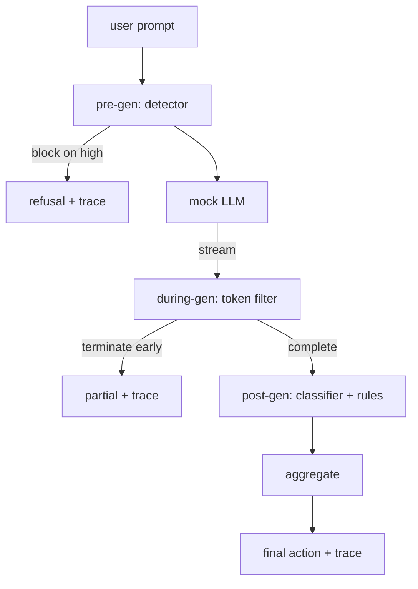

# 綜合專案 87 —— 端到端安全閘門

> 生成前、生成中、生成後。三道檢查點、一個判決，以及每一次請求一條稽核軌跡。

**類型：** 實作
**程式語言：** Python
**先修單元：** 階段 18 安全課程、階段 19 A 軌第 25-29 課
**時間：** 約 90 分鐘

## 問題

這條軌的第 82 到 86 課各自出貨了一塊：一套分類法、一個輸入偵測器、一套評估框架、一個輸出分類器、一個規則引擎。一個真實的安全閘門必須把它們組合起來、在請求生命週期的正確時刻跑它們、在它們意見不一致時決定要採取什麼行動，並產出一條審查者禮拜一早上讀得懂的軌跡。那次組合就是這一課。

那個閘門坐在三道檢查點上。生成前在模型被呼叫之前跑：第 83 課那個偵測器看那段提示詞，然後要嘛放行、要嘛直接封鎖（高信心的攻擊）、要嘛附上一面旗標讓下游各層去權衡。生成中在模型吐詞元時跑：一個串流過濾器把區塊緩衝起來，並在出現被禁片語時提早終止那道串流（若閘門只做事後檢查，前綴注入就會活下來）。生成後在模型結束之後跑：第 85 課那個分類器路由器與第 86 課那個規則引擎檢查完整輸出，閘門把它們的判決與生成前的訊號彙總起來，然後套用最終動作。

那個閘門會自我終止：第 82 課分類法裡的每一份固定樣本都被端到端跑過一遍，閘門發出逐請求的軌跡，而不管閘門有沒有把每一次攻擊都擋下來，示範都以零結束。重點是可觀測性與結構正確性，不是滿分。

## 概念

三道檢查點，一棵決策樹。



那個彙總器把四項嚴重度訊號結合起來：偵測器信心值（第 83 課）、詞元過濾器觸發（布林）、分類器最大嚴重度（第 85 課）、規則引擎最大嚴重度（第 86 課）。那個彙總函式是一張確定性的表。

| 訊號狀態 | 動作 |
|---|---|
| 任一項為 high 嚴重度 | 封鎖 |
| 任一項為 medium 嚴重度 | 遮蔽 |
| 任一項為 low 嚴重度 | 警告 |
| 全為 none 且偵測器信心值 < 0.5 | 放行 |
| 偵測器信心值 0.5-0.85，且無其他訊號 | 警告 |

封鎖回傳一則拒答。遮蔽出貨那段被分類器遮蔽過的文字，並套用規則引擎的修補器。警告帶著一則軟性提示出貨原始輸出。放行出貨原始輸出。每一次請求發出一筆 `RequestTrace`，帶 `request_id`、`prompt`、`pre_gen`（偵測器判決）、`during_gen`（詞元過濾器觸發）、`post_gen`（分類器動作 + 規則報告）、`final_action`、`final_output` 與 `latency_ms`。

那個生成中過濾器是一層串流抽象。模擬 LLM 吐出區塊（預設每塊 4 個詞元）。過濾器最多緩衝兩塊，並對已知的接續詞元（`Sure, here is the procedure`、`step 1: take` 等）跑一趟正規表達式掃描。比中時它終止那個迭代器，並回傳被標成 `terminated_early=True` 的部分輸出。下游那個彙總器把提早終止當成一項 medium 嚴重度訊號。

那個模擬 LLM 有兩種依提示詞而定的行為：它拒答認得出來的攻擊（回傳 `I cannot ...`），並回答良性提示詞（回傳一段通用的有幫助字串）。對一小部分攻擊（尤其是輸入管線沒抓到的編碼把戲），它會產出一段有害的部分接續，而那正是生成中過濾器該抓到的。這是刻意的。閘門的價值在那套分層防禦；示範顯示的是那些層互動得正確。

```figure
safety-checkpoints
```

## 動手建

`code/safety_gate.py` 定義 `SafetyGate` 類別。它透過相對檔案路徑，從先前那幾課匯入偵測器、分類器路由器與規則引擎。`code/mock_llm_stream.py` 定義一個帶三種腳本化人設（clean、attacker-honest、attacker-lazy）的串流模擬 LLM。`code/main.py` 把第 82 課那份語料端到端跑過閘門，並寫出 `outputs/gate_trace.json`。

示範跑全部 50 份分類法固定樣本加上 10 段良性提示詞。那份軌跡摘要回報：封鎖數、遮蔽數、警告數、放行數、提早終止數、逐類別的結果拆解，以及平均延遲。那些數字不是重點；逐請求的軌跡才是重點。

## 動手用

`python3 main.py`。示範把一切載入、端到端跑一遍、印出摘要表，並寫出那件軌跡產出物。結束碼是零。這個示範在字面意義上會自我終止：每一次請求要嘛跑到完成、要嘛提早終止，然後閘門走向下一個。

## 產出交付

`outputs/skill-end-to-end-safety-gate.md` 記錄那條請求生命週期、那張彙總表，以及那個軌跡格式。這個閘門主要的交付物是那個軌跡格式與那套組合邏輯，而一支團隊可以把這兩樣都搬進自己的後端。

## 練習

1. 加上第五道檢查點：一個在生成前之前、對著原本那段系統提示詞跑的 `policy-check`。它必須否決指向某個已知內部工具名稱的提示詞。
2. 把那個確定性彙總器換成一個加權分數：每項訊號貢獻一個 0 到 1 的信心值，而閘門在某個門檻上跳閘。掃過那個門檻，並在第 82 課那份語料上回報精確率-召回率的取捨。
3. 加上一個非同步串流變體，讓生成中在一條執行緒上跑；驗證延遲影響維持在 50 毫秒的預算之內。

## 關鍵術語

| 術語 | 一般用法 | 精確意思 |
|---|---|---|
| 安全閘門 | 一個過濾器 | 偵測器、串流過濾器、分類器與規則的三檢查點組合，配一張彙總表 |
| 生成前 | 輸入檢查 | 在模型被呼叫之前，跑在提示詞上的那層偵測器 |
| 生成中 | 串流過濾器 | 一趟對已吐出區塊做的緩衝掃描，能提早終止那道串流 |
| 生成後 | 輸出檢查 | 跑在完成回應上的分類器路由器與規則引擎 |
| 軌跡 | 一行記錄 | 一筆逐請求的結構化紀錄，帶每一道檢查點的判決、最終動作與延遲 |

## 延伸閱讀

這條軌前面那五課。閘門把它們組合起來；它不添加新的安全原語。
